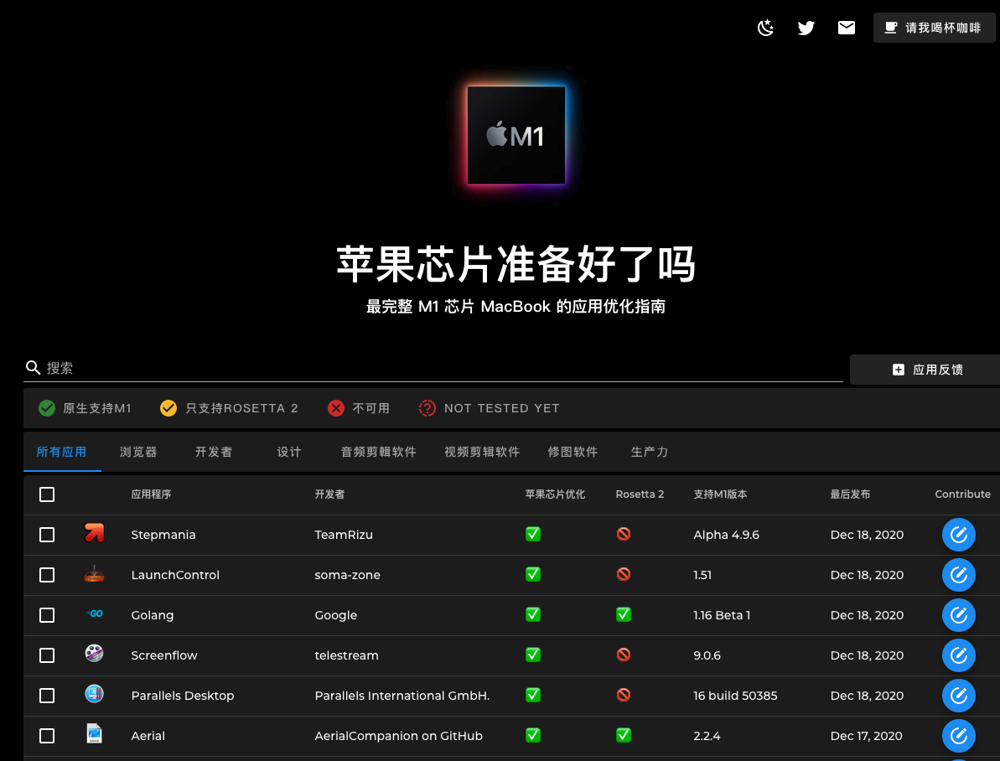

大家好，我是站长 polarisxu。

这段时间关注 Apple M1 芯片挺多的，对 Apple 的强大由衷的感慨。市值 2.1 万亿美金，做的动作都成为行业引领者。

- 当年扁平化设计出来，被各种吐槽；结果大家都扁平化了；
- 出暗黑模式（很程序员？），有些人不喜欢，但现在各种都支持暗黑模式；
- iPhone 12 不带耳机和充电器，骂声一片，目测各个手机厂商都跟进，比如三星就宣布不带了；
- Mac 换成自己的 M1 芯片，很多软件厂商及时跟进支持；
- 。。。

昨天 Go 1.16 Beta1 发布，原生支持 M1 芯片，今天无意中发现了一个 Twitter 账号：Is Apple Silicon Ready ?
@ism1ready，以及对应的网站：<https://isapplesiliconready.com>。刚换芯片，软件厂商们立马跟进，还有人做了这么个站点，不得不感叹：Apple 就是牛逼！

如果你买了 M1 的 Mac，可以看看这个网站，它支持多国语言。对应用做了分类，同时就支持程度分为：原生支持 M1、只支持 Rosetta 2、不可用和还没测试。同时支持搜索某个软件。

有了这个网站，你可以很清晰的知晓软件对 M1 的支持程度。

## Rosetta 2

有些人可能不清楚 Rosetta 2 是啥，这里简单普及一下。

要说 Rosetta 2，先说说 Rosetta。

2006 年，苹果发布了 Rosetta，原因是它由原来的 PowerPC 芯片换成了 Intel 芯片，为了过渡，使许多 PowerPC 应用程序无需修改即可在基于 Intel 的 Mac 计算机上运行。因此可以简单的理解为，Rosetta 做了转换。

现在苹果又放弃了 Intel 芯片，采用 ARM 架构的 M1 芯片，同样会存在过渡问题，因此推出了 Rosetta 2，搭载苹果芯片的 Mac，可以运行专为 Intel 处理器 Mac 构建的 App。

苹果官方介绍在大多数情况下，需要 Rosetta 的 App 的性能不会出现任何差异。但实际上，性能和运行速度就无法保证和在 Intel 芯片的 Mac 上一样了。毕竟原生肯定优化的更好。

## 软件原生支持情况

浏览器方面，Safari、Chrome、Edge、Firefox 都原生支持 M1 了。	

编程语言方面，Go 1.16 支持，已经发布了 Beta1 版本；PHP 已经支持；Java 已经支持；Python 已经支持；Ruby 已经支持；Node 已经支持。其他一些语言，可以通过 Rosetta 2 来运行。

更多其他软件的支持情况可以通过该站的搜索查看。

所以，整体来说，因为有 Rosetta 2 的存在，新版 Mac 的使用完全不是问题，问题是有没有钱买~哈哈哈哈