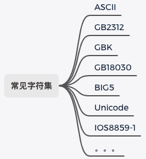

十几年前，国内 UTF-8 还不太流行，新手开发过程中，乱码问题是很常见的。记得我刚毕业那会，公司的系统是这样的：数据库 MySQL 使用的是 Latin-1 编码（IOS8859-1），程序源码使用的是 GBK，这样的情况，乱码真是满天飞~好在对数据库操作做了封装，编码问题在中间层处理了。那时候听到关于乱码问题的一个终极解决方案是：保证各个地方编码一致。

现如今，Unicode 相当普及，中文使用 UTF-8 编码虽然比 GBK 编码占用更多的空间，但一般都不会在乎。特别是使用了 Go 语言后，乱码问题更是没有了。在 Go 语言标准库中有 unicode 包，它下面还有 utf8 和 utf16 两个子包。又是 Unicode、又是 UTF-8、UTF-16，它们是什么关系？

本文试着通过图的方式问大家解答你关于字符集和字符编码的困惑。

本文目录：

## 1、什么是字符集

字符集，从字面看，是多个字符的集合。字符是各种文字和符号的总称，包括各国家文字、标点符号、图形符号、数字等。因此不同的字符组合在一起就可以认为是不同的字符集。当然不是瞎组合。国人常见字符集如下：

## 2、什么是字符编码

大家都知晓，计算机只认 0 和 1 组成的二进制数。所以整数通过进制转换转为二进制就可以被计算机处理。然而像文本、音频、视频等这样的信息，如何转为二进制被计算机处理呢？这就需要进行编码。

**编码**（encode）是把数据从一种形式转换为另外一种形式的过程，它是一套算法。解码（decode）就是编码的逆过程。

比如对于 ASCII 字符集中的字符 1，转换为二进制是 00110001，这就是一次编码；将 00110001 显示为 1，涉及到一次解码。

1->00110001 图

**字符编码**，顾名思义，是对字符进行编码，是字符和二进制数据之间转换的算法，它们之间必须一一对应，这是本文需要讨论的主题。一个二进制叫做位，8 位称为“字节”，根据计算一个字节一共可组合出 256（2 的 8 次方）种不同的状态。

关于字符集和字符编码，使用 ASCII 进行总结说明：

> ASCII **字符集**是字母、数字、标点符号以及控制符（回车、换行、退格）等组成的 128 个字符。
>
> ASCII **字符编码**是将这 128 个字符转换为计算机可识别的二进制数据的一套规则（算法）。

因此当我们说 ASCII 时，一般同时指 ASCII 字符集和 ASCII 字符编码。通常，字符集会同时定义一套同名的字符编码规则。然而万事都有特例，比如 Unicode 就只是代表字符集，对应的字符编码有多种，比如 UTF-8、UTF-16 等。

## 3、Unicode 和 UTF 系列

现在知道了 Unicode 只是代表字符集，它的编码规则是通过 UTF 系列定义的。

那 Unicode 是什么？[官方](https://home.unicode.org/basic-info/overview/)有这么一句话：

> Unicode provides a unique number for every character, no matter what the platform, program, or language is.

即 Unicode 为每一个字符提供了一个唯一的数字编码（代号），叫做 Code Point（码点）。这里可以查找你要查询某个字符的码点（Code Point）：<https://www.unicode.org/cgi-bin/GetUnihanData.pl>。注意这里的码点不是字符编码，只是字符集而已。

所以，Unicode 字符集一个最主要的工作就是维护这样一个表，可以想象成是一个数据库表，里面存储着每一个字符对应的唯一 ID（即 Code Point），统一用 U+XXXX 来表示（X 为 16 进制的字符），如 「徐」U+5F90、【新】U+65B0。现在这个数据表已经拥有 100 多万的字符，还在不停的更新。

为什么会出现 Unicode 呢？因为之前的编码方式，大多只考虑自己国家，不同国家的编码方式不同，导致使用中国 GBK 编码的文档，在日本用本地编码打开就乱码了。标准总是在混乱中诞生的，于是一些国际组织指定出了全球统一的编码格式。这就是 Unicode。

> 大家可能见到过 USC，这是 ISO 制定的一种计算机行业标准，和 Unicode 目的是一样的。他们双方意识到不应该出现两种不同的国际标准。因此你可以认为它们是一样的。

了解了 Unicode，那为什么会有 UTF-8、UTF-16？

### UTF 系列

前面说了 Unicode 本身主要工作是维护一个表，它并没有规定一个字符到底用几个字节来表示，只规定了每个字符对应到唯一的码点（code point），码点可以从 0000 ~ 10FFFF [共 1114112 个值](https://unicode-table.com/cn/blocks/)。

那为什么 Unicode 不规定字符编码呢？如果将 Unicode 码点直接当编码规则会如何？其实是有的，这就是 UTF-32。因为计算机没法确认两字节到底是表示 1 个字符还是 2 个字符，因此 UTF-32 粗暴的取最大值，所有字符都按 4 字节编码。很显然，这在空间上是极浪费的（英文文档直接大 3 倍），因此 UTF-32 很少使用。

UTF 是 Unicode Transformation Format （Unicode 转换格式）的首字母缩写，专门解决 Unicode 的编码问题。根据编码规则的不同有 UTF-8、UTF-16 和 UTF-32 等几种具体的方案。

由于 UTF-32 浪费空间，使用不多，着重介绍 UTF-8 和 UTF-16。

## 4、UTF-8 详解

UTF-8，也可写为 UTF8，是 Unicode 的一种变长编码方案。它完全兼容 ASCII，同时避免了 UTF-16 和 UTF-32 中的字节序等复杂性。UTF-8 能够被广泛接受，跟其完全兼容 ASCII 有很大关系。

为什么叫 -8？因为它将每个 Unicode 字符编码为 1~4 个八位元（octets）（八位元即一个字节），因此叫 -8。其中字节的个数取决于分配给 Unicode 字符的整数值。

当面对 4 个字节，UTF-8 如何知晓应该把它当做 1 个字符解析、还是 2 个？亦或是 4 个？这就是 UTF-8 设计巧妙之处。

- 单字节可编码的 Unicode 范围：\u0000~\u007F（0~127）
- 双字节可编码的 Unicode 范围：\u0080~\u07FF（128~2047）
- 三字节可编码的 Unicode 范围：\u0800~\uFFFF（2048~65535）
- 四字节可编码的 Unicode 范围：\u10000~\u1FFFFF（65536~2097151）

UTF-8 从首字节就可以判断一个字符 UTF-8 编码有几个字节， 具体判断逻辑就是，根据首字节二进制的起始内容：

- 如果以 0 开始，肯定是单字节编码；
- 如果以 110 开头，肯定是双字节编码；
- 如果以 1110 开头，肯定是三字节编码；
- 如果以 11110 开头，肯定是四字节编码；

除首字节之外，其他字节也有规定，如下：

| 字节数 | 用来表示码点的位数 | Unicode 十六进制码点范围 | 字节1    | 字节2    | 字节3    | 字节4    |
| ------ | ------------------ | ------------------------ | -------- | -------- | -------- | -------- |
| 1      | 7                  | 0000 0000 - 0000 007F    | 0xxxxxxx |          |          |          |
|        | 11                 | 0000 0080 - 0000 07FF    | 110xxxxx | 10xxxxxx |          |          |
| 3      | 16                 | 0000 0800 - 0000 FFFF    | 1110xxxx | 10xxxxxx | 10xxxxxx |          |
| 4      | 21                 | 0001 0000 - 0010 FFFF    | 11110xxx | 10xxxxxx | 10xxxxxx | 10xxxxxx |

具体如何编码和解码呢？以中文“徐”为例，说明这个过程。

“徐”的 Unicode 码点是 0x5F90（二进制：101 1111 1001 0000），对照上面的表发现 0x5F90 位于第三方的范围，所以格式是 1110xxxx 10xxxxxx 10xxxxxx。接着从“徐” Unicode 码点的二进制数最后一位开始，按从右向左依次填充这个格式中的 x，多出的 x 用 0 补上。这样就得到了“徐”这个汉字的 UTF-8 编码：11101011 1011110 10010000，转成十六进制是 0xE5 0xBE 0x90。

解码的过程也十分简单：如果一个字节的第一位是 0 ，则说明这个字节对应一个字符；如果一个字节的第一位是 1，那么连续有多少个 1，就表示该字符占用多少个字节。

关于 UTF-8 的规范参考 [rfc3629](https://tools.ietf.org/html/rfc3629)，这是 Ken Thompson 和 Rob Pike 等制定的，这两位也是 Go 语言的作者。

## 5、UTF-16 详解

UTF-16  是 16-bit Unicode Transformation Format。有一点需要特别强调，它跟 UTF-8 一样，是可变长度的。代码点（Code Point）是用一个或两个 16 位代码单元编码的。至于网上有些资料说的 UTF-16 是固定 2 个字节长度编码，那其实不是 UTF-16，而是 UCS-2 （用于 2 字节通用字符集）。UTF-16 可以看做是它的父集。

> 这里涉及一个概念，简单介绍下。
>
> 基本多语言平面（BMP）：UCS-2 只对这些字符进行了编码，一共能编码 65,536 个字符。后来不够用了，怎么办？IEEE 引入了 UCS-4，所有字符都用 4 字节编码，这太浪费空间了，因此出现了一个折中方案：UTF-16，即超出 U+FFFF 的部分使用 4 字节，这部分叫做辅助平面（SMP），码点范围 U+010000 到 U+10FFFF。
>
> 注意 UCS-2 已经过时。

因为是变长的方案，就需要有办法标识到底是 2 个字节还是 4 个字节。上文讲解 UTF-8 时，判断首字节字节开头位即可。类似的，看如下一张表：

| 字节数 | 16 进制码点范围         | 16-bit code 1    | 16-bit code 2    |
| ------ | ----------------------- | ---------------- | ---------------- |
| 2      | U+0000 - U+D7FF         | xxxxxxxxxxxxxxxx |                  |
| 2      | U+E000 - U+FFFF         | xxxxxxxxxxxxxxxx |                  |
| 4      | U+00010000 - U+0010FFFF | 110110xxxxxxxxxx | 110111xxxxxxxxxx |

使用 UTF-16 最知名的是 Java，JVM 内部使用的就是 UTF-16 编码。因为 UTF-16 不兼容 ASCII，因此网络传输一般不会使用它。

https://play.studygolang.com/p/RMgAqK2pXG6

Go语言如何获取码点。

http://www.ruanyifeng.com/blog/2007/10/ascii_unicode_and_utf-8.html

https://books.studygolang.com/gopl-zh/ch3/ch3-05.html
