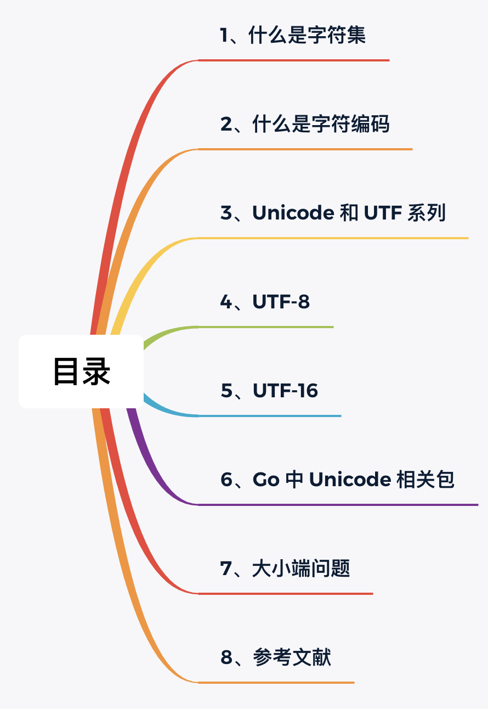

十几年前，国内 UTF-8 还不太流行，新手开发过程中，乱码问题是很常见的。记得我刚毕业那会，公司的系统是这样的：数据库 MySQL 使用的是 Latin-1 编码（IOS8859-1），程序源码使用的是 GBK，这样的情况，乱码真是满天飞~好在对数据库操作做了封装，编码问题在中间层处理了。那时候听到关于乱码问题的一个终极解决方案是：保证各个地方编码一致。

现如今，Unicode 相当普及，中文使用 UTF-8 编码虽然比 GBK 编码占用更多的空间，但一般都不会在乎。特别是使用了 Go 语言后，乱码问题更是没有了。在 Go 语言标准库中有 unicode 包，它下面还有 utf8 和 utf16 两个子包。也许有此疑问：又是 Unicode、又是 UTF-8、UTF-16，它们是什么关系？

本文试着为大家解决关于字符集和字符编码的困惑。

本文目录：



## 1、什么是字符集

字符集，从字面看，是多个字符的集合。字符是各种文字和符号的总称，包括各国家文字、标点符号、图形符号、数字等。因此不同的字符组合在一起就可以认为是不同的字符集。当然不是瞎组合。国人常见字符集如下：


## 2、什么是字符编码

大家都知晓，计算机只认 0 和 1 组成的二进制数。所以整数通过进制转换转为二进制就可以被计算机处理。然而像文本、音频、视频等这样的信息，如何转为二进制被计算机处理呢？这就需要进行编码。

**编码**（encode）是把数据从一种形式转换为另外一种形式的过程，它是一套算法。解码（decode）就是编码的逆过程。

比如对于 ASCII 字符集中的字符 1，转换为二进制是 00110001，这就是一次编码；将 00110001 显示为 1，涉及到一次解码。

**字符编码**，顾名思义，是对字符进行编码，是字符和二进制数据之间转换的算法，它们之间必须一一对应，这是本文需要讨论的主题。一个二进制叫做位，8 位称为“字节”，根据计算一个字节一共可组合出 256（2 的 8 次方）种不同的状态。

关于字符集和字符编码，使用 ASCII 进行总结说明：

> ASCII **字符集**是字母、数字、标点符号以及控制符（回车、换行、退格）等组成的 128 个字符。
>
> ASCII **字符编码**是将这 128 个字符转换为计算机可识别的二进制数据的一套规则（算法）。

因此当我们说 ASCII 时，一般同时指 ASCII 字符集和 ASCII 字符编码。通常，字符集会同时定义一套同名的字符编码规则。然而万事都有特例，比如 Unicode 就只是代表字符集，对应的字符编码有多种，比如 UTF-8、UTF-16 等。

## 3、Unicode 和 UTF 系列

现在知道了 Unicode 只是代表字符集，它的编码规则是通过 UTF 系列定义的。

那 Unicode 是什么？[官方](https://home.unicode.org/basic-info/overview/)有这么一句话：

> Unicode provides a unique number for every character, no matter what the platform, program, or language is.

即 Unicode 为每一个字符提供了一个唯一的数字编码（代号），叫做 Code Point（码点）。这里可以查找你要查询某个字符的码点（Code Point）：<https://www.unicode.org/cgi-bin/GetUnihanData.pl>。注意这里的码点不是字符编码，只是字符集而已。

所以，Unicode 字符集一个最主要的工作就是维护这样一个表，可以把它想象成是一个数据库表，里面存储着每一个字符对应的唯一 ID（即 Code Point），统一用 U+XXXX 来表示（X 为 16 进制的字符，因为字符很多，并不一定所有的字符都是 4 个 16 进制数，比如笑哭的 Emoji 表情，Code Point 是 U+1F602），如 「徐」U+5F90、「新」U+65B0。现在这个数据表已经拥有 100 多万的字符，还在不停的更新。

为什么会出现 Unicode 呢？因为之前的编码方式，大多只考虑自己国家，不同国家的编码方式不同，导致使用中国 GBK 编码的文档，在日本用本地编码打开就乱码了。标准总是在混乱中诞生的，于是一些国际组织制定出了全球统一的编码格式。这就是 Unicode。

> 大家可能见到过 USC，这是 ISO 制定的一种计算机行业标准，和 Unicode 目的是一样的。他们双方意识到不应该出现两种不同的国际标准。因此你可以认为它们是一样的。

了解了 Unicode，那为什么会有 UTF-8、UTF-16？

### UTF 系列

前面说了 Unicode 本身主要工作是维护一个表，它并没有规定一个字符到底用几个字节来表示，只规定了每个字符对应到唯一的码点（code point），码点可以从 0000 ~ 10FFFF [共 1114112 个值](https://unicode-table.com/cn/blocks/)。

那为什么 Unicode 不规定字符编码呢？如果将 Unicode 码点直接当编码规则会如何？其实是有的，这就是 UTF-32。因为计算机没法确认两字节到底是表示 1 个字符还是 2 个字符，因此 UTF-32 粗暴的取最大值，所有字符都按 4 字节编码。很显然，这在空间上是极浪费的（英文文档直接大 3 倍），因此 UTF-32 很少使用。

UTF 是 Unicode Transformation Format （Unicode 转换格式）的首字母缩写，专门解决 Unicode 的编码问题。根据编码规则的不同有 UTF-8、UTF-16 和 UTF-32 等几种具体的方案。

由于 UTF-32 浪费空间，使用不多，本文着重介绍 UTF-8 和 UTF-16。

## 4、UTF-8

UTF-8，也可写为 UTF8，是 Unicode 的一种变长编码方案。它完全兼容 ASCII，同时避免了 UTF-16 和 UTF-32 中的字节序等复杂性。UTF-8 能够被广泛接受，跟其完全兼容 ASCII 有很大关系。

为什么叫 `-8`？因为它将每个 Unicode 字符编码为 1~4 个八位元（octets）（八位元即一个字节），因此叫 `-8`。其中字节的个数取决于分配给 Unicode 字符的整数值。

当面对 4 个字节，UTF-8 如何知晓应该把它当做 1 个字符解析、还是 2 个？亦或是 4 个？这就是 UTF-8 设计巧妙之处。

- 单字节可编码的 Unicode 范围：\u0000~\u007F（0~127）
- 双字节可编码的 Unicode 范围：\u0080~\u07FF（128~2047）
- 三字节可编码的 Unicode 范围：\u0800~\uFFFF（2048~65535）
- 四字节可编码的 Unicode 范围：\u10000~\u1FFFFF（65536~2097151）

UTF-8 从首字节就可以判断一个字符的 UTF-8 编码有几个字节， 具体判断逻辑就是，根据首字节二进制的起始内容：

- 如果以 0 开始，肯定是单字节编码；
- 如果以 110 开头，肯定是双字节编码；
- 如果以 1110 开头，肯定是三字节编码；
- 如果以 11110 开头，肯定是四字节编码；

除首字节之外，其他字节也有规定，如下：

| 字节数 | 用来表示码点的位数 | Unicode 十六进制码点范围 | 字节1    | 字节2    | 字节3    | 字节4    |
| ------ | ------------------ | ------------------------ | -------- | -------- | -------- | -------- |
| 1      | 7                  | 0000 0000 - 0000 007F    | 0xxxxxxx |          |          |          |
| 2      | 11                 | 0000 0080 - 0000 07FF    | 110xxxxx | 10xxxxxx |          |          |
| 3      | 16                 | 0000 0800 - 0000 FFFF    | 1110xxxx | 10xxxxxx | 10xxxxxx |          |
| 4      | 21                 | 0001 0000 - 0010 FFFF    | 11110xxx | 10xxxxxx | 10xxxxxx | 10xxxxxx |

具体如何编码和解码呢？以中文“徐”为例，说明这个过程。

「徐」的 Unicode 码点是 0x5F90（二进制：101 1111 1001 0000），对照上面的表发现 0x5F90 位于第三行的范围，所以格式是 1110xxxx 10xxxxxx 10xxxxxx。接着从「徐」Unicode 码点的二进制数最后一位开始，按从右向左依次填充这个格式中的 x，多出的 x 用 0 补上。这样就得到了「徐」这个汉字的 UTF-8 编码：11101011 1011110 10010000，转成十六进制是 0xE5 0xBE 0x90。

解码的过程也十分简单：如果一个字节（编码的二进制表示）的第一位是 0 ，则说明这个字节对应一个字符；如果一个字节的第一位是 1，那么连续有多少个 1，就表示该字符占用多少个字节。还是以「徐」字为例，它的 UTF-8 编码的二进制表示是：11101011 1011110 10010000，根据规则，第一个字节的第一位是 1，且有三个 1，因此占用 3 个字节。根据上面表中第三行，将第一个字节开头的 1110 去掉，第二、第三个字节开头的 10 去掉，剩下的组合在一起，即：1011 11110 010000，这就是 0x5F90。

关于 UTF-8 的规范参考 [rfc3629](https://tools.ietf.org/html/rfc3629)，这是 Ken Thompson 和 Rob Pike 等制定的，这两位也是 Go 语言的作者。

## 5、UTF-16

UTF-16  是 16-bit Unicode Transformation Format。有一点需要特别强调，它跟 UTF-8 一样，是可变长度的。代码点（Code Point）是用一个或两个 16 位代码单元编码的。至于网上有些资料说的 UTF-16 是固定 2 个字节长度编码，那其实不是 UTF-16，而是 UCS-2 （用于 2 字节通用字符集）。UTF-16 可以看做是它的父集。

> 这里涉及一个概念，简单介绍下。
>
> 基本多语言平面（BMP）：UCS-2 只对这些字符进行了编码，一共能编码 65,536 个字符。后来不够用了，怎么办？IEEE 引入了 UCS-4，所有字符都用 4 字节编码，这太浪费空间了，因此出现了一个折中方案：UTF-16，即超出 U+FFFF 的部分使用 4 字节，这部分叫做辅助平面（SMP），码点范围 U+010000 到 U+10FFFF。
>
> 注意 UCS-2 已经过时了。

因为是变长的方案，就需要有办法标识到底是 2 个字节还是 4 个字节。上文讲解 UTF-8 时，判断首字节字节开头位即可。类似的，看如下一张表：

| 字节数 | 16 进制码点范围         | 16-bit code 1    | 16-bit code 2    |
| ------ | ----------------------- | ---------------- | ---------------- |
| 2      | U+0000 - U+D7FF         | xxxxxxxxxxxxxxxx |                  |
| 2      | U+E000 - U+FFFF         | xxxxxxxxxxxxxxxx |                  |
| 4      | U+00010000 - U+0010FFFF | 110110xxxxxxxxxx | 110111xxxxxxxxxx |

使用 UTF-16 最知名的是 Java，JVM 内部使用的就是 UTF-16 编码。因为 UTF-16 不兼容 ASCII，因此网络传输一般不会使用它。

但 Java 的编码方式其实没那么简单。一般地 Java 中是这样的：（来源于 《Java 核心技术手册》 一书）

- Java 源文件，可能使用本地编码（比如中国是 GB）；
- 类文件（class 文件），使用 modified UTF-8（即做了部分修改的 UTF-8）；
- 虚拟机，使用过 UTF-16

接下来，以汉字"?"为例，说明 UTF-16 编码方式是如何工作的。

汉字"?"的 Unicode 码点为 `0x20BB7`，该码点显然超出了基本平面的范围（0x0000 - 0xFFFF），因此需要使用四个字节表示。首先用 `0x20BB7 - 0x10000` 计算出超出的部分，然后将其用 20 个二进制位表示（不足前面补 0 ），结果为`0001000010 1110110111`。接着，将前 10 位映射到 U+D800 到 U+DBFF 之间，后 10 位映射到 U+DC00 到 U+DFFF 即可。`U+D800` 对应的二进制数为 `1101100000000000`，直接填充后面的 10 个二进制位即可，得到 `1101100001000010`，转成 16 进制数则为 `0xD842`。同理可得，低位为 `0xDFB7`。因此得出汉字"?"的 UTF-16 编码为 `0xD842 0xDFB7`。

## 6、Go 中 Unicode 相关包

Go 语言让复杂的编码问题变得简单很多，极大的减轻了程序员的心智负担。为了方便对 unicode 字符串进行处理，Go 语言标准库提供三个包：unicode、unicode/utf8 和 unicode/utf16。

这里简单介绍下三个包的功能：

- unicode：unicode 提供数据和函数来测试 Unicode 代码点（Code Point，用 rune 存储）的某些属性。
- unicode/utf8：用于处理 UTF-8 编码的文本，提供一些常量和函数，包括在 rune（码点） 和 UTF-8 字节序列之间的转换。
- unicode/utf16：函数比较少，主要是 UTF-16 序列的编码和解码。

具体函数不讲解了，大家可以看标准库文档或通过我的开源书阅读相关章节：<https://github.com/polaris1119/The-Golang-Standard-Library-by-Example>。

着重介绍下 Go 中字符串的写法。

在 Go 语言中，字符串字面值有 4 种写法，比如「徐新华」可以这么写：

```go
s1 := "徐新华"
s2 := "\u5F90\u65B0\u534E"
s3 := "\U00005F90\U000065B0\U0000534E"
s4 := "\xe5\xbe\x90\xe6\x96\xb0\xe5\x8d\x8e"
```

简单来生活就是 \u 紧跟四个十六进制数，\U 紧跟八个十六进制数。其中 \u 或 \U 代表后面是 Unicode 码点。而 \x 紧跟两个十六进制数，这些十六进制不是 Unicode 码点，而是 UTF-8 编码。

下面的代码有利于你的理解：

```go
package main

import (
	"fmt"
	"unicode/utf8"
)

func main() {
	s := `徐新华`
	var (
		buf = make([]byte, 4)
		n   int
	)

	fmt.Println("字符\tUnicode码点\tUTF-8编码十六进制\tUTF-8编码二进制")
	for _, r := range s {
		n = utf8.EncodeRune(buf, r)
		fmt.Printf("%q\t%U\t\t%X\t\t%b\n", r, r, buf[:n], buf[:n])
	}
	
	s2 := "\u5F90\u65B0\u534E"
	s3 := "\U00005F90\U000065B0\U0000534E"
	s4 := "\xe5\xbe\x90\xe6\x96\xb0\xe5\x8d\x8e"
	
	fmt.Println(s2)
	fmt.Println(s3)
	fmt.Println(s4)
}
```

运行结果：

```bash
字符	Unicode码点	UTF-8编码十六进制	UTF-8编码二进制
'徐'	U+5F90		E5BE90		[11100101 10111110 10010000]
'新'	U+65B0		E696B0		[11100110 10010110 10110000]
'华'	U+534E		E58D8E		[11100101 10001101 10001110]
徐新华
徐新华
徐新华
```

此外，关于字符串其他方面的处理，比如编码转换等，可以到 <https://pkg.go.dev/golang.org/x/text> 里找。

## 7、大小端问题（Little endian 和 Big endian）

最后聊一下大小端的问题。

一个字符使用多字节存储时，涉及到哪个在前哪个在后。以汉字「徐」为例，Unicode 码点是 5F90，需要用两个字节存储，一个字节是`5F`，另一个字节是`90`。存储的时候，`5F`在前，`90` 在后，这就是 Big endian 方式；`90`在前，`5F`在后，这是 Little endian 方式。

这两个古怪的名称来自英国作家斯威夫特的《格列佛游记》。在该书中，小人国里爆发了内战，战争起因是人们争论，吃鸡蛋时究竟是从大头（Big-endian）敲开还是从小头（Little-endian）敲开。为了这件事情，前后爆发了六次战争，一个皇帝送了命，另一个皇帝丢了王位。

第一个字节在前，就是”大端方式"（Big endian），第二个字节在前就是”小端方式"（Little endian）。

那么很自然的，就会出现一个问题：计算机怎么知道某一个文件到底采用哪一种方式编码？

Unicode 规范定义，每一个文件的最前面分别加入一个表示编码顺序的字符，这个字符的名字叫做"零宽度非换行空格"（zero width no-break space），用 FEFF 表示。这正好是两个字节，而且 FF 比 FE 大1。

如果一个文本文件的头两个字节是 FE FF，就表示该文件采用大端方式；如果头两个字节是 FF FE，就表示该文件采用小端方式。

但从上面关于 UTF-8 编码的说明可以看出，虽然 UTF-8 存在多字节表示一个字符的情况，但顺序是固定的，没有字节序的问题。Unix 系统下，UTF-8 没有任何前置字符，但 Windows 下记事本保存的 UTF-8 文件会带上 BOM（Byte Order Mark），即 EF BB BF 这三个字节。关于这一点，Unicode 之父 Rob Pike 明确说 UTF-8 不需要 BOM，所以一开始 Go 源文件是不允许有 BOM 的，否则编译不通过，不过现在已经可以有了。但建议还是别带 BOM。

> UTF-8 带 BOM 说不是为了区分字节序，而是为了更方便的知晓这是一个 UTF-8 文件。

你可以通过 hexdump 工具查看文件开始的字符。

## 8、参考文献

- http://www.ruanyifeng.com/blog/2007/10/ascii_unicode_and_utf-8.html
- https://books.studygolang.com/gopl-zh/ch3/ch3-05.html
- https://blog.csdn.net/hezh1994/article/details/78899683
- https://blog.csdn.net/weixin_39640298/article/details/84074498

