大家好，我是站长 polarisxu。

团队一直保持着分享的习惯，而我却分享的较少。忘了当时同事分享什么主题，涉及到浮点数相关知识。于是我决定分享一期关于浮点数的，而且 Go 之父 Rob Pike 说不懂浮点数不配当码农。。。So？！


本着「要学习就系统透彻的学」这个原则，本文通过图的方式尽可能详细的讲解浮点数，让大家能够对浮点数有一个更深层次的认识。

本文目录：

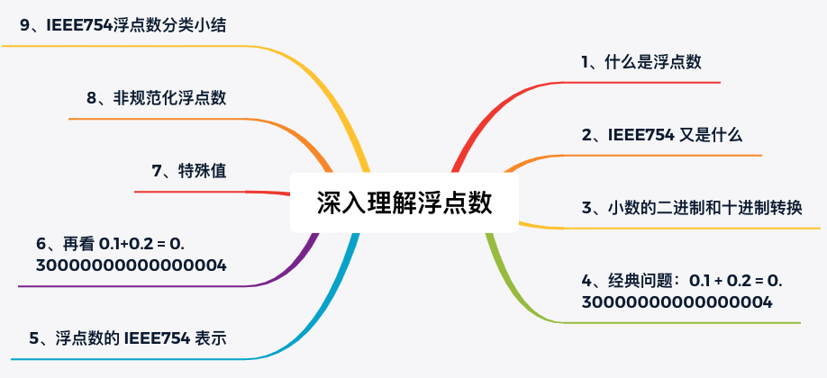

## 0、几个问题

开始之前请思考如下问题：

- 二进制 0.1，用十进制表示的话是多少？十进制的 0.1，用二进制表示又是多少？
- 为什么 0.1 + 0.2 = 0.30000000000000004？
- 单精度和双精度浮点数的有效小数位分别是多少？
- 单精度浮点数能表示的范围是什么？
- 浮点数为什么会存在 -0？infinity 和 NaN 又是怎么表示的？

如果现在不会，那这篇文章正好可以为你解惑。

## 1、什么是浮点数

我们知道，数学中并没有浮点数的概念，虽然小数看起来像浮点数，但从不这么叫。那为什么计算机中不叫小数而叫浮点数呢？

因为资源的限制，数学中的小数无法直接在计算机中准确表示。为了更好地表示它，计算机科学家们发明了浮点数，这是对小数的近似表示。维基百科中关于[浮点数](https://en.wikipedia.org/wiki/Floating-point_arithmetic)的概念说明如下：

> The term floating point refers to the fact that a number's radix point (decimal point, or, more commonly in computers, binary point) can float; that is, it can be placed anywhere relative to the significant digits of the number.

也就是说浮点数是相对于定点数而言的，表示小数点位置是浮动的。比如 7.5 × 10、0.75 × 10² 等表示法，值一样，但小数点位置不一样。

具体来说，浮点数是指用符号、尾数、基数和指数这四部分来表示的小数。

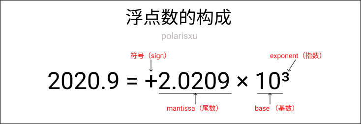

## 2、IEEE754 又是什么

知道了浮点数的概念，但需要确定一套具体的表示、运算标准。其中最有名的就是 [IEEE754 标准](https://en.wikipedia.org/wiki/IEEE_754)。William Kahan 正是因为浮点数标准化的工作获得了图灵奖。

> The **IEEE Standard for Floating-Point Arithmetic** (**IEEE 754**) is a [technical standard](https://en.wikipedia.org/wiki/Technical_standard) for [floating-point arithmetic](https://en.wikipedia.org/wiki/Floating-point_arithmetic) established in 1985 by the [Institute of Electrical and Electronics Engineers](https://en.wikipedia.org/wiki/Institute_of_Electrical_and_Electronics_Engineers) (IEEE). The standard [addressed many problems](https://en.wikipedia.org/wiki/Floating-point_arithmetic#IEEE_754_design_rationale) found in the diverse floating-point implementations that made them difficult to use reliably and [portably](https://en.wikipedia.org/wiki/Software_portability). Many hardware [floating-point units](https://en.wikipedia.org/wiki/Floating-point_unit) use the IEEE 754 standard.

本文的讨论都基于 IEEE754 标准，这也是目前各大编程语言和硬件使用的标准。

根据上面浮点数的组成，因为是在计算机中表示浮点数，基数自然是 2，因此 IEEE754 浮点数只关注符号、尾数和指数三部分。

## 3、小数的二进制和十进制转换

为了方便后面的内容顺利进行，复习下二进制和十进制的转换，其中主要涉及到小数的转换。

### 二进制转十进制

和整数转换一样，采用各位数值和位权相乘。比如：

(0.101)₂ = 1×2⁻¹ + 0×2⁻² + 0×2⁻³ = (0.625)₁₀

记住小数点后第一位是从 -1 开始即可。

### 十进制转二进制

十进制整数转二进制采用“除 2 取余，逆序排列”法。例如十进制数 11 转为二进制：

```
11/2=5 … 余1
5/2=2  … 余1
2/2=1  … 余0
1/2=0  … 余1
```

所以 (11)₁₀ 的二进制是 (1011)₂。

但如果十进制是小数，转为二进制小数如何做？采用“乘 2 取整，顺序排列”。例如十进制小数 0.625 转为二进制小数：

```
0.625*2=1.25 … 取整数部分1
0.25*2=0.5 	 … 取整数部分0
0.5*2=1			 … 取整数部分1
```

顺序排列，所以 (0.625)₁₀ = (0.101)₂。

为了方便大家快速的做转换，网上有很多这样的工具。推荐一个我觉得最棒的：<https://baseconvert.com/>，支持各进制的转换，还支持浮点数。

## 4、经典问题：0.1 + 0.2 = 0.30000000000000004

这个问题网上相关的讨论很多，甚至有专门的一个网站：<https://0.30000000000000004.com/>，这个网站上有各门语言的 0.1 + 0.2 的结果。比如 C 语言：

```c
#include <stdio.h>

int main(int argc, char** argv) {
  printf("%.17f\n", .1 + .2);
  return 0;
}
```

Go 语言：

```go
package main

import (
	"fmt"
)

func main() {
	var a, b float64 = 0.1, 0.2
	fmt.Println(a + b)
}
```

结果都是 0.30000000000000004。

为什么会这样？这要回到 IEEE754 标准关于浮点数的规定。

## 5、浮点数的 IEEE754 表示

上文提到，浮点数由四个部分构成，那 IEEE754 标准是如何规定它们的存储方式的呢？

一般地，IEEE754 浮点数有两种类型：单精度浮点数（float）和双精度浮点数（double），还有其他的，不常用。单精度浮点数使用 4 字节表示；双精度浮点数使用 8 字节表示。在 Go 语言中用 float32 和 float64 表示这两种类型。

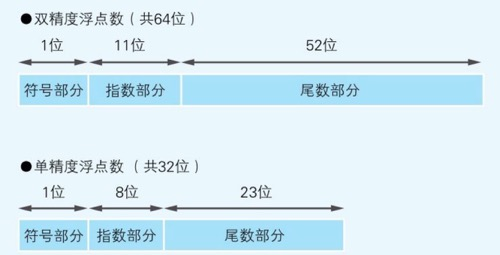

符号位不用说，0 表示正数，1 表示负数。着重看指数部分和尾数部分。（基数前文说了，固定是 2，因此不存）

### 尾数部分

前面提到过，浮点数名称的由来在于小数点是浮动的。但具体存储时，需要固定一种形式，这叫做尾数的标准化。IEEE754 规定，在二进制数中，通过移位，将小数点前面的值固定为 1。IEEE754 称这种形式的浮点数为规范化浮点数（normal number）。

比如十进制数 0.15625，转为二进制是 0.00101。为了让第 1 位为 1，执行逻辑右移 3 位，尾数部分成为 1.01，因为右移了 3 位，所以指数部分是 -3。因为规定第 1 位永远为 1，因此可以省略不存，这样尾数部分多了 1 位，只需存 0100（要记住，这是的数字是小数点后的数字，因此实际是 0.01，转为十进制是 0.25 — 没算未存的小数点前面的 1）。

因此对于规范化浮点数，尾数其实比实际的多 1 位，也就是说单精度的是 24 位，双精度是 53 位。为了作区分，IEEE754 称这种尾数为 significand。

> 有规范化浮点数，自然会有**非规范化浮点数**（denormal number），这会在后文讲解。

请牢记，尾数决定了精度，对于单精度浮点数，因为只有 23 位，而 `1<<23` 对应十进制是 8388608，因此不能完整表示全部的 7 个十进制位，所以说，单精度浮点数**有效小数位**最多 7 位；双精度的**有效小数位**是 15 位；切记切记，有精度问题！！

### 指数部分

因为指数有正、有负，为了避免使用符号位，同时方便比较、排序，指数部分采用了 **The Biased exponent**（有偏指数）。IEEE754 规定，2ᵉ⁻¹-1 的值是 0，其中 e 表示指数部分的位数，小于这个值表示负数，大于这个值表示正数。因此，对于单精度浮点数而言， 2⁸⁻¹-1 = 127 是 0；双精度浮点数，2¹¹⁻¹-1 = 1023 是 0。

没看懂？举个栗子。

还是用十进制 0.15625 举例。上文知道，因为右移了 3 位，所以指数是 -3。根据 IEEE754 的定义，单精度浮点数情况下，-3 的实际值是 127 - 3 = 124。明白了吗？127 表示 0，124 就表示 -3 了。而十进制的 124 转为二进制就是 1111100。

如果你还不理解，想想这个问题。

> 如果让你用扑克牌（A ~ K，也就是 1 ~ 13）来表示支持负数的。怎么办？我们会选择一个中间的数，比如 7 当做 0，因此 10 就是 +3，4 就是 -3。现在理解了吧！

### 小结

结合尾数和指数的规定，IEEE754 单精度浮点数，十进制 0.15625 对应的二进制内存表示是：0 01111100 01000000000000000000000。

## 6、程序确认下 IEEE754 的如上规定

读到这里，希望你能坚持下去。为了进一步加深理解，我画一张图和一个确认程序。

### 一张图

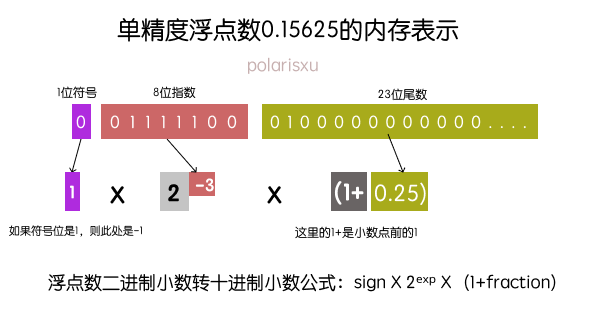

这张图是单精度浮点数 0.15625 的内存存储表示。根据三部分的二进制表示，可以反推出计算该数的十进制表示。作为练习，十进制的 2.75，用上图表示的话，各个位置分别都是什么值呢？

### 程序确认单精度浮点数的内存表示

使用 Go 语言编写一个程序，能够得到一个单精度浮点数的二进制内存表示。比如提供单精度浮点数 0.15625，该程序能够输出：0-01111100-01000000000000000000000。

```go
package main

import (
	"fmt"
	"math"
)

func main() {
	var f float32 = 0.15625
	outputFEEE754(f)
}

func outputFEEE754(f float32) {
	// 将该浮点数内存布局当做 uint32 看待（因为都占用 4 字节）
	// 这里实际上是做强制转换，内部实现是：return *(*uint32)(unsafe.Pointer(&f))
	buf := math.Float32bits(f)

	// 加上两处 -，结果一共 34 byte
	var result [34]byte

	// 从低字节开始
	for i := 33; i >= 0; i-- {
		if i == 1 || i == 10 {
			result[i] = '-'
		} else {
			if buf%2 == 1 {
				result[i] = '1'
			} else {
				result[i] = '0'
			}
			buf /= 2
		}
	}

	fmt.Printf("%s\n", result)
}

// output: 0-01111100-01000000000000000000000
```

你可以使用上述程序，验证下 2.75，看看你做对没有！提供了一个在线可运行版本：<https://play.studygolang.com/p/pg0QNQtBHYx>。

其实上面推荐的那个工具就能够得到十进制浮点数的二进制内存表示，地址：<https://baseconvert.com/ieee-754-floating-point>。

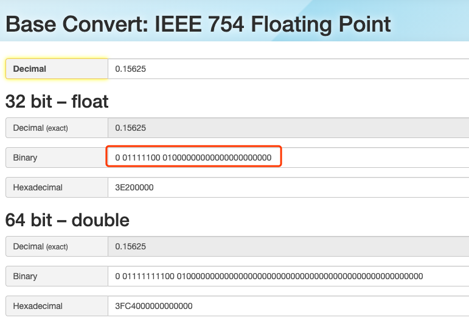

另外，在 Java 语言中也有类似的方法：Float.floatToIntBits()，你可以使用 Java 实现上面类似的功能。

## 6、再看 0.1+0.2 = 0.30000000000000004

有了上面的知识，我们回过头看看这个经典的问题。（讨论单精度的情况，因此实际是 0.1+0.2 = 0.300000004）

### 出错的原因

出现这种情况的根本原因是，有些十进制小数无法转换为二进制数。如下图：

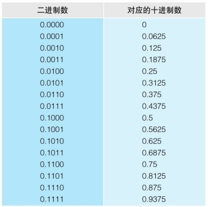

在小数点后 4 位时，连续的二进制数，对应的十进制数却是不连续的，因此只能增加位数来尽可能近似的表示。

### 0.1 和 0.2 是如何表示的？

根据前面的讲解，十进制 0.1 转为二进制小数，得到的是 0.0001100… （重复1100）这样一个循环二进制小数，使用 IEEE754 表示如下图：

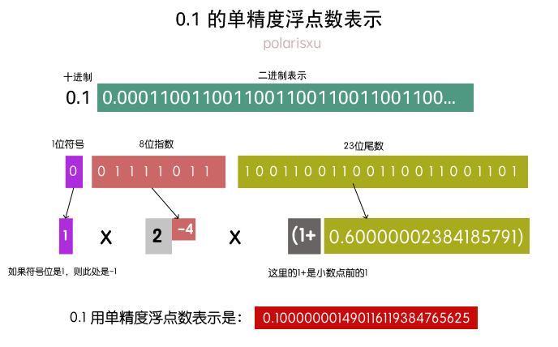

同样的方法，0.2 用单精度浮点数表示是：0.20000000298023223876953125。所以，0.1 + 0.2 的结果是：0.300000004470348358154296875。

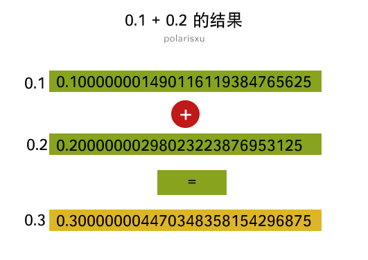

## 7、特殊值

耐心的读者看到这里，你真的很棒！但还没完哦，继续加油！

### 单精度浮点数的最大值

讲解下一个知识点之前，请思考本文开始的一个问题：**单精度浮点数的最大值是多少？**

根据前面学到的知识，我们很容易想到它的最大值的内存应该表示是这样的。


即：01111111111111111111111111111111。然而我们把这个值填入 <https://baseconvert.com/ieee-754-floating-point> 中，发现结果是这样的：

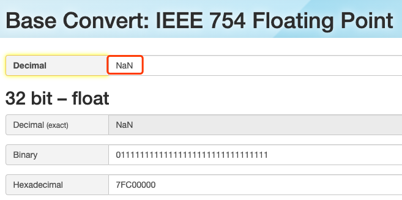

什么？NaN 是个什么鬼？！我就是按照你上面讲过的思考的。。。

别急，因为凡是都有特殊。现在就讲讲浮点数中的特殊值。

### 特殊值 infinity（无穷）

当指数位全是 1，尾数位全是 0 时，这样的浮点数表示无穷。根据符号位，有正无穷和负无穷（+infinity 和 -infinity）。为什么需要无穷？因为计算机资源的限制，没法表示所有的数，当一个数超过了浮点数的表示范围时，就可以用 infinity 来表示。而数学中也有无穷的概念。

在 Go 语言中，通过 math 包的 func Inf(sign int) float64 函数可以获取到正负无穷。

在 Java 语言中，通过 Float 或 Double 类中的常量可以获得：Float.POSITIVE_INFINITY、Float.NEGATIVE_INFINITY。

具体表示可以定义一个常量，比如：

> 正无穷：0x7FF0000000000000，负无穷：0xFFF0000000000000

和上面浮点数内存位模型强转 int 类似，这个执行相反操作（类似 Float64frombits 这样的函数），就得到了这个特殊的浮点值。可以看 Go 语言 math 标准库相应函数的实现。

### 特殊值 NaN

NaN 是 not-a-number 的缩写，即不是一个数。为什么需要它？例如，当对 -1 进行开根号时，浮点数不知道如何进行计算，就会使用 NaN，表示不是一个数。

NaN 的具体内存表示是：指数位全是 1，尾数位不全是 0。

和 infinity 类似，Go 和 Java 都定义了相应的函数或常量。

### 小结

现在清楚上面单精度浮点数最大值是不对的了吧，它是一个 NaN。画一张图，方便你更清晰的记住这些特殊值。

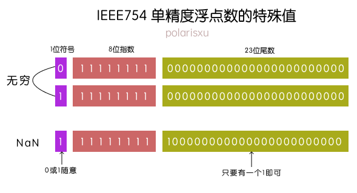

所以单精度浮点数的最大值应该能确认了，即：0 11111110 11111111111111111111111。

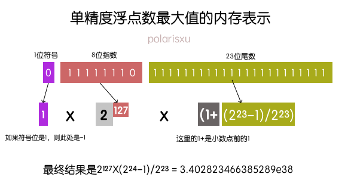

## 8、非规范化浮点数

接着用问题的方式继续：单精度浮点数的最小值是多少（正数）？

根据前面的知识，我们会得到这样的最小值：0 00000000 00000000000000000000001。根据前面规范化浮点数的规定，我们知晓该值是：2⁻¹²⁷×(1+2⁻²³)。

然而，最小值的内存表示没错，但算出来的结果是错的。（额头冒汗没？怎么又错了~）

为了避免两个小浮点数相减结果是 0（也就是规范化浮点数无法表示）这样情况出现，同时根据规范化浮点数的定义，因为尾数部分有一个省略的前导 1，因此无法表示 0。所以，IEEE754 规定了另外一种浮点数：

> 当指数位全是 0，尾数部分不全为 0，尾数部分没有省略的前导 1，同时指数部分的偏移值比规范形式的偏移值小 1，即单精度是 -126，双精度是 -2046。这种形式的浮点数叫非规范化浮点数（denormal number）。

因此单精度浮点数的最小值（正数）如下图：

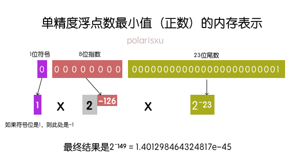

有了非规范化浮点数，IEEE754 就可以表示 0 了，但会存在 +0 和 -0：即所有位全是 0 时是 +0；符号位是 1，其他位是 0 时是 -0。

## 9、IEEE754 浮点数分类小结

至此，浮点数相关的知识就介绍差不多了。为了让大家对整体再有一个更好的掌握，对浮点数的分类进行一些总结。

从上面的讲解，IEEE754 浮点数，指数是关键，根据指数，将其分为：特殊值、非规范化浮点数和规范化浮点数。

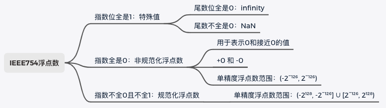

从上图规范化和非规范化浮点数的表示范围可以看出，两种类型的表示是具有连续性的。这也就是为什么非规范化浮点数指数规定为比规范形式的偏移值小 1（即单精度为 -126，双精度为 -2046）。

在数轴上，浮点数的分布：

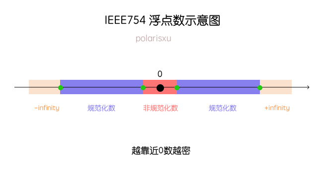

## 10、总结

《深入理解计算机系统》这本书在讲解浮点数时说：许多程序员认为浮点数没意思，往坏了说，深奥难懂。经过本文的四千多字图文并茂的方式讲解，如果你认真看完了，我相信你一定掌握了浮点数。

此外，还有其他一些知识点，比如浮点数的运算、不满足结合律、四舍但五不一定入等，有兴趣的可以查阅相关资料。

现在是时候回过头来看看开始的题目了，你都会了吗？

最后，建议你结合你熟悉的语言更进一步补充相关知识。比如 Go 语言的 math 标准库；Java 的 java.lang.Float/Double 等包。

## 参考资料或相关链接

- https://floating-point-gui.de/
- https://www.geeksforgeeks.org/ieee-standard-754-floating-point-numbers/
- https://baseconvert.com/
- 这个交互式工具，很不错：http://evanw.github.io/float-toy/
- https://bartaz.github.io/ieee754-visualization/
- 柴大：https://mp.weixin.qq.com/s/0lCte3UD5qYcaBnebwnYrQ
- 左神：https://mp.weixin.qq.com/s/QsEe34pcimNdqCb99h44cQ
- 图书《程序是怎样跑起来的》

