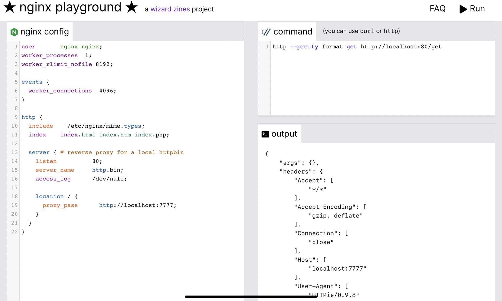

大家好，我是 polarisxu。

曾几何时，playground 似乎成了新语言的标配：Go 发布就带有 <https://play.golang.org/>，Rust 发布也有 <https://play.rust-lang.org/>。你想过 Nginx 也有一个 playground 吗？你可以通过它方便的测试 Nginx 配置。

今天发现，还真有一个，地址：<https://nginx-playground.wizardzines.com>。关键是，后端使用 Go 构建的。

以下是该网址的截图：



本文简单介绍下这个 playground。

## 01 如何使用

打开这个网站后，在左侧，你可以写 Nginx 配置，在右上角可以通过 curl 命令或 http 命令（这是 httpie）来向该 Nginx 实例发送 HTTP 请求。

然后点击右上角的“Run”，成功后，在右下角会输出：

1）如果 Nginx 启动成功，输出执行命令的结果；

2）如果 Nginx 无法启动（配置出错了），则会输出 Nginx 错误日志。

## 02 原理

这个网站使用的技术如下：

1）前端使用 vue.js 和 tailwind；

2）后端就一个 API endpoint，使用 Go 语言构建。它只做 1 件事，即运行 Nginx 配置。

后端的完整代码见这里：<https://gist.github.com/jvns/edf78e7775fea8888685a9a2956bc477>。

当你单击“Run”时，Go 后端会执行以下操作：

1. 将配置写入临时文件
2. 创建一个新的网络命名空间 ( `ip netns add $RANDOM_NAMESPACE_NAME`)
3. 在端口 777 上启动 [go-httpbin](https://github.com/mccutchen/go-httpbin)，以便可以在 nginx 配置中使用它作为 backend（如上面截图中的 proxy_pass 地址）
4. 启动 Nginx
5. 等待 100 毫秒以确保 nginx 启动完成，如果失败则将 nginx 的错误日志返回给客户端
6. 运行用户请求的命令（并确保命令以`curl`或开头`http`）
7. 返回命令的输出
8. 完毕

Go 后端一共 100 多行代码，逻辑处理代码 70 行左右，对实现感兴趣的可以读一下。

## 03 小结

这个网站的作者写了一篇文章介绍它，包括安全问题、性能问题等，有兴趣的可以查看：<https://jvns.ca/blog/2021/09/24/new-tool--an-nginx-playground/>。另外，还有一个 Nginx location match 测试的网址：<https://nginx.viraptor.info/>。

为了方便无法访问上面 Go 代码的同学，我将完整 Go 代码贴在下面：

```go
package main

import (
	"encoding/json"
	"fmt"
	"io/ioutil"
	"log"
	"math/rand"
	"net/http"
	"os"
	"os/exec"
	"strings"
	"syscall"
	"time"
)

type RunRequest struct {
	NginxConfig string `json:"nginx_config"`
	Command     string `json:"command"`
}

type RunResponse struct {
	Result string `json:"result"`
}

func main() {
	rand.Seed(time.Now().UnixNano())
	http.Handle("/", wrapLogger(Handler{runHandler}))
	log.Fatal(http.ListenAndServe(":8080", nil))
}

func runHandler(w http.ResponseWriter, r *http.Request) error {
	w.Header().Add("Access-Control-Allow-Origin", "*")
	w.Header().Add("Access-Control-Allow-Headers", "*")
	if r.Method != "POST" {
		// OPTIONS request
		return nil
	}
	body, err := ioutil.ReadAll(r.Body)
	if err != nil {
		return fmt.Errorf("failed to read body: %s", err)
	}
	var req RunRequest
	json.Unmarshal([]byte(body), &req)

	// write config
	file, err := os.CreateTemp("/tmp", "nginx_config")
	errorFile, err := os.CreateTemp("/tmp", "nginx_errors")
	if err != nil {
		return fmt.Errorf("failed to create temp file, %s", err)
	}
	file.WriteString(req.NginxConfig)
	file.Close()
	defer os.Remove(file.Name())
	defer os.Remove(errorFile.Name())

	// set up network namespace
	namespace := "ns_" + randSeq(16)
	if err := exec.Command("ip", "netns", "add", namespace).Run(); err != nil {
		return fmt.Errorf("failed to create network namespace: %s", err)
	}
	defer exec.Command("ip", "netns", "delete", namespace).Run()

	if err := exec.Command("ip", "netns", "exec", namespace, "ip", "link", "set", "dev", "lo", "up").Run(); err != nil {
		return fmt.Errorf("failed to create network namespace: %s", err)
	}

	// start httpbin
	httpbin_cmd := exec.Command("ip", "netns", "exec", namespace, "go-httpbin", "-port", "7777")
	if err := httpbin_cmd.Start(); err != nil {
		return fmt.Errorf("failed to start go-httpbin: %s", err)
	}
	defer kill(httpbin_cmd)

	// start nginx
	nginx_cmd := exec.Command("ip", "netns", "exec", namespace, "nginx", "-c", file.Name(), "-e", errorFile.Name(), "-g", "daemon off;")
	if err != nil {
		return fmt.Errorf("failed to get pipe: %s", err)
	}
	ch := make(chan error)
	go func() {
		ch <- nginx_cmd.Run()
	}()

	// Check for errors
	select {
	case <-ch:
		logs, _ := os.ReadFile(errorFile.Name())
		return fmt.Errorf("nginx failed to start. Error logs:\n\n %s", string(logs))
	case <-time.After(100 * time.Millisecond):
		defer term(nginx_cmd)
		break
	}

	// run curl
	curlArgs := strings.Split(strings.TrimSpace(req.Command), " ")
	if curlArgs[0] != "curl" && curlArgs[0] != "http" {
		return fmt.Errorf("command must start with 'curl' or 'http'")
	}
	curlCommand := append([]string{"netns", "exec", namespace}, curlArgs...)
	output, _ := exec.Command("ip", curlCommand...).CombinedOutput()

	// return response
	resp := RunResponse{
		Result: string(output),
	}
	response, err := json.Marshal(&resp)
	if err != nil {
		return fmt.Errorf("failed to marshal json, %s", err)
	}

	w.Header().Add("Content-Type", "application/json")
	w.Write(response)

	return nil
}

func wrapLogger(handler http.Handler) http.Handler {
	return http.HandlerFunc(func(w http.ResponseWriter, r *http.Request) {
		rw := &responseWrapper{w, 200}
		start := time.Now()
		handler.ServeHTTP(rw, r)
		elapsed := time.Since(start)
		log.Printf("%s %d %s %s %s", r.RemoteAddr, rw.status, r.Method, r.URL.Path, elapsed)
	})
}

func term(cmd *exec.Cmd) {
	if cmd.Process != nil {
		cmd.Process.Signal(syscall.SIGTERM)
	}
}
func kill(cmd *exec.Cmd) {
	if cmd.Process != nil {
		cmd.Process.Kill()
	}
}

var letters = []rune("abcdefghijklmnopqrstuvwxyzABCDEFGHIJKLMNOPQRSTUVWXYZ")

func randSeq(n int) string {
	b := make([]rune, n)
	for i := range b {
		b[i] = letters[rand.Intn(len(letters))]
	}
	return string(b)
}
```

