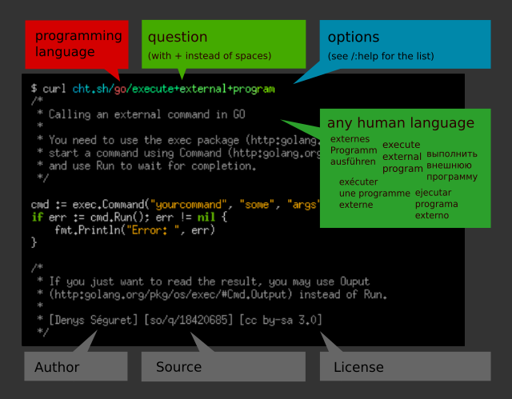
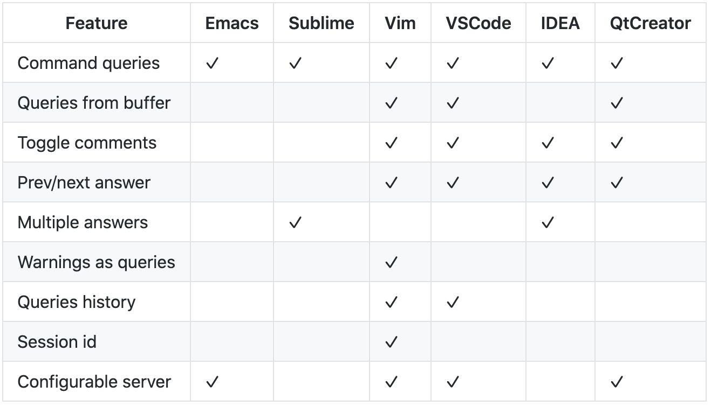
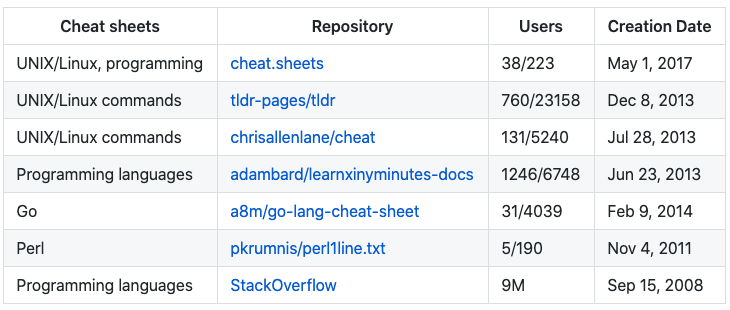
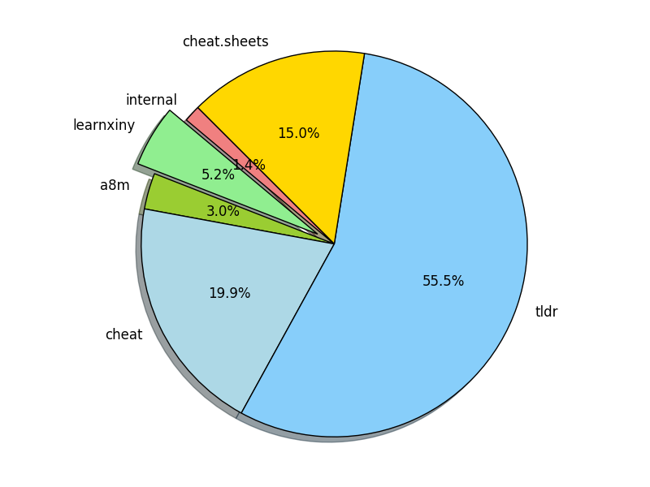

大家好，我是站长 polarisxu。

在逛 GitHub Trending 时看到了这个项目：<https://github.com/chubin/cheat.sh>，因为之前我整理过一系列 cheatsheet，因此好奇的打开了这个项目。于是被它吸引了。。。

## 01 是什么

该项目的描述是：

> the only cheat sheet you need

简单一句话却很吸引人：这么强大，这一个 cheatsheet 就够了？

因为在这一份清单中，包含了几乎所有开发者常见的东西，不仅如此，它还提供了很好的获取接口，让你轻松的找到你想要的。它是一个统一访问世界上最好的、社区驱动的备忘单（cheat sheet）存储库。

## 02 有什么

让我们想象一下，有一种理想的备忘单。看起来像什么？它应该具有什么功能？

- **简洁**—它只应包含你需要的东西，而不能包含其他任何东西；
- **快速**—想使用时就能立马使用；
- **全面**—它应该包含每个可能问题的答案；
- **通用**—它应该随处可用，无需任何准备；
- **不打扰**—它不应分散你的主要任务；
- **辅导**—它应该可以帮助你学习该主题；
- **不起眼**—完全可以忽略使用它；

作者认为 cheat.sh 做到了。我也认为做到了。

**那它具体有哪些特性呢？**

- 具有简单的 curl/browser 界面；
- 涵盖 56 种编程语言，若干 DBMS 和 1000 多种最重要的 UNIX/Linux 命令；
- 与 StackOverflow 一样，提供对世界上最好的社区驱动的备忘单存储库的访问；
- 随处可用，无需安装；
- 超快，通常会在 100 毫秒内返回答案；
- 有一个方便的命令行客户端 cht.sh，虽然不是必须的，但它非常有用且很有帮助；
- 可以直接从代码编辑器中使用，而无需打开浏览器并且不切换您的思维环境；
- 支持特殊的隐形模式，在这种模式下，无需触摸按键和发出声音即可完全隐身使用；

## 03 如何使用

使用 cheat.sh 有以下几种方式：（可以是 HTTP 或 HTTPS，也可以是 cheat.sh 或 cht.sh）

- 在终端使用 curl 工具；
- 使用其他 HTTP/HTTPS 客户端；
- 浏览器访问 cheat.sh；
- 终端使用 cht.sh 客户端；
- 在你的编辑器中集成；

一般建议通过 curl 工具、cht.sh 客户端或编辑器插件来使用。使用示例：

```bash
$ curl cheat.sh/tar
$ curl cht.sh/go
$ curl https://cheat.sh/php
$ curl https://cht.sh/redis
```

上面例子中，tar、go、php、redis 等可以是 Linux 命令，也可以是语言的命令等。

如果你记不起来命令准确名称，则可以使用 〜KEYWORD 表示法进行搜索。例如，查看如何制作文件系统/卷/其他内容的快照：

```bash
$ curl cht.sh/~snapshot
```

官方的一张图看看相关说明：



关于选项（options），可以通过 `/:help` 查看。对于开发来说，经常会加上 Q 选项，比如上面命令加上 Q 选项后的结果：

```bash
$ curl "http://cheat.sh/go/execute+external+program?Q"
cmd := exec.Command("yourcommand", "some", "args")
if err := cmd.Run(); err != nil {
    fmt.Println("Error: ", err)
}
```

关于更多使用在客户端工具 cht.sh 中介绍。

## 04 客户端工具 cht.sh

cheat.sh 服务有自己的命令行客户端（cht.sh），与使用 curl 直接查询该服务相比，它具有几个有用的功能：

- 特殊的 shell 模式，具有持久查询上下文和 readline 支持；
- 查询历史；
- 粘贴板整合；
- shell 的 tab 完成支持（bash、zsh、fish）；
- stealth 模式；

### 安装

```bash
mkdir -p ~/bin/
curl https://cht.sh/:cht.sh > ~/bin/cht.sh
chmod +x ~/bin/cht.sh
```

确保 cht.sh 在 PATH 中，方便使用。

shell 模式需要 rlwrap，这是 readline 的包装。Mac 下可以通过 brew install rlwrap 安装。

### 使用

有了 cht.sh，之前 curl 的方式可以用更自然的方式。比如：

```bash
$ cht.sh go execute external program
```

个人更推荐采用交互式 shell 模式：

```bash
$ cht.sh --shell [LANG]
```

其中 [LANG] 可以指定具体的编程语言，比如 go。

因此 cheat.sh 命令有两种上下文：特定语言和非特定语言（全局）。`:help` 在这两种上下文下显示的内容是不一样的。

- 在特定语言下，有 hello、`:list` 和 `:learn`，其中 `:learn` 是该语言的一个简短教程；
- 通过 `/` 可以切换上下文。比如：/go  表示在 go 这个语言上下文查找；/tar 表示在全局上下文查找 tar 命令；
- 查找当前所在语言的内容，直接查询即可，比如当前如果是 Go 上下文，直接输入 int，可以查看 int 类型的信息；

在交互式 shell 下通过 help 命令可以查看帮助：

```bash
cht.sh> help
help    - show this help
hush    - do not show the 'help' string at start anymore
cd LANG - change the language context
copy    - copy the last answer in the clipboard (aliases: yank, y, c)
ccopy   - copy the last answer w/o comments (cut comments; aliases: cc, Y, C)
exit    - exit the cheat shell (aliases: quit, ^D)
id [ID] - set/show an unique session id ("reset" to reset, "remove" to remove)
stealth - stealth mode (automatic queries for selected text)
update  - self update (only if the scriptfile is writeable)
version - show current cht.sh version
/:help  - service help
QUERY   - space separated query staring (examples are below)
              cht.sh> python zip list
              cht.sh/python> zip list
              cht.sh/go> /python zip list
```

其中 cd 用来切换语言上下文；copy 和 ccopy 用来复制内容。

### 定制

如果你想要定制 cht.sh，可以编辑文件：`~/.cht.sh/cht.sh.conf`。我觉得用默认即可。

## 05 编辑器集成

这方面对 Vim 的支持是最好的。见下图：



项目首页提供了这些编辑器对应的插件和配置、使用方法。请自行根据需要按照、配置。

## 06 搜索

cheat.sh 包含内容众多，方便的搜索是必不可少的。除了上文介绍的 ~KEYWORD 方式，还支持其他一些选项（辅助功能）。

```bash
i   case insensitive search
b   word boundaries
r   recursive search
```

比如：

```
/~shot/bi
```

## 07 实际用途

比如我想查询某们语言 MD5 怎么用？

**Go 语言**

```go
cht.sh>/go md5

/*
 * cryptography - How to get a MD5 hash from a string in Golang ...
 *
 * From crypto/md5 doc (http:golang.org/pkg/crypto/md5/#New):
 */

package main

import (
    "crypto/md5"
    "fmt"
    "io"
)

func main() {
    h := md5.New()
    io.WriteString(h, "The fog is getting thicker!")
    fmt.Printf("%x", h.Sum(nil))
}

// [Stephen Hsu] [so/q/2377881] [cc by-sa 3.0]
```

**PHP 语言**

```php
cht.sh>/php md5

/*
 * php - Using MD5 on login page
 *
 * Simply wrap $_POST['password'] into md5() like so:
 */

$mypassword = md5 ($_POST['password']);
```

**Java 语言**

```java
cht.sh>/java md5

/*
 * java - How can I generate an MD5 hash?
 *
 * The MessageDigest class can provide you with an instance of the MD5
 * digest.
 *
 * When working with strings and the crypto classes be sure to always
 * specify the encoding you want the byte representation in. If you just
 * use string.getBytes() it will use the platform default. (Not all
 * platforms use the same defaults)
 */

import java.security.*;

..

byte[] bytesOfMessage = yourString.getBytes("UTF-8");

MessageDigest md = MessageDigest.getInstance("MD5");
byte[] thedigest = md.digest(bytesOfMessage);

/*
 * If you have a lot of data take a look at the .update(byte[]) method
 * which can be called repeatedly. Then call .digest() to obtain the
 * resulting hash.
 *
 * [koregan] [so/q/415953] [cc by-sa 3.0]
```

再比如你需要反转一个数组，不知道怎么写，可以找 cheat.sh 帮忙：

```go
cht.sh> /go reverse list

/*
 * How do I reverse an array in Go?
 *
 * Honestly this one is simple enough that I'd just write it out like
 * this:
 */

package main

import "fmt"

func main() {

    s := []int{5, 2, 6, 3, 1, 4}

    for i, j := 0, len(s)-1; i < j; i, j = i+1, j-1 {
        s[i], s[j] = s[j], s[i]
    }

    fmt.Println(s)
}
```

## 08 数据来源

目前 cheat.sh 的数据来源如下：





你也可以为 cheat.sh 做贡献，输入 `:post` 看看。

## 09 总结

这个项目在 GitHub 近 21k Star，觉得不错可以点个 Star，让更多人知晓这个优秀的项目。希望它能够为你的工作带来便利，通过查这个手册，能够提升你的效率，同时增强你的能力。