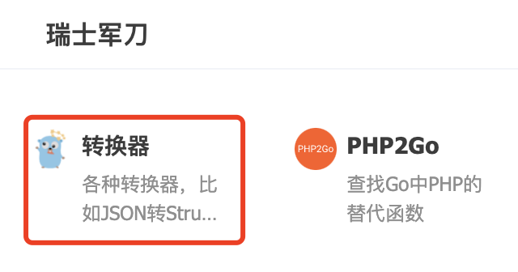
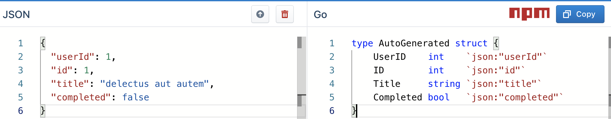
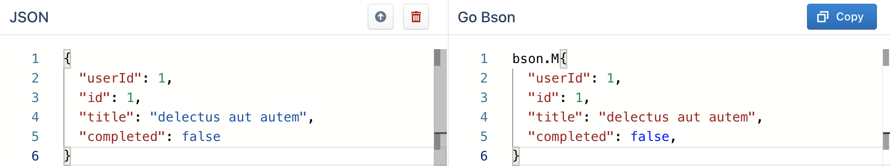
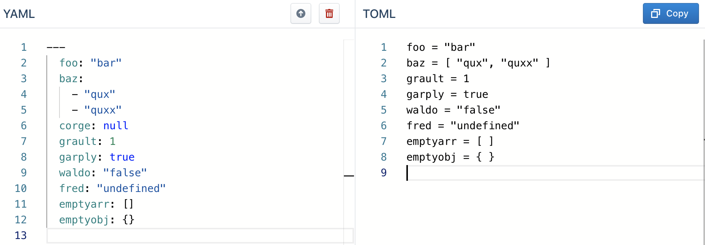

大家好，我是 polarisxu。

上次推荐的 「Go网址导航」，其中收录了一项：转换器。

网址是：<https://transform.tools/>。

这是一个开源项目，项目地址：<https://github.com/ritz078/transform>，目前 Star 数 2.8k+。

这个网站将转换工具分成了几类：

- SVG
- HTML
- JSON
- JSON Schema
- CSS
- JavaScript
- GraphQL
- JSON-LD
- TypeScript
- Flow
- Others

其中有一些对 Gopher 比较有用，这里简单列举介绍下。

## 01 Go 相关

JSON 几乎每个程序员都会用到。在 Go 语言中，会有哪些场景会用到这里 JSON 相关工具呢？

**1）转为 struct**

这是一个很常见的场景，目前也存在很多在线工具，支持 JSON 转为 struct，而且我没记错的话，GoLand 自带将 JSON 转为 struct。

transform 里也有这样的工具：<https://transform.tools/json-to-go>

在左边改动 JSON，右边会实时显示出对应的 struct。

此外，顶部的向上箭头，是导入文件，支持从本地导入和远程 URL 导入。

**2）转为 BSON**

如果你存储使用的是 MongoDB，会使用到 BSON。不过 JSON 到 BSON 转换几乎不太需要借助工具。

> BSON 是一种类 JSON 的一种二进制形式的存储格式，简称 Binary JSON，它和 JSON 一样，支持内嵌的文档对象和数组对象，但是 BSON 有 JSON 没有的一些数据类型，如 Date 和 BinData 类型。BSON 可以做为网络数据交换的一种存储形式，这个有点类似于 Google 的 Protocol Buffer，但是 BSON 是一种 schema-less 的存储形式，它的优点是灵活性高，但它的缺点是空间利用率不是很理想，BSON有 三个特点：轻量性、可遍历性、高效性。

所以，BSON 看起来和 JSON 是一样的。

## 02 其他配置文件相关

目前常用的配置文件有：yaml、toml、json、xml 等，它们直接是可以直接转换的。这个网站就提供了相关工具，将一种格式转为另一种格式。

比如讲 yaml 转为 toml（我喜欢的文件类型）：

## 03 总结

好的工具可以提升开发速度，我们要善于使用工具。当然，有能力，你也可以自己生产工具。有好工具记得分享，让更多人知晓、使用。