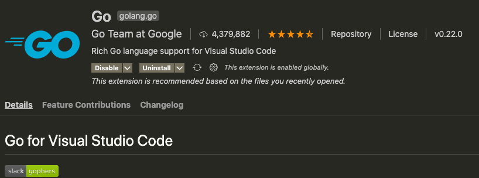
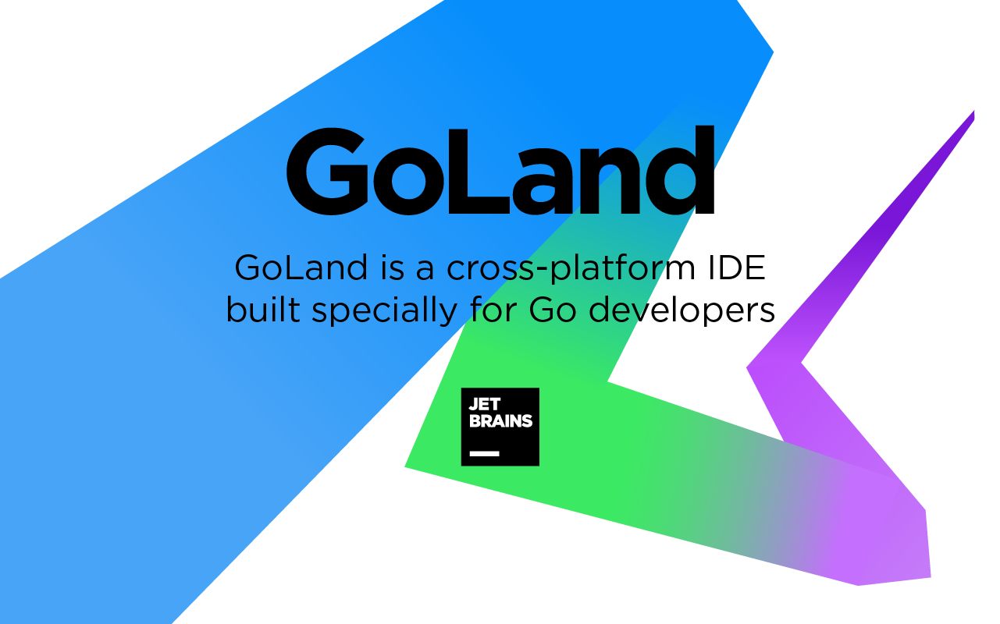
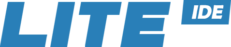
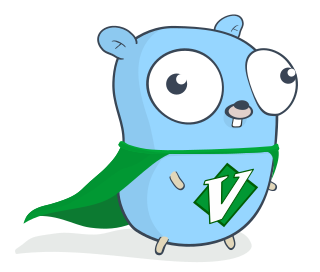
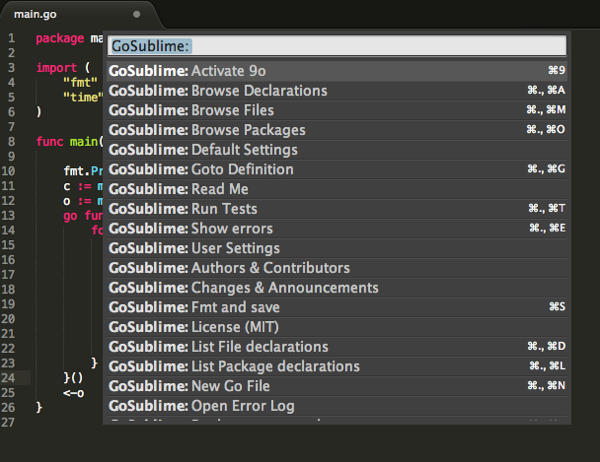
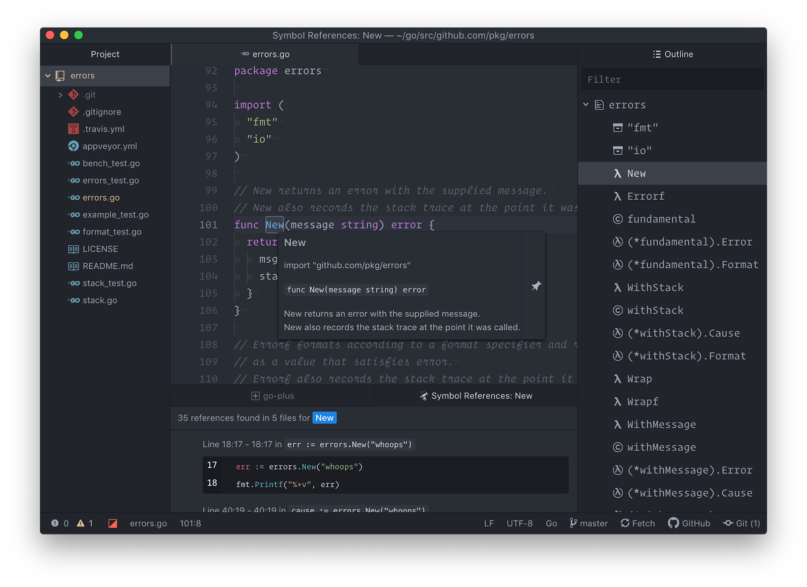
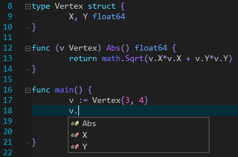

> 声明：这里的 IDE 包括普通的文本编辑器和真正的 IDE。或者应该叫做开发工具。

这个 Top 排行，没有直接数据支持，凭直觉的，哈哈哈哈哈。（其实也结合了部分网上资料，比如 2019 年官方的调查结果）。

## 1、VSCode

这是微软出品的，超级棒的文本编辑器。我出过 [VSCode 系列相关教程](https://mp.weixin.qq.com/s/twGr49fAqRG8UguZ_9TiiA)，目前我主要使用 VSCode 进行开发。VSCode 本身不是专门针对 Go 的编辑器，所以需要通过插件来支持 Go，这就是 Go for Visual Studio Code 插件，前些天更新到了 v0.22.0，默认启用了 gopls。关于什么是 gopls，可以参考我写的[这篇文章](https://mp.weixin.qq.com/s/vMWvSs2h3LwpghS27VQ9rg)。

注意，目前该插件是 Go Team 维护的。官方支持，值得拥有！

有了 gopls，VSCode 写 Go 代码的感觉特别棒，我认为一定程度上可以媲美 GoLand，而且它是开源免费的呢。

## 2、GoLand

JetBrains 以 Intellij IDEA 和针对特定语言的 IDE 而闻名。而 GoLand 是为 Go 开发者提供的 JetBrains 解决方案。

GoLand 是一个专门为 Go 开发者构建的跨平台 IDE。它是一个商业 IDE，也就是要钱的，不过正因为要钱，它的功能特别强大。

比如有动态错误检测和修复建议、一步撤销重构、智能代码完成、未使用代码检测和文档提示等。

此外，它还具有强大的调试功能，用户友好的代码导航，以及对 Git、GitHub 和 Mercurial 开箱即用的支持。

目前个人用户第一年 89 美金，后续续费会便宜些。

可能很多人抱怨贵，但 JetBrains 还是很不错的，如果你有开源项目，可以申请免费 Licence；如果你是学生，也可以申请。

## 3、LiteIDE

有些人可能不知道这款 IDE，这是国人开发的，专门为 Go 语言打造的 IDE。在 2012 年我刚接触 Go 语言时，这款 IDE 就跟着出现了。

官方的介绍：这是一款简单，开源，跨平台的 Go IDE，主页地址：<http://liteide.org>。

因为 LiteIDE 是为 Go 设计的，所以它为开发者提供了许多开箱即用的有用特性。其中包括可配置的构建命令、高级代码编辑器、代码管理、gdb 和 Delve 调试器支持、自动完成和 WordApi 主题化、基于 MIME 类型的系统等等。

作者是七叶，更新很积极，应该拥有一批忠实的用户。

## 4、Vim

作为编辑器之神，自然会支持 Go，这是通过 [vim-go](https://github.com/fatih/vim-go) 这个插件实现的。

vim-go 插件是免费的，易于安装，维护良好，经常在 Github 上更新。安装后，vim-go 将为你的 Vim 文本编辑器配备 Go 包编译、折叠和语法高亮显示、集成的 delve 支持，以及在用 Golang 编写应用程序时可能需要的其他功能，Vim 可扩展性特别强。

此外，作者维护了较好的[文档](https://github.com/fatih/vim-go/wiki)，有问题可以得到较好的支持。

## 5、Sublime Text

曾经 Sublime Text 风光无限，自从 VSCode 出来后，受到了极大的冲击。如果你是 Sublime Text 爱好者，通过 GoSublime 插件可以进行 Go 开发。

值得注意的是，你可能需要一些额外的插件来充分发挥 Sublime Text 作为 Go IDE 的作用。比如 [Golang Build package](https://github.com/golang/sublime-build)，它是用于 Go Build 系统集成的官方 Sublime Text package。

## 6、Atom

这是 GitHub 出品的。它是一个轻量级框架，通过大量插件，来丰富其功能。

如果你是 Atom 的爱好者，可以通过 [Go-plus](https://atom.io/packages/go-plus) 插件来支持 Go 开发。

该插件提供了构建流程、lints、vet 和覆盖测试等工具。此外还有自动完成、格式化、测试和文档功能。

## 总结

除了上面介绍的 6 款（它们都是跨平台的），在[这篇文章](https://blog.codota.com/top-7-golang-ides-for-go-developers/)看到了另外一款：[Zeus IDE](https://www.zeusedit.com/languages/go.html)。这个国内应该很多人都没听过，这是 Windows 上的一款 IDE，Windows 的用户可以试试。

注意，Eclipse 上的 Go 插件已经不维护了，所以大家别用 Eclipse 开发 Go 了。

最后问一句，有人使用 Emacs 开发 Go 吗？
