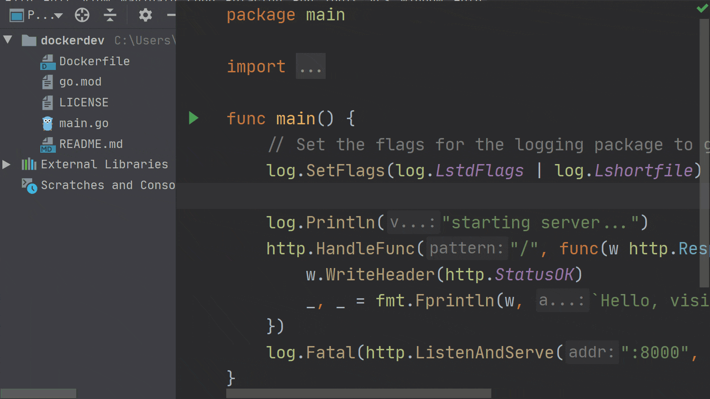

今天，我们开始撰写一系列有关 GoLand 内部对 Docker，Docker Compose 和 Kubernetes 的支持以及它如何帮助我们在 Go 中编写（微）服务的文章。

我们将研究如何在 IDE 中配置项目，如何使用 Docker 或 Kubernetes 运行或调试我们的项目，以及如何将项目连接到我们选择的数据库 PostgreSQL。

让我们从介绍普通的 Docker 工作流程开始，然后我们将构建容器并运行它。

在继续之前，我们需要 GoLand 2020.1.1 或更高版本，该版本带有最新的 Docker 插件。我们还需要一个相当现代的 Docker 版本，例如 17.06 或更高版本。注意：虽然旧版本的 IDE 在一定程度上可以使用，但是本文使用了新功能，并且 IDE 的外观可能有所不同。

## 项目设置

让我们开始设置我们的项目。

我们可以创建一个新的 Go Modules 项目，也可以使用现有的项目。

项目结构应类似于此仓库中的结构：<https://github.com/dlsniper/dockerdev>。

本教程不会介绍如何为你的系统安装和配置 Docker。

相反，我们将从配置 Docker 服务器开始，以便我们可以运行我们的应用程序。将 Docker 安装到系统中后，转到 `Settings/Preferences | Build, Execution, Deployment | Docker`，然后单击 + 按钮添加新的 Docker 服务器连接。

默认情况下，该插件将创建与本地计算机 Docker 服务器的连接，对于我们的教程而言已经足够了。单击确定按钮以创建服务器配置。



## 使用 Dockerfile

首先，让我们在项目的根目录中打开 Dockerfile。

```dockefile
# Compile stage
FROM golang:1.13.8 AS build-env
 
ADD . /dockerdev
WORKDIR /dockerdev
 
RUN go build -o /server
 
# Final stage
FROM debian:buster
 
EXPOSE 8000
 
WORKDIR /
COPY --from=build-env /server /
 
CMD ["/server"]
```

该 Dockerfile 使用多阶段构建，该方式使我们能够生成最小的 Docker 映像，因为构建应用程序二进制文件的编译阶段与构建容器的最终阶段是分开的。

将上面的代码粘贴到 Dockerfile 中后，第一个 `FROM […]` 指令旁边会出现一个绿色箭头。这是运行容器的最快方法。

但是，我们需要进行一些编辑才能运行它，因为我们需要为容器公开正确的端口以接收连接。


## 为容器创建一个新的运行配置

我们可以创建一个新的运行配置，也可以编辑仓库中存在的配置。为了简单起见，直接使用现有的，因为它已经预先填写了我们需要的所有值。要对其进行编辑，请单击选项列表底部的 `Edit ‘Docker – Web – Standalone’ ` 选项。

在这里，我们可以设置运行 Docker 容器所需的所有选项。我们的运行配置已经填上了重要内容，例如配置名称：“ Docker – Web Dev – Standalone”。容器名称设置为 docker-web-dev-standalone。最后，在“绑定端口”字段中，我们将“主机”端口和“容器”端口都设置为 8000，以便可以访问应用程序。


现在，我们可以单击对话框底部的 “Run” 按钮，来启动我们的容器。

## 了解服务工具窗口

Docker 完成构建过程后，我们可以查看 “Services Tool Window” 窗口，并在 “Containers” 部分中看到新创建的容器。我们还将在 “Images” 部分中看到使用的镜像。

对于每个容器，有以下可用选项卡：

- Build Log：它显示用于构建容器的日志；
- Log：显示容器的输出；
- Attached console：如果可以的话，这允许我们与容器的应用程序/shell 交互；
- Properties：将显示有关容器的更多信息，例如 镜像 ID 或容器 ID；
- Environment variables：显示容器使用的环境变量；
- Port bindings：显示容器暴露给主机的所有端口；
- Volume bindings：显示为容器安装的卷；
- Files：如果它支持运行 ls 命令，则允许我们浏览容器中的文件。对于像我们这样的基于 Alpine 的容器，我们可以添加 RUN apk add --no-cache coreutils 指令来启用此功能；


在左侧，我们可以看到各种按钮。首先，有一个 “Redeploy” 按钮，它使我们可以再次运行容器的构建配置。

还有 “Edit Configuration” 按钮，可用于对容器的 “Run Configuration” 进行任何调整。

最后， “Start/Stop” 按钮，用于启动或停止容器，以及 “Delete” 按钮，用于删除容器。


容器上的右键单击操作可以访问一些其他有用的功能。我们可以使用 List Processes 看到正在运行的进程的列表，也可以使用 Exec 在正在运行的容器中执行命令。最后，Inspect 将提供有关容器及其当前配置的更多信息。


**Pro tip**：如果将鼠标悬停在容器名称上，则可以看到容器的正常运行时间。

**Pro tip**：要加快容器的构建速度，请使用 Go vendoring mode。在 IDE 终端中运行 go mod vendor 命令可确保 IDE 自动选择 vendor 文件夹。为此，您还需要在容器的环境变量列表中添加 `GOFLAGS ="-mod = vendor"`。

## 总结

我们讨论了如何创建和运行 Docker 配置。在下一篇文章中，我们将介绍如何调试 Docker 中的应用程序。

> 原文链接：https://blog.jetbrains.com/go/2020/05/04/go-development-with-docker-containers/
>
> 作者：Florin Pățan
>
> 翻译：Go语言中文网 polaris

