这是 2020 年第 3 个版本，也是最后一个版本。在 GoLand 2020.3 中，您可以探索 goroutines dumps，运行并导航到单个表测试（table tests），并从对 Testify 测试框架的扩展支持中获得更多信息。你还将发现许多新的代码编辑功能，包括对 time 包的支持，更智能的处理包方法，UI 改进，用于 Web 开发和使用数据库的各种新功能以及用于协作开发和结对编程的新服务。具体看看有哪些新特性。

## 01 调试器改进

### Dump Goroutines

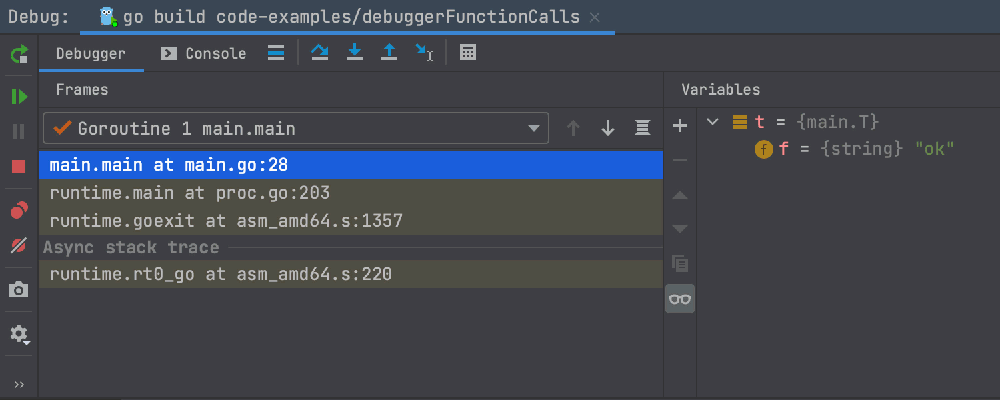

调试器中新的转储 Goroutines（Dump Goroutines） 图标使您可以在调试会话期间轻松地在堆栈中查找包含指定字符串的 goroutine。只需单击该图标即可在单独的窗口中打开转储。

为了帮助您始终关注重要信息，可以选择隐藏单个goroutine或具有相同堆栈的goroutine。右键单击goroutine，然后选择所需的操作，或按Delete键将其移至转储窗口中的特殊“隐藏”部分，这样不会分散您的注意力。

### Go Remote configuration

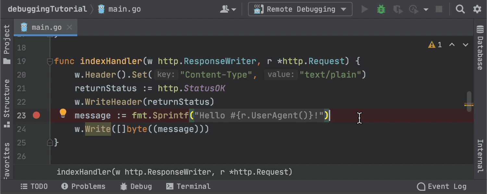

如果不需要重新连接，GoLand 2020.3可以通过 Go Remote 配置停止进程。

在配置设置中，您可以指定断开连接时调试器的默认行为，可以选择 “Stop remote Delve processes”，“使其保持运行状态”或让 GoLand 每次询问您如何继续。

## 02 测试增强

### 支持 table tests

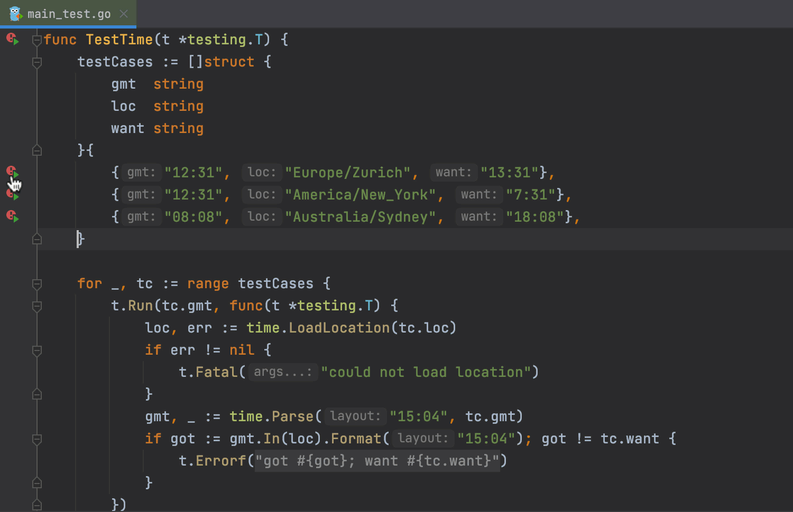

您可以从 “Run” 工具窗口运行并导航到表测试。

有一些限制：

- 测试数据变量必须是切片，数组或 map。它必须在与调用相同的函数中定义，并且在初始化后不得修改（for 循环中的 range 子句除外）。
- 各个测试数据条目必须是结构体字面值。调用前不得使用子测试名称表达式中使用的循环变量。
- 子测试名称表达式可以是测试数据中的字符串字段，测试数据字符串字段的连接以及带有 ％s 和 ％d 动词的fmt.Sprintf() 调用。

### 扩展了对 Testify 的支持

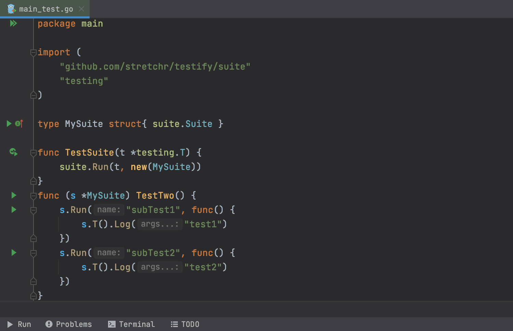

现在，IDE 可以识别启动测试套件的测试功能，并提供一种启动单个 suite.Run 和 suite.T().Run，只要子测试名称是字符串常量即可。另外，可以从“Run”工具窗口重新运行子测试，以避免重新运行整个顶级测试。

此外，GoLand 现在可以在一个测试用例中使用相同的方法名称分别运行 Testify 套件。

最后但并非最不重要的一点是，当您准备写测试函数时（testing.T 作为第一个参数），GoLand 会在可能的情况下自动传递该参数。这适用于 testify/assert，testify/require，testify/mock 和 testify/suite 包。

## 03 代码检查

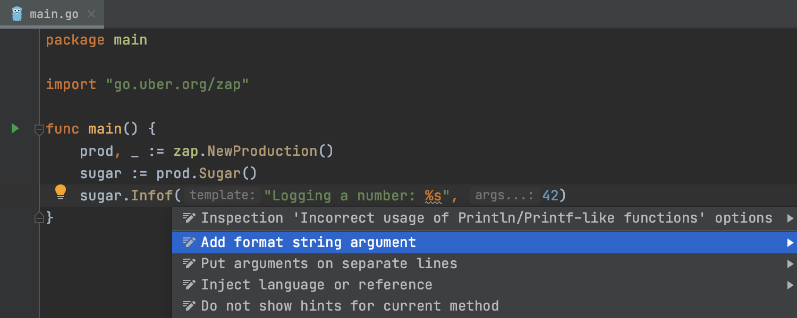

不正确使用类似 Println/Printf 的函数，GoLand 会有警告，之前只对标准库起作用，现在支持 github.com/pkg/errors, github.com/sirupsen/logrus 和 go.uber.org/zap 包。

最重要的是，我们添加了占位符突出显示和折叠，以及添加格式字符串参数的意图。

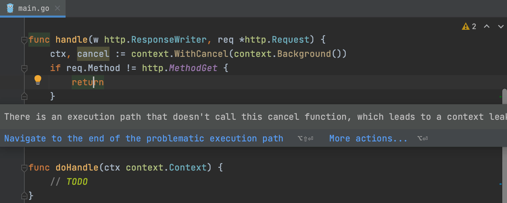

context.CancelFunc（不称为代码检查）报告了 context 取消的潜在不安全使用。当 context 返回的 “cancel” 函数未在所有执行路径上调用时，此功能特别有用。

更多细节可以查看标准库文档：<https://docs.studygolang.com/pkg/context>。

## 04 代码编辑

### time 包的支持

> Go 语言中文网注：Go 中的时间格式化和其他语言不一样，其他语言都是使用 YYYY、MM、dd 等，而 Go 使用魔法数字：2006-01-02 15:04:05 这样的固定时间。有些人可能记不住或习惯其他语言的格式。GoLand 2020.3 做了这样的转换，见下图。

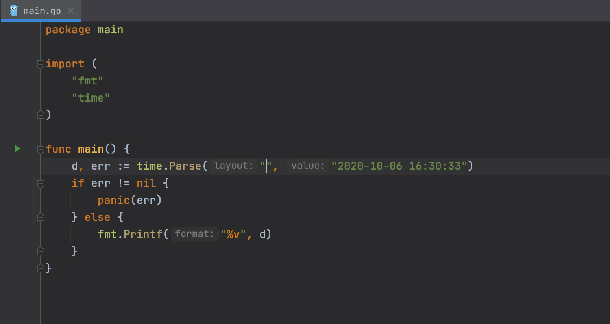

我们增加了对 time 包的支持，因此您可以更轻松地使用 time 和 duration。 GoLand 将通过代码补全（⌃Space）建议使用 ISO-8601 中 YYYY，MM，DD 占位符的预定义 Layout。

在某个 token 上按 ⌘P，IDE 将显示其含义。Layout 标记也有语法突出显示。代码完成还建议在字符串文字之外的标准时间 Layout。

### 更智能的包处理

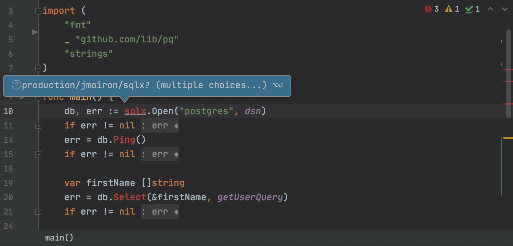

现在，IDE 可以更聪明地为您经常使用的包的提示项配置优先级，这些包是在项目的 go.mod 文件中明确声明的。

我们还添加了一个选项，可将包从项目导入路径和完成建议中完全排除。您可以通过 Alt + Enter 或在排除窗口中执行此操作。

### 支持变量 shadowing

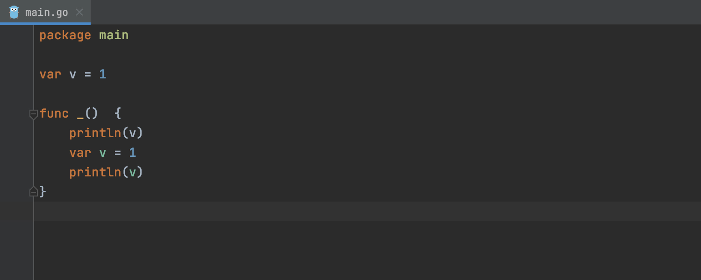

GoLang 可以更轻松地发现变量 shadowing。

- IDE 显示的变量现在可以用不同的颜色区分 shadowing 变量。
- 导航到 shadowing 声明意图操作，使您可以立即切换到 shadowing 声明。

### 类型参数中的方括号

我们跟踪了 Go 小组对 [泛型](https://groups.google.com/g/golang-nuts/c/iAD0NBz3DYw?pli=1) 的更新，并增加了对泛型语法方括号的支持。

请注意，Settings | Go 中的 “*Enable generics (experimental support for type parameters)* ” 默认情况下处于关闭状态。您需要明确选择该复选框才能开始使用该功能。

更多关于该功能的信息可以[查看该文章](https://blog.jetbrains.com/go/2020/11/24/experimenting-with-go-type-parameters-generics-in-goland/)。

## 05 其他改进

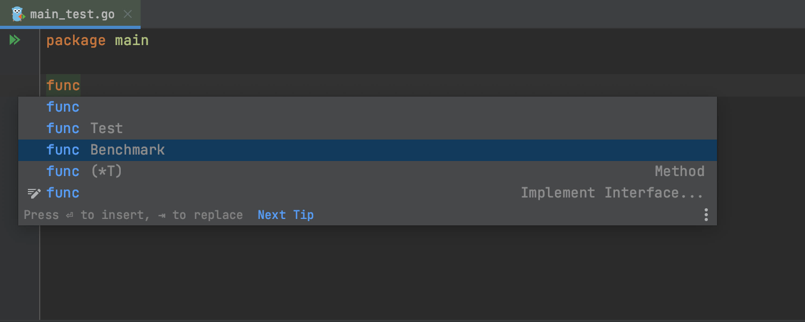

在测试文件中键入 func 时，默认情况下，GoLand 会提示出 bench 和 test 函数模板。

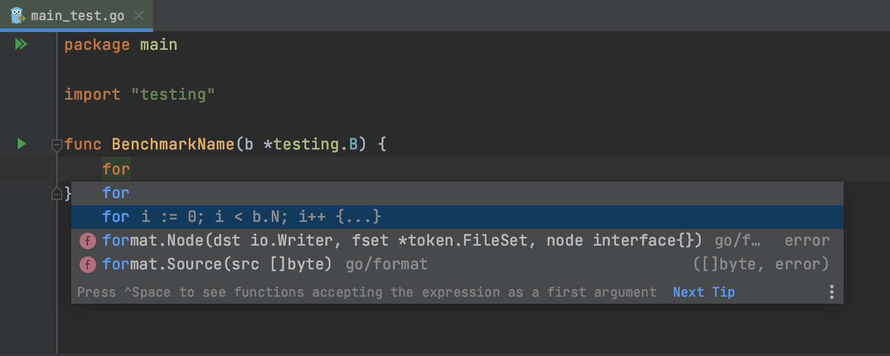

当您在基准测试中输入 for 时，IDE 建议使用 b.N 的 for 循环来完成它。

### 改进了拼写和语法检查器

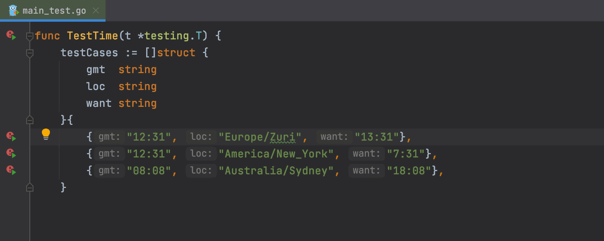

现在，当您按 Alt + Enter 时，建议会立即显示在对话框中。此外，新版本的 LanguageTool 语法检查引擎还改进了英语检查功能，并增加了对 10 种其他语言的支持。

## 06 和我编码（结对编程）

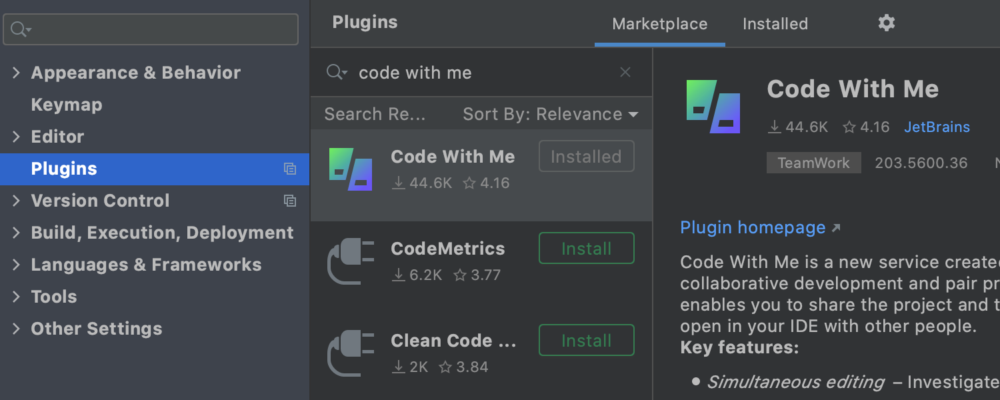

GoLand 2020.3 支持 Code With Me（EAP），这是 JetBrains 的一项新服务，用于协作开发和结对编程。与我一起编写代码使您可以与他人共享您当前在 IDE中 打开的项目，并实时进行协作。

关于该功能的更多信息请查看[这篇文章](https://blog.jetbrains.com/tag/codewithme/)。

## 07 其他

其他的改进有：

- UI 改进；
- VSC 更新；
- Web 开发增强；
- 对数据库支持增强；

关于这块的详细信息可以到[这里查看](https://www.jetbrains.com/go/promo/whatsnew/)。

## 08 总结

GoLand 是一个收费软件，可以试用 30 天。如果觉得不错，欢迎支持！当然免费的 VSCode 也香，对吧！
