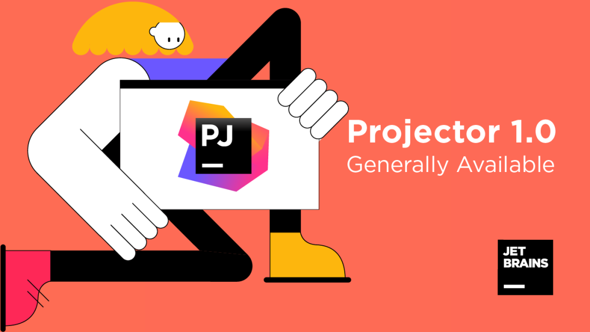
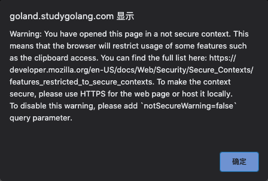
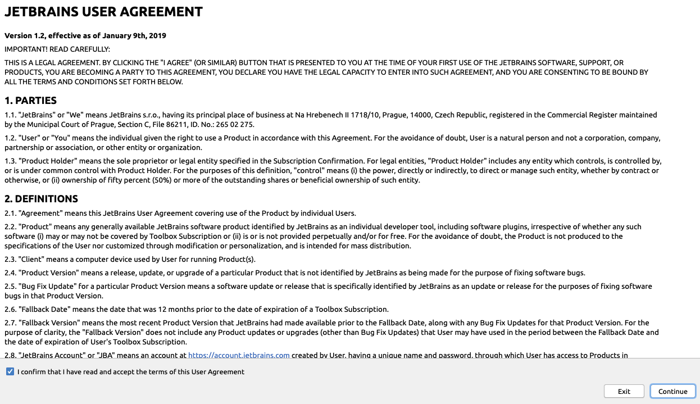
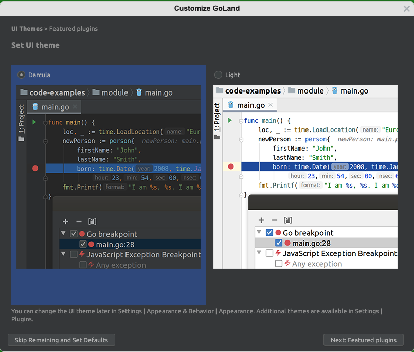
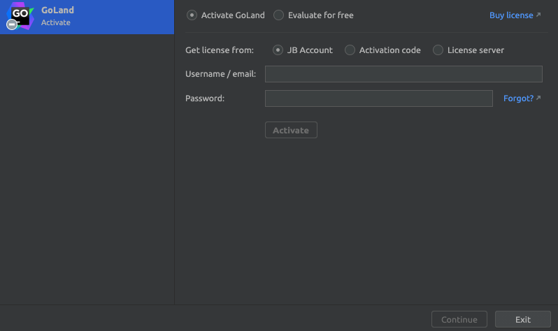
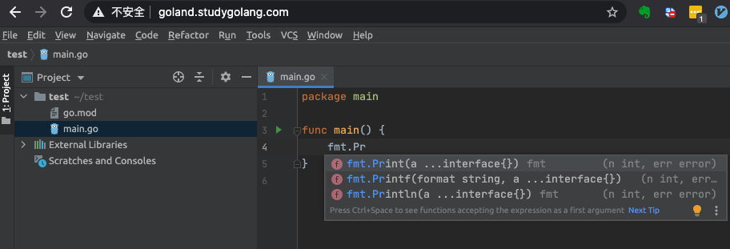
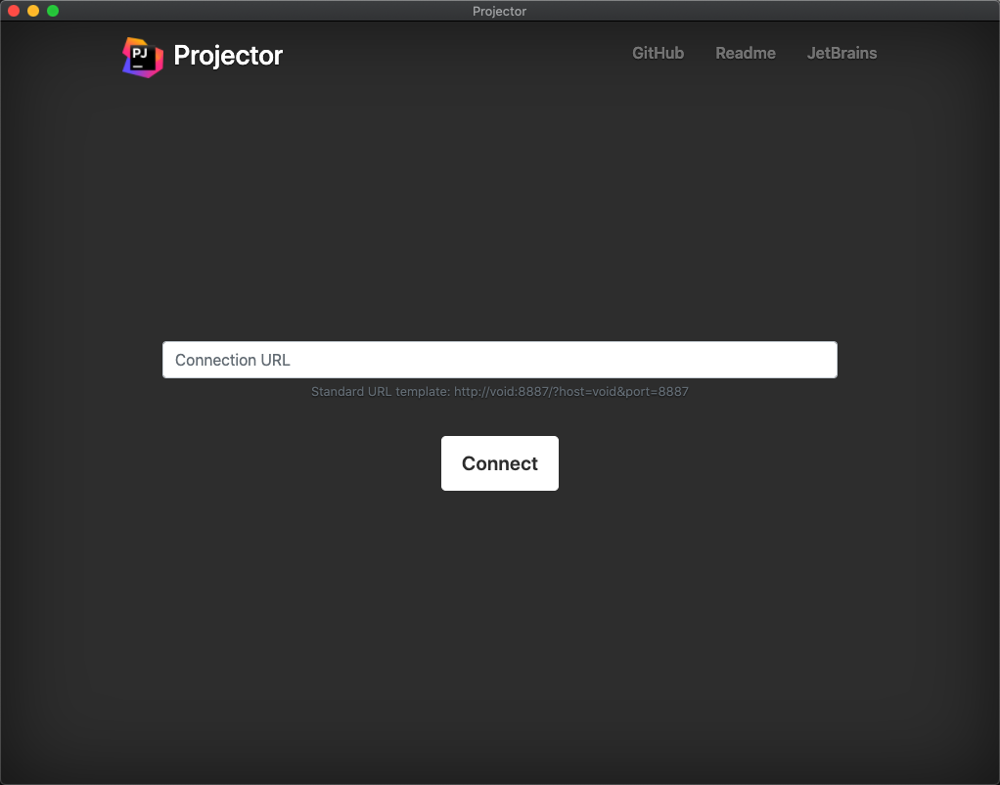
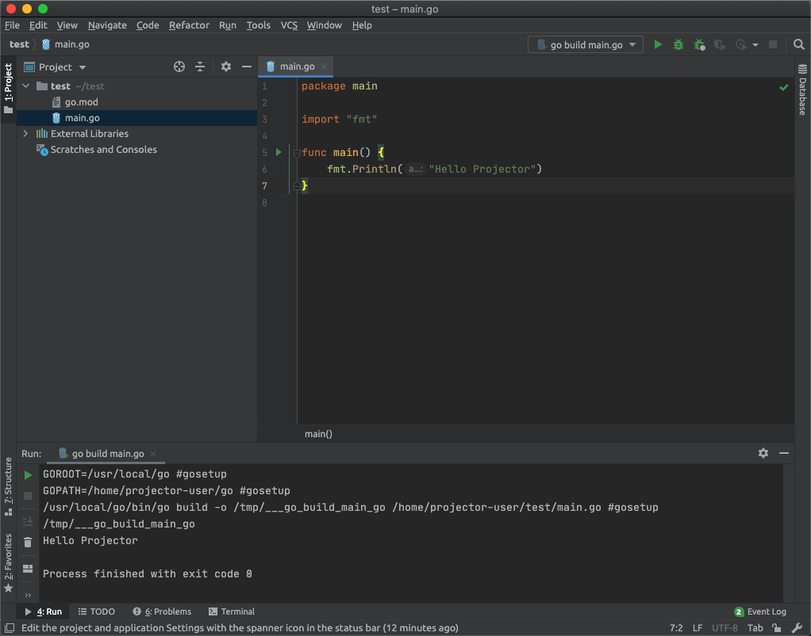

大家好，我是站长 polarisxu。

JetBrains 官方今天发了一篇文章：[《使用 Projector 远程访问 IDE》](https://mp.weixin.qq.com/s/cb8lHQlctpbFTrPKW5YCFA)，了解到 JetBrains 搞了一个远程开发 IDE。很多人知道 VSCode 可以进行远程开发，现在 JetBrains 系列 IDE 也支持了（自然 GoLand 也支持），于是安装试用了下，给大家做一个汇报。

## 01 Projector 是什么

Projector 是一种远程运行和访问 Swing GUI 应用程序的技术（Swing 是 Java 的 GUI API，JetBrains 系列 IDE 都是使用 Swing 绘制的 UI），目前 1.0 版本可用，不过还是预览版（初始版本）。



也就是说，Projector  可以通过网络远程运行 JetBrains IDE 和 Swing 应用。

Projector 还是一种自托管技术，可在服务器上运行基于 IntelliJ 的 IDE 和基于 Swing 的应用，让您可以使用浏览器和本机应用从任何位置进行访问。

为什么要开发 Projector 呢？官方解释，在有些特殊情况下，比如瘦客户端，需要采用特殊的方法。具体来说有如下应用场景：

- 高度安全的企业环境。
- 真正的大型项目。
- 禁止源代码本地复制。
- 用户硬件约束。
- 瘦客户端。
- 需要在 Windows 机器甚至是 ChromeOS 等非传统操作系统上的 GNU/Linux 环境中运行 IDE。
- 需要在关闭计算机后让应用在服务器上继续运行。
- 远程调试服务器端（devtest、devprod）。
- 具有调试源和预配置 IDE 的 VM 或 Docker 映像。
- 需要远程访问的配置。

可见，有些时候如果能远程开发，确实还挺方便的。

注意，Projector 目前不支持协作开发。

特别值得一提的是，Projector 是开源的，它采用 C-S 架构（其实也支持 B-S 架构），IDE 运行在服务器，客户端通过网络链接到服务器上的 IDE，有点远程桌面的感觉。

因此，Projector 至少包含两部分：

- 服务端，即 projector-server，地址：<https://github.com/JetBrains/projector-server>
- 客户端，即 projector-client，地址：<https://github.com/JetBrains/projector-client>

现在是容器时代，为了方便，官方提供了 Server 的 Docker 版本，地址：<https://github.com/JetBrains/projector-docker>，我试用就基于 Docker 进行的。

## 02 安装

关于服务器端安装有多种方式，但这里我只介绍我采用的基于 Docker 的方式。毕竟 Docker 是在云环境中运行 Projector 的最简单的方法。

官方构建好了可以直接使用的镜像，不过没有发布到 DockerHub，而是使用自定义 Docker Registry。因为我使用 GoLand，所以执行如下命令：（记得先安装好 Docker）

```bash
$ docker pull registry.jetbrains.team/p/prj/containers/projector-goland
```

其他 IDE 怎么安装，官方在 GitHub 上有列出：

```bash
docker pull registry.jetbrains.team/p/prj/containers/projector-clion
docker pull registry.jetbrains.team/p/prj/containers/projector-datagrip
docker pull registry.jetbrains.team/p/prj/containers/projector-goland
docker pull registry.jetbrains.team/p/prj/containers/projector-idea-c
docker pull registry.jetbrains.team/p/prj/containers/projector-idea-u
docker pull registry.jetbrains.team/p/prj/containers/projector-phpstorm
docker pull registry.jetbrains.team/p/prj/containers/projector-pycharm-c
docker pull registry.jetbrains.team/p/prj/containers/projector-pycharm-p
docker pull registry.jetbrains.team/p/prj/containers/projector-webstorm
```

安装完成后，可以通过下面命令运行 Server：

```bash
docker run --rm -p 8887:8887 -it registry.jetbrains.team/p/prj/containers/projector-goland
```

打开浏览器，访问 `http://localhost:8887/` 即可试用了。这是将 Server 安装在了本地，如果将 Server 安装在性能更好的服务器上，该怎么访问呢？

简单的，可以通过 Nginx 做反向代理，配置好域名。我进行了相关尝试，将 Server 安装在 Linux 服务器，本地使用 Mac。Nginx 的配置如下：

```nginx
server {
        listen 80;
        server_name goland.studygolang.com;

        location / {
                proxy_pass http://127.0.0.1:8887;#必须
                proxy_set_header X-Real-IP $remote_addr;
                proxy_set_header Host $host;
                proxy_set_header X-Forwarded-For $proxy_add_x_forwarded_for;
                proxy_http_version 1.1;#必须
                proxy_set_header Upgrade $http_upgrade;#必须
                proxy_set_header Connection "upgrade";#必须
                proxy_send_timeout 30s;#send 超时时间 记得一定要按需配置这个 否则默认60s就断开了
                proxy_read_timeout 30s;#read 超时时间
        }
}
```

- server_name 可以随便配置一个，但不进行实际的解析，而是在本地配置 host；
- 因为和服务器通讯使用的是 WebSocket，因此需要做 WebSocket 的代理；

关于安全问题，可以在 <https://github.com/JetBrains/projector-docker#faq> 查看，因为我只是试用，所以没有考虑安全问题。

这样在本地通过 `http://goland.studygolang.com` 就可以打开 GoLand IDE 了。

## 03 试用

浏览器打开后，会出现如下安全提示，点击确认即可。



等待链接建立后，出现用户须知：



勾选后，继续。接着提示你是否发送给它们统计数据，你决定即可。

之后出现这个定制界面，默认选中暗黑模式，你可以选择左下角跳过，保留默认。



最开始，我以为这种方式可以免费使用 GoLand 了，当看到这一步，嗯，我想多了：



这里我们选择免费试用，可以试用 30 天。

接下来的步骤和原生版本的 GoLand 是一样的。

不过有一点尴尬的是，这个镜像中并没有安装 Go，怎么办？我目前的办法是通过 Docker 和宿主机进行目录映射，使用宿主机上的 Go，即这样启动 Docker：

```bash
$ docker run --rm -p 8887:8887 -it -v xxx:/usr/local/go  registry.jetbrains.team/p/prj/containers/projector-goland
```

其中，-v 后面的 xxx 替换为宿主机上的 Go 安装目录，重启启动后，配置好 GOROOT（选择 /usr/local/go），可以正常写代码了：



然后可以运行、调试了。

不过浏览器使用感觉不是太爽，官方还提供了原生客户端，即上面说的 client，我们通过这个地址下载一个：<https://github.com/JetBrains/projector-client/releases/tag/launcher-v1.0.1>，记得选择适合你操作系统的版本。

安装启动后，长这样：



就是一个空壳子。跟浏览器中类似，我们输入地址，然后 Connect。之后的过程和浏览器是一样的。

如果之前在浏览器打开过，这个客户端会直接记忆上次的位置，而不是第一次访问的那些界面，现在看起来是不是跟本地的 GoLand 差不多了：



## 04 感受

试用后，感觉目前还不是太成熟：

- 启动时，有时候会莫名报错，需要重新运行 Server；
- 用起来不是很流畅；
- Mac 下，没有应用全局菜单，设置在 File 菜单下；而且 Command 相关快捷键没作用，必须改用 Control，这会很不习惯；

也许还有其他问题，我没有深入使用，毕竟使用起来体验不太好。

不过，JetBrains 说 Projector 是一种技术，而不是最终用户解决方案。你可以使用它来自定义架构，满足您的业务需求。Ansible？Kubernetes？都是没有问题的。

Projector 毕竟刚起步，是一项非常年轻的技术，需要给它一些时间，而且相信开源的力量。JetBrains 有信心，认为它有潜力成为远程 IDE 访问的最佳解决方案之一。

期待 Projector 更好的那一天！！