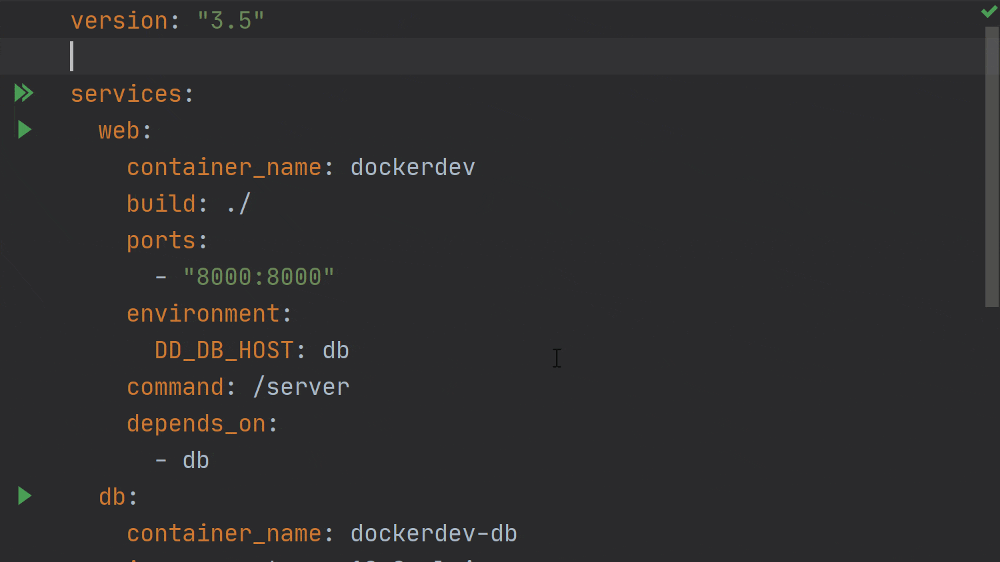
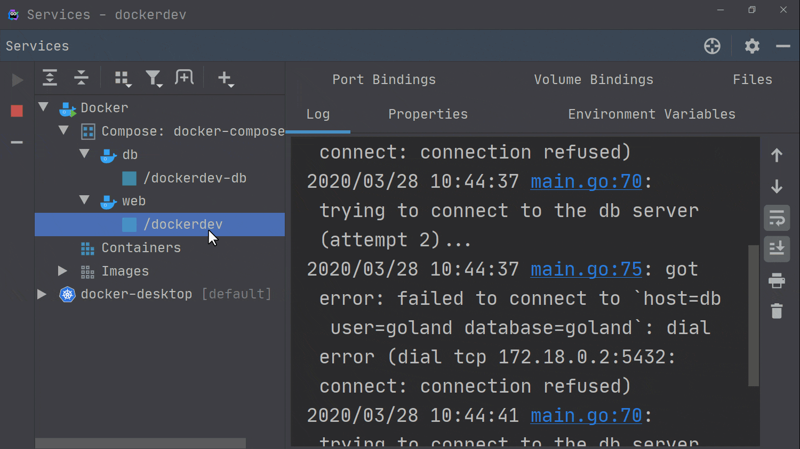
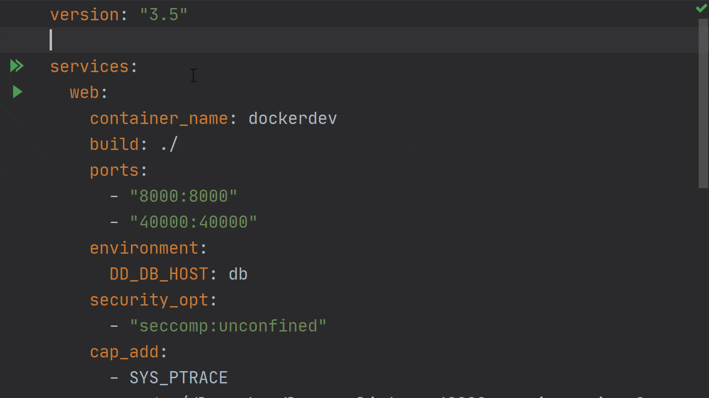

今天，我们将继续有关[如何使用 Docker 运行](https://mp.weixin.qq.com/s/2tajxPBhGwgwlT4TzAgmVw)和[调试 Go 应用程序](https://mp.weixin.qq.com/s/4-fkIWcr_3LdLFALVk4ZTA)的系列文章。

在本文中，我们将使用 Docker Compose 运行和调试我们的应用程序。对于本文，我们将使用[此处的源代码](https://github.com/dlsniper/dockerdev/tree/compose)，在开始之前切换到 [compose 分支](https://github.com/dlsniper/dockerdev/tree/compose)。

## 使用 Docker Compose 运行 Go 应用程序

让我们从使用 Docker Compose 运行应用程序开始。

查看我们已经创建的项目，可以在代码仓库中找到 docker-compose.yaml 文件：

```yaml
version: "3.5"
 
services:
  web:
    container_name: dockerdev
    build: ./
    ports:
      - "8000:8000"
    environment:
      DD_DB_HOST: db
    command: /server
    depends_on:
      - db
  db:
    container_name: dockerdev-db
    image: postgres:12.2-alpine
    ports:
      - "5432:5432"
    environment:
      POSTGRES_USER: goland
      POSTGRES_PASSWORD: goland
      POSTGRES_DB: goland
    volumes:
      - ./init.sql:/docker-entrypoint-initdb.d/init.sql
```

在数据库部分，我们需要创建一个名为 init.sql 的新文件。该文件的内容用于设置服务运行所需的数据库。

最后，让我们在 main.go 文件中运行 `Sync packages of <project>` 来 quick-fix，以下载 [pgx](https://github.com/jackc/pgx/) 库并运行该应用程序。注意：如果你的模块缓存中还没有 pgx 的 4.5.0 版本，则需要执行此步骤。

运行基于 Docker Compose 的应用程序类似于其他 `Run Configurations`。单击 docker-compose.yaml 中 services 指令旁边的双绿色箭头按钮。要仅运行一项服务，请点击要运行的服务类型旁边的绿色箭头，例如上面的示例配置中的 web 或 db。



配置运行后，在 Docker 节点下的 `Services Tool` 窗口中会有一个名为 Compose 的新节点。这里会显示正在运行的每个 Docker Compose 服务套件。

可以浏览每个服务定义，并为每个服务显示所有正在运行的实例。Docker Compose 服务中可用于容器的信息与常规 Docker 容器可使用的信息相同。

**注意**：如果你要启动较重的服务（例如数据库服务器），或者这些服务需要一些初始化时间，则我们的 Go 程序服务需要考虑这些服务的启动时间。

在我们的示例代码中，这是使用 getDBConnection 函数处理的，该函数尝试在放弃之前尝试几次以指数退避的方式连接到数据库。

## 重启动 Docker Compose 服务

更改我们的代码后，我们需要重新启动服务以重新加载这些更改。目前，使用 IDE 重新启动它有点复杂，因为这样做需要你执行以下步骤：

- 执行 `Run | Edit Configurations` 并复制一份现有的 Docker Compose 配置；
- 编辑新创建的配置以添加重新启动的服务的名称，并启用 `–build` 选项以强制在运行镜像之前对其进行重建；

完成这些步骤之后，你可以停止现有服务，删除现有容器，然后启动新创建的配置。



**Pro tip**：你可以使用 “Delete” 功能同时停止和删除服务。

## 使用 Docker Compose 调试 Go 应用程序

要使用 Docker Compose 调试应用程序，我们需要同时更改 Dockerfile 和 docker-compose.yaml 文件。我们可以切换到代码库的 [compose-debug 分支](https://github.com/dlsniper/dockerdev/tree/compose-debug)，这样更容易理解。

现在，docker-compose.yaml 文件如下所示：

```yaml
version: "3.5"
 
services:
  web:
    container_name: dockerdev
    build: ./
    ports:
      - "8000:8000"
      - "40000:40000"
    environment:
      DD_DB_HOST: db
    security_opt:
      - "seccomp:unconfined"
    cap_add:
      - SYS_PTRACE
    command: /dlv --headless --listen=:40000 --api-version=2 exec /server
    depends_on:
      - db
  db:
    container_name: dockerdev-db
    image: postgres:12.2-alpine
    ports:
      - "5432:5432"
    environment:
      POSTGRES_USER: goland
      POSTGRES_PASSWORD: goland
      POSTGRES_DB: goland
    volumes:
      - ./init.sql:/docker-entrypoint-initdb.d/init.sql
```

**注意**：这里的重要部分是 security_opt 和 cap_add 属性，因为它们允许调试器在 Docker 环境中运行。

运行此操作类似于运行常规 Docker Compose 配置。我们可以使用 Go Remote 配置连接到容器，调试器会话将像调试常规配置一样开始。



今天我们的文章到此结束。我们已经讨论了如何使用 Docker Compose，以及如何从 GoLand 运行和调试我们的应用程序。

在下一篇文章中，我们将介绍如何在 IDE 中使用 Kubernetes，以及如何使用它运行和调试我们的应用程序。

> 原文链接：https://blog.jetbrains.com/go/2020/05/08/running-go-applications-using-docker-compose-in-goland/
>
> 作者：Florin Pățan
>
> 翻译：Go语言中文网 polaris
