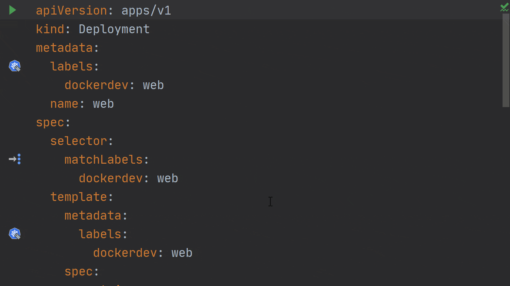

这是我们使用 Docker，Docker Compose 或 Kubernetes 运行 Go 服务的系列文章的最后一部分。在这一部分中，我们将专注于使用 Kubernetes 集群时的运行和调试。

虽然我们不会介绍如何安装和配置 Kubernetes 集群，但是可以使用各种工具（例如 [kubeadm](https://kubernetes.io/docs/setup/production-environment/tools/kubeadm/create-cluster-kubeadm/)，[minikube](https://kubernetes.io/docs/setup/learning-environment/minikube/) 和 [microk8s](https://microk8s.io/)）来实现这一目标。如果您使用的是 Windows，则 [Docker Desktop for Windows](https://www.docker.com/products/docker-desktop) 附带[内置的 Kubernetes 支持](https://docs.docker.com/docker-for-windows/kubernetes/)。如果您打算使用基于 ARM 芯片的平台（例如 [Raspberry Pi 4](https://blog.jetbrains.com/go/2020/02/18/running-goland-on-a-raspberry-pi-4/)），则可以使用 [k3s](https://k3s.io/) 之类的东西来入门。

在开始之前，还应该安装 Kubernetes 插件，因为它没有与 IDE 捆绑在一起。您可以通过打开 `Settings/Preferences | Plugins | Marketplace`并搜索 Kubernetes 找到并安装插件。

## 在 IDE 中使用 Kubernetes 运行服务

如果您到目前为止一直在关注本系列，那么您会知道所有代码都可以[在此](https://github.com/dlsniper/dockerdev)下载和使用，使用 Kubernetes 也是这种情况。我们可以从 [kubernetes 分支](https://github.com/dlsniper/dockerdev/tree/kubernetes)开始。

在这里我们可以找到两个不同的文件：db.yaml 和 web.yaml。这些文件包含了我们开始使用 Kubernetes 集群中的应用程序所需的所有定义。为了方便起见，他们还假定 Kubernetes 与 IDE 在同一台计算机上运行。

打开 db.yaml：

```yaml
apiVersion: v1
kind: ConfigMap
metadata:
  name: db-config
  labels:
    dockerdev: db
data:
  POSTGRES_DB: goland
  POSTGRES_USER: goland
  POSTGRES_PASSWORD: goland
---
apiVersion: apps/v1
kind: StatefulSet
metadata:
  labels:
    dockerdev: db
  name: db
spec:
  serviceName: dockerdev-db
  selector:
    matchLabels:
      dockerdev: db
  template:
    metadata:
      labels:
        dockerdev: db
    spec:
      containers:
        - name: db
          image: postgres:12.2-alpine
          imagePullPolicy: IfNotPresent
          envFrom:
            - configMapRef:
                name: db-config
          ports:
            - containerPort: 5432
          volumeMounts:
            - name: db-init
              mountPath: /docker-entrypoint-initdb.d/init.sql
              subPath: init.sql
      volumes:
        -  name: db-init
           hostPath:
             path: /d/GoLandProjects/dockerdev
---
apiVersion: v1
kind: Service
metadata:
  labels:
    dockerdev: db
  name: dockerdev-db-exported
spec:
  type: NodePort
  ports:
    - name: 5432-tcp
      port: 5432
      targetPort: 5432
      nodePort: 30432
  selector:
    dockerdev: db
```

**注意**：在启动此示例之前，我们需要确保更改了 init.sql 文件在主机上的位置。您可以通过将路径：/d/ GoLandProjects / dockerdev 替换为先前克隆该项目的位置的路径来实现。

完成此操作后，我们可以使用文件顶部编辑器装订线上的绿色箭头在 Kubernetes 中部署数据库。

部署数据库将创建一个 StatefulSet 并在 pod 中运行数据库。将出现 “Services Tool” 窗口，并显示用于创建资源的命令以及该命令的输出。

## Kubernetes 集群概述

在 Kubernetes 集群中，我们将看到工作负载信息，例如正在运行的 Pods, Deployments, Stateful Sets, Daemon Sets, Jobs, Cron Jobs, Replica Sets, 和 Replication Controllers。


我们还可以查看有关集群中服务和入口点的网络信息。


“Configuration” 部分包含当前名称空间或群集的所有配置信息，例如有关运行名称空间，节点，群集角色，角色，配置 map 和秘钥的信息。


最后，“Storage” 部分将向我们显示当前配置中的“持久卷”，“持久卷声明”和“存储类”。


## 在 IDE 中使用 Kubernetes 集群运行 Go 应用程序

让我们在同一个 Kubernetes 集群中运行 Go 应用程序，看看它是如何工作的。

不过，在运行该应用程序之前，我们首先需要构建该应用程序所在的 Docker 容器。示例代码库中包含一个名为 build Dockerfile 的运行配置，需要运行该配置才能在集群中使用我们的容器。

正如您可能已经猜到的那样，此后，我们终于可以使用先前与 db.yaml 文件一起使用的绿色箭头在 Kubernetes 中运行 Go 应用程序，只有这次我们才在 web.yaml 文件中使用它。

```yaml
apiVersion: apps/v1
kind: Deployment
metadata:
  labels:
    dockerdev: web
  name: web
spec:
  selector:
    matchLabels:
      dockerdev: web
  template:
    metadata:
      labels:
        dockerdev: web
    spec:
      containers:
        - name: dockerdev-web
          image: dockerdev-web:latest
          imagePullPolicy: Never
          env:
            - name: DD_DB_HOST
              value: "dockerdev-db-exported"
          ports:
            - containerPort: 8000
---
apiVersion: v1
kind: Service
metadata:
  labels:
    dockerdev: web
  name: dockerdev-web-exported
spec:
  type: NodePort
  ports:
    - name: 8000-tcp
      port: 8000
      targetPort: 8000
      nodePort: 30800
  selector:
    dockerdev: web
```



**Pro tip**：我们可以使用 HTTP 请求文件的方式从 IDE 运行请求，以检查服务是否已启动并正在运行。


## 从 Kubernetes 调试服务

在使用 GoLand 调试 Kubernetes 服务之前，我们需要对 web.yaml 文件进行一些更改。这些变化可以在我们代码库的 kubernetes-debug 分支中看到。

我们需要进行一些与调试常规 Docker 容器非常相似的更改。

首先，我们需要调整 Dockerfile，然后我们必须使用 `Run | Run … | ‘build Dockerfile’ `来配置。

接着我们可以使用 `Run | Debug … | Kubernetes Service`，它将启动 Go Remote 调试配置。


调试器将跟之前我们习惯的调试形式一样工作。

这个系列文章是我们使用 Docker，Docker Compose 和 Kubernetes 运行和调试 Go 微服务的总结。

在本文中，我们讨论了如何使用 Kubernetes 插件来编辑 Deployment 文件，以便它将正常启动，从而可以对其进行调试。

> 原文链接：https://blog.jetbrains.com/go/2020/05/11/using-kubernetes-from-goland/
>
> 作者：Florin Pățan
>
> 翻译：Go语言中文网 polaris

