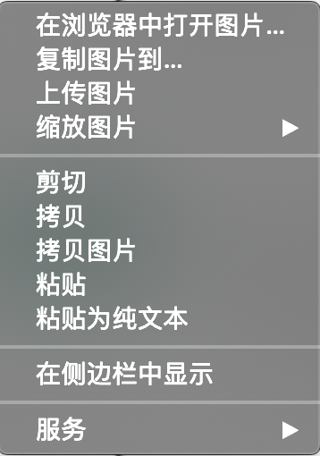
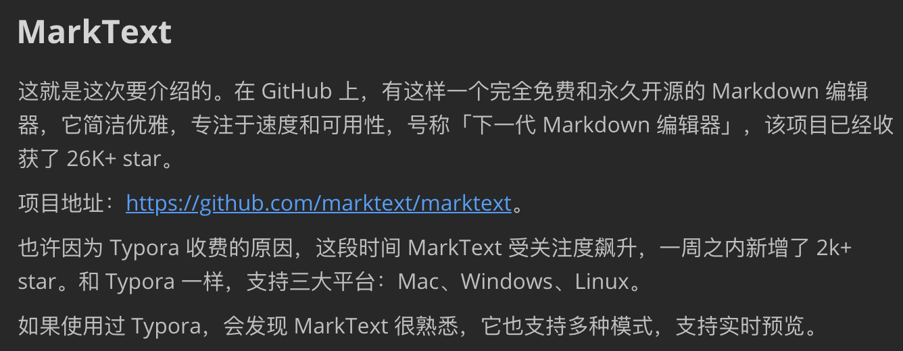

大家好，我是 polarisxu。

这几年，Markdown 写作不要太流行，包括一些社区也基本支持 Markdown 格式，包括 Go 语言中文网。GitHub 的评论也是支持 Markdown 格式，因此 Markdown 是每个程序员都应该掌握的。如果你从来没有使用过 Markdown，现在是时候尝试使用了。

> Markdown 是一种纯文本格式，用来撰写结构化文档。由 John Gruber 在 2004 年创造。他用 perl 实现了第一个 Markdown 到 HTML 的转换器，迅速地在网络上普及开来。到 2014 年已有几十种不同语言的实现。一些扩展了 Markdown 语法，比如脚注、定义列表、表格等， 一些可以将 Markdown 转换到 LaTeX 等多种格式。

你用 Markdown 写作，用的是什么工具呢？有些人可能说 VSCode。的确，通过扩展，VSCode 可以支持 Markdown，有些人可能用的也挺好。不过我要说，没用过好的，确实不会觉得自己用的有多大问题、有多烂！（当然，也许我一直用的也不是最好的。）

## 1、Typora

这些年写作，一直使用的 Markdown 编辑器是 [Typora](https://www.typora.io/)。之前也有使用过其他编辑器，但用了 Typora 之后，发现真的很优秀、很好用。

Typora 有几个特性是我特别喜欢的，这里简单说明：

**1）实时预览（所见即所得）**。而不是常见的左右分栏预览，当然可以自由切换到源码模式。

**2）粘贴，默认带格式粘贴**。这样在复制网页内容时，能够将格式一起复制过来。当然，也支持不带格式粘贴。

**3）图片处理**。支持复制图片粘贴，被粘贴的图片会保存在一个临时文件夹中。特别好用的是在图片上右键会出现类似下面菜单，能够复制图片到你希望放置的目录。这是我最常使用的功能。

**4）退出编辑器，下次打开能自动恢复上次打开的文件**。当然可以修改为其他启动选项。

**5）链接处理**。在整理周刊时，经常需要处理链接。复制链接后，选中文本，然后按下 Commad + K 就生成了 Markdown 格式的链接。

一直以来，Typora 一直是免费软件。不过近期，Typora 发布了 1.0.0 正式版，变成付费软件：89元 / 3台设备 / 免费升级。

面对收费，有些人可能会放弃 Typora，如果是重度用户，完全可以购买支持，Typora 可是国人开发的哦，界面的中文支持特别好，发现了吧。

如果不愿付费，还有两种选择：1）选择最新的免费版本，即：0.11.18，可以在这里下载：<https://www.typora.io/releases/all>；2）尝试其他 Markdown 编辑器。

## 2、MarkText

这就是这次要介绍的。在 GitHub 上，有这样一个完全免费和永久开源的 Markdown 编辑器，它简洁优雅，专注于速度和可用性，号称「下一代 Markdown 编辑器」，该项目已经收获了 26K+ star。

项目地址：<https://github.com/marktext/marktext>。

也许因为 Typora 收费的原因，这段时间 MarkText 受关注度飙升，一周之内新增了 2k+ star。和 Typora 一样，支持三大平台：Mac、Windows、Linux。

如果使用过 Typora，会发现 MarkText 很熟悉，它也支持多种模式，支持实时预览。

MarkText 具有以下特性：

- 对数学表达（KaTeX）、front matter 等进行了扩展；
- 支持段落和行内样式快捷方式，以提高用户写作效率；
- 可以输出 HTML 、PDF 文件；
- 支持 Cadmium Light、Material Dark 等 6 种主题；
- 支持 3 种编辑模式：源码模式、打字机模式和专注模式；
- 可以直接从剪贴板粘贴图像。

下载安装试用可以访问官网：<https://marktext.app/>。

值得骄傲的是，MarkText 也是国人主导开发的。

## 3、总结

Markdown 语法不少，但写作时，常用的就那些，多用几次就记住了。

我试用了一段时间 MarkText，有一些它的优势，不过也有用起来不太爽的地方，目前感觉比 Typora 还是差一些。下篇文章会写一篇 MarkText 的使用报告。
