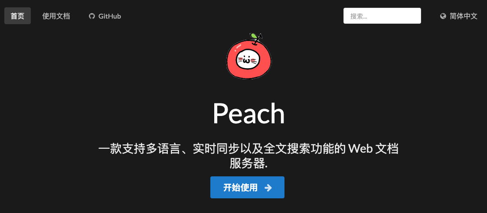

大家好，我是站长 polarisxu。

今天起，我计划起一个系列，叫做「对话 xxx」，主要访谈、撰写一些圈里人的成长故事，希望他们的故事对大家有一些启发。

今天要对话的这位是国内 Go 开源界的名人，GitHub followers 有 11.1k+，主导了开发了好几个 Go 开源项目，它就是无闻，昵称 unknwon（注意，不是 unknown）。早期学习 Go 的小伙伴，知道他可能更多是来自他的视频教程。不管什么方式，希望本文对有些读者有帮助。

## 01 与 Go 结缘

早在无闻读高中时，我们就认识了（没见过面，网上认识）。因为我接触 Go 比较早，2012~2013 年就创建了 Go 社区。具体怎么联系上的，不记得了。

2013 年上半年，他开始制作 Go 语言视频教程，我印象特别深的是，那年清明节左右，我在度蜜月，还每天和他交流 Go 语言，主要探讨视频制作的知识点，他很严谨，怕知识点讲解有误，和我交流、探讨确认。一口气，他制作了 [《Go编程基础》](https://github.com/Unknwon/go-fundamental-programming)、[《Go 名库讲解》](https://github.com/Unknwon/go-rock-libraries-showcases)、[《Go Web基础》](https://github.com/Unknwon/go-web-foundation/tree/v1)等视频教程。所以早期学习 Go 的小伙伴，很多都是看无闻的视频入门的。

但很多人也许不知道，他的这些视频是边学 Go 边制作的，这就是所谓的通过输出做到更好的输入，教别人是最有效的学习方法。

当然在这背后还隐藏着其他不为人知的故事。

### 其一：VBA 起家

无闻是一个文科生，是不是很惊讶？2010 年就出国，在国外读的高中。因为 2 点半就放学，很无聊，然后研究 Excel。有些人也许不知道，Excel 是支持编程的，那就是 VBA（Visual Basic for Applications），这是一种宏语言。基于 VBA 做了一个简单的账本。这算是编程的入门。

学了 VBA 后，不满足于它，可能也对编程产生了兴趣，同时由于 VBA 算是 VB 的子集，所以又去学习了 VB 6.0。用 VB 6.0 做了一些工具，在网上也得到了一些前辈友善的指导，这让他拓展了很大的知识面。

接着，无闻还学习了易语言，对，没错，就是那个中文语言。易语言是 C++ 实现的，但它和 VB 一样，提供了很多方便的编程接口，包括提供方便的图形化编辑环境，使得有 VB 基础的学习易语言比较容易。

### 其二：做视频教程，学习 Go

2011 年开始学习 C#，在学习 C# 的过程中，就一边学习一边做视频教程。所以，Go 视频教程才会做的比较好。

那时正是 Web 2.0 比较火的时候，Web 开发是比较受欢迎的。无闻发现，PHP 是那时候 Web 开发最欢迎的。于是准备学习 PHP，相关图书都买好了（寄到国外的哦）。但无意中，他在 GitHub 上看到了 <https://github.com/astaxie/build-web-application-with-golang> 这本书，捣鼓了一下 Go，发现它的运行方式和易语言很像（都是编译为二进制文件）。因为自己有强迫症，而 Go 语言的工具链很好的解决了这些问题，不再有选择的痛苦，大家写的代码风格几乎一样。

于是 2013 年无闻开始学 Go 语言，并做了上面的视频教程和翻译一些 Go 资料，比如国外另外一本讲解很全面的 Go 语言图书：《The Way to Go》，无闻向作者要到了授权，翻译成中文，在 GitHub 上免费提供给大家阅读，目前已经有 25.1k+ Star：<https://github.com/unknwon/the-way-to-go_ZH_CN>。

我总结一下无闻的 Go 学习之路：

- 通过 VBA 进入编程世界；
- 因为易语言和 C# 的视频制作经验，爱上 Go 并制作了优秀的视频教程；
- 通过制作更多的 Go 视频教程，翻译优秀教程以及名库讲解，打好自己的 Go 基础，同时回馈 Go 社区；

## 02 开源之旅

做开源可能是一种巧合，因为对 Git 的喜爱，加上 GitHub 私有库是收费的（现在他已经是 GitHub PRO，而且在 GitHub 上赞助其他人），同时 Go 语言的生态都是基于 GitHub。所以，那时候只是知道将自己的代码放在 GitHub 上公开，并不知晓这原来就是开源。

后来对开源接触越来越多，发现开源项目都比较优秀，有一些管理相关的模板。

对于 [gogs](https://github.com/gogs/gogs) 这个开源项目，主要对 Ruby 不太喜欢，不太喜欢笨重的环境，虽然有 GitLab，但想要用 Go 实现一个。因此和朋友一起开始搞 gogs。

在做 gogs 时，无闻对数据库还是一无所知的状态。有着强烈学习的意愿，开发 gogs 的过程中，涉及到很多的基础东西，都从头实现了一遍。比如：

- github.com/go-macaron/macaron：一个 Web 框架，以及其他一些框架的设施，都是自己从头实现；
- github.com/go-ini/ini：超赞的 Go 语言 INI 文件操作库；
- github.com/go-macaron/i18n：gogs 是一个国际项目，自然需要国际化；
- github.com/unknwon/cae：类似 PHP 风格的压缩和归档库；
- github.com/unknwon/com：一些经常使用的便利函数；
- github.com/go-clog/clog：基于 channel 的日志库；
- 。。。

除了 gogs，还有其他一些知名的项目，比如 [gowalker](https://gowalker.org/)、gopm（已关停）等。所有这些，都是它在学习、实践过程中遇到了问题，然后自己将它解决掉。可能解决方案不是最好的，甚至市面上已经有其他解决方案了，但自己实现它，给无闻带来的收益是巨大的。

大家可能没有注意，他的开源项目，很多都有漂亮的网站或独立文档站，而且基本这些站也是自己实现的。因为开源项目，文档很重要，于是他用 Go 实现了一个，这就是 [peach](https://github.com/peachdocs/peach)：一个用于多语言，实时同步和可搜索文档的 Web 服务器。

他实现这些，顺便把前端相关技术也学习了。

参与开源，不一定一上来就是参与者，也可以是反馈者，通过反馈慢慢融入这个项目，实际上将问题反馈清楚也是一种挑战。

无闻的理念：自己学习阶段，通过造轮子，把自己往“死”里整，什么新技术都尽量用上，多想想这项技术解决了什么问题，通过项目提升自己能力。

## 03 划重点

通过对无闻步入编程世界，回顾了他学习 Go 语言的经历，以及进行 Go 开源的心得体会，我认为有以下几点值得大家借鉴，特别是对于后浪们，比如还是在校学生。

### 一、越早学习越好

在股票基金投资中，很强调时间，因为复利效应很可怕。学习也是一样。对于编程学习来说，你开始的越早，就越早的走在同辈的前列，比如无闻，虽然是文科生，但高中就开始接触编程，并自发的进行各种学习、研究，做视频、做项目，进行主动学习。我特别欣赏那些还在读书的人能够积极融入各种社区的圈子。不管是开源项目，还是社区的一些活动、群等，其中有大学生的话，我会特别注意他，觉得他前途无量。

想想我的大学生活，只是沉浸在校园生活中，对业界发生的事情一无所知。这注定起点就比那些早早接触外界的人低。所以，我强烈建议你现在就开始认真学习，无闻经历也许可以借鉴。

而且，你越早学习，越早了解外界，越早工作，你的能力、薪资等大概率会比同龄人强。何况都说程序员吃青春饭，所以更应该提前学习。尽早多接触外界，外界的人和事。

### 二、兴趣是最好的老师

工作很多时候是为了生活，但你不能全无兴趣。而且，我认为兴趣也是可以培养的，要善于发现生活的美。只要你不讨厌它，慢慢的，你大概率可以喜欢它。大家可以想想生活中，你看到一个女生，觉得一般，时间长了，接触多了，有没有觉得还挺好看的，属于耐看型？哈哈哈哈，对吧，需要培养！

无闻能够做这么多项目，我相信一定是对这些事情是有兴趣的，而且做成了很有成就感，更进一步增加了兴趣。抱着喜欢它去学习，而不是太功利的，目标就是通过它找到一个好工作。其实只要你学好了，学透了，好工作是自然的。

### 三、通过输出倒逼输入

学习别只是看。无闻的经历很明显，他通过边学习边做视频，进步很快。你不一定非得做视频，但至少应该做做笔记，写写文章。写出来的东西，一定通过网络发布，比如微信公众号，这样督促自己更严谨。

其次，一定要实践。你别跟我说：不知道用 Go 写点什么。那是你根本没有思考，对自己不够狠。能写的东西很多。再不济，参与一些你喜欢的开源项目也可以，比如提提 typo 也是可以的，关键要迈出第一步。

认清自己，看自己的长处。通过输出，倒逼自己输入，让输入更高效！

希望通过「对话无闻」能够对大家有帮助！

