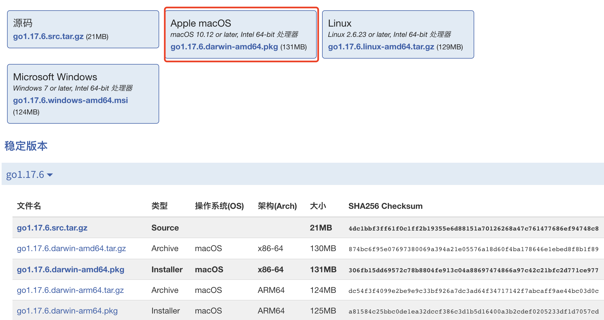
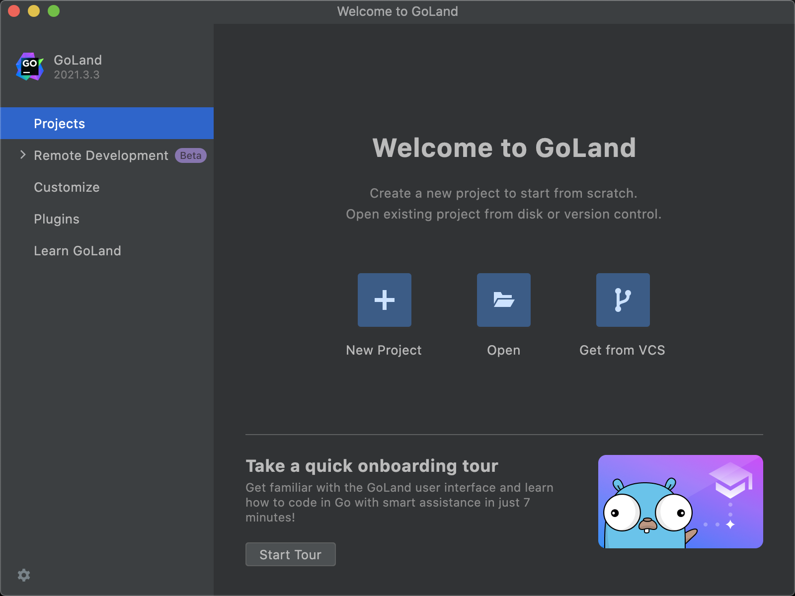
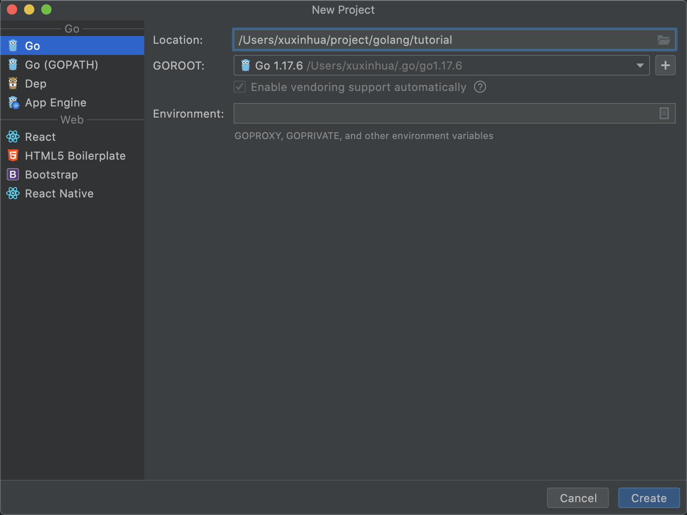
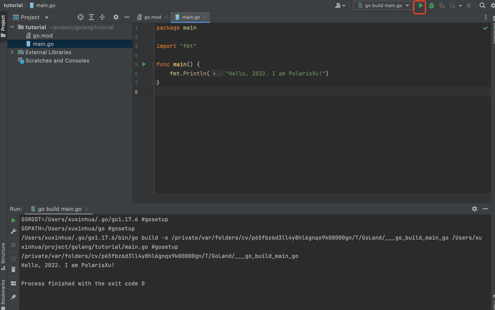
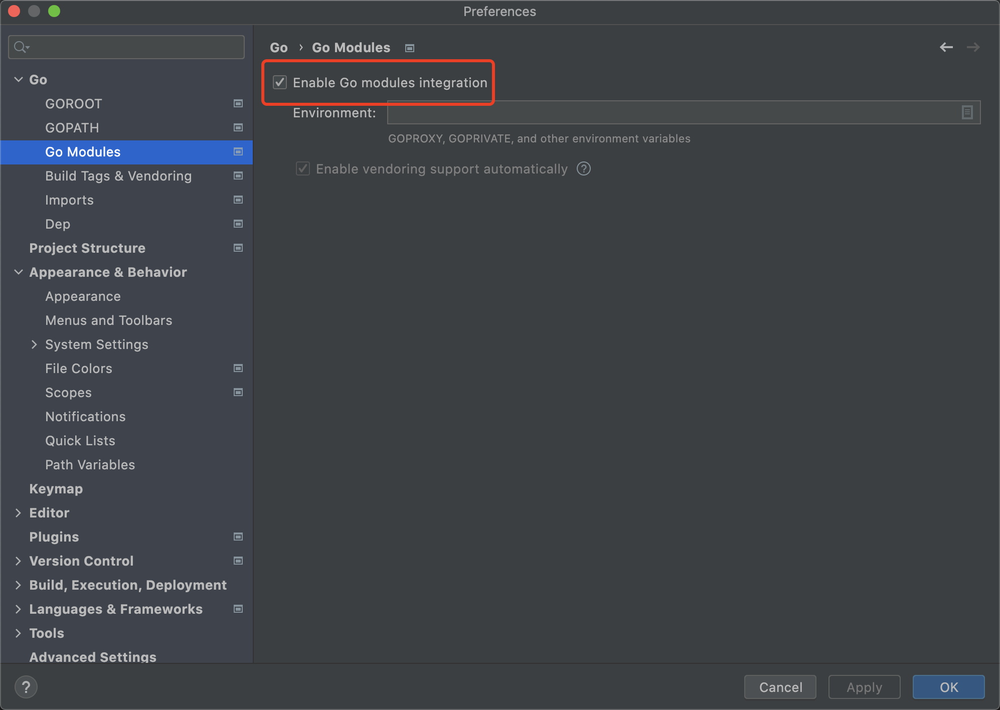

大家好，我是 polarisxu。

实话说，这个时候还写这么基础的文章，感觉有点太 low？但几乎每天有人开始学习 Go，那自然绕不开搭建 Go 开发环境。很多人会通过搜索网上的教程来照着做，于是发现搞不定，原因是找到的教程大部分比较老旧，都是基于 GOPATH 的。隔段时间我就会看到有人问类似的问题，所以才决定写一篇 2022 版 Go 开发环境搭建。

> 提醒一句，入门教程涉及到代码放入 src 目录下的，基本是基于 GOPATH 的教程，请忽略。

## 1、安装 Go

Go 语言支持多平台，因此需要根据你的平台来下载对应的 Go 安装包。本文以当前最新的版本（1.17.6）为例，以 Mac 系统为主讲解。

### 常规安装

到 <https://studygolang.com/dl> 下载对应的安装包。



如果你是 M1 之后的 Mac，下载 go1.17.6.darwin-arm64.pkg，否则下载 go1.17.6.darwin-amd64.pkg。之后双击下载的安装包，按提示一步步操作即可。

> Windows 安装方式类似，一步步操作即可。
>
> Linux 下，需要解压压缩包，然后将解压后的文件夹移动到 /usr/local/ 目录下。

默认情况下，经过以上操作，Go 安装在了 /usr/local/go 中，可以通过以下命令验证是否安装成功：

```bash
$ /usr/local/go/bin/go version
go version go1.17.6 darwin/amd64
```

如果能正常输出版本信息，表示安装成功了。

你发现没？我没有配置任何环境变量。实际上，Go 默认已经不需要配置任何环境变量了——什么 GOROOT、GOPATH 等都不需要了。

但有一个环境变量需要配置下，那就是 PATH，否则每次都需要指定 `/usr/local/go/bin/go` 这么长的路径。

打开 `~/.bash_profile`，在文末加上以下内容：

```bash
export PATH=$PATH:/usr/local/go/bin
```

然后执行：

```bash
$ source  ~/.bash_profile
```

这时在终端直接输入 go verison：

```bash
$ go version
go version go1.17.6 darwin/amd64
```

这就是 PATH 环境变量的作用。

> Linux 下配置和 Mac 类似。
>
> Windows 下请查阅配置 PATH 环境变量的方法。

不过，国内特殊的环境，我们还需要做一个**重要的配置**，那就是 GOPROXY：

```bash
$ go env -w GOPROXY=https://goproxy.cn,https://goproxy.io,direct
```

这样可以方便的下载 golang.org/x 等包，所以，记得执行以上命令。

### 其他安装方法

以上是常规的安装方法，你也可以通过源码编译安装。不过，我更喜欢通过第三方工具管理 Go，因为可以方便的切换多版本。

具体可以参考我之前写的文章：[《终于找到了一款我喜欢的安装和管理 Go 版本的工具》](https://mp.weixin.qq.com/s/yTblk9Js1Zcq5aWVcYGjOA)。

## 2、使用 GoLand

这是大名鼎鼎的 JB 专门为 Go 语言定制的 IDE，很强大，目前最新稳定版本是 2021.3。

到 <https://www.jetbrains.com/zh-cn/go/> 下载 goland-2021.3.3（2022.1.28 日构建 213.6777.51），之后双击安装。打开后看到如下界面：（GoLand 是付费软件，不过可以试用 30 天）



可以看到，GoLand 支持远程开发了，在打开/创建项目之前，可以做一些基本的配置，包括学习 GoLand、安装插件等。如果你不喜欢英文界面，在 Plugins 中可以找到中文界面插件，安装即可（GoLand 现在已经支持本地化，在你打开一个项目时，右下角会有提示，要不要切换到本地语言环境，即不需要手动安装语言包）。（我比较建议直接使用英文版）

我们点击 New Project，创建一个新项目：



一定要选择第一项，而不是 Go（GOPATH），Location 可以选择你喜欢的位置，GOROOT 就是你 Go 安装的位置，GoLand 会自动检测到。

创建后，会创建好项目，里面会有一个 go.mod 文件。这是 Go Module 的依赖管理文件。创建一个文件 main.go，输入以下内容：

```go
package main

import "fmt"

func main() {
	fmt.Println("Hello, 2022. I am PolarisXu!")
}
```

GoLand 默认会自动保存。然后点击运行按钮运行：



还可以 Debug。

对于已经存在的项目，如果发现代码提示、依赖等有问题，打开 GoLand 的「Preferences」，确认有无勾选 Module：



GoLand 是开箱即用的，几乎不需要任何配置就可以愉快的玩耍。

## 3、使用 VSCode

如果你更喜欢轻量级的文本编辑器，VSCode 会是一个不错的选择。之前我写过[一系列关于 VSCode 的文章](https://mp.weixin.qq.com/mp/appmsgalbum?__biz=MzAxNzY0NDE3NA==&action=getalbum&album_id=1495071262631641088&scene=126#wechat_redirect)，涉及到关于 VSCode 进行 Go 开发的内容，其中关于 Go 开发环境的配置，主要看这篇：[《VSCode 开发 Go 程序也可以和 GoLand 一样强大》](https://mp.weixin.qq.com/s/J01LY7s6xMB8Lk10sxTFhg)。这里就不重复了。

## 4、总结

总结一下，如下几个关键步骤：

- 下载安装 Go
- 配置 PATH 环境变量
- 配置 GOPROXY
- 选择 GoLand 或 VSCode 或其他你喜欢的开发工具

Enjoy Coding with Go！

