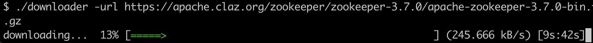

大家好，我是 polarisxu。

今天为大家带来一个实战项目。建议你一定要动手实践。

在往下看之前，你不妨思考下，用 Go 如何实现一个并发下载器。（我之前有推荐过一个类似的开源项目：[推荐三个Go实战开源项目](https://mp.weixin.qq.com/s/v_wonIeuxQWT_qPTGv7GIw)）

## 01 原理

对于服务器上的某个文件，我们要并发下载到本地，很容易想到，应该将文件分成多个部分，然后开多个 goroutine 并发地去下载，最后将这多个部分合并成一个文件，实现并发下载的目的。

现在的问题是，服务器上的一个文件，我们怎么做到分成多个呢？

这需要 HTTP 协议相关知识了。

HTTP 协议有一个响应头：Accept-Ranges，服务器通过该头来标识自身支持部分请求（partial requests），也叫范围请求。如果服务端支持部分请求，我们就可以实现并发下载。该头有两个可能的值：

```
Accept-Ranges: bytes
Accept-Ranges: none
```

- none：不支持任何部分请求单位，由于其等同于没有返回此头部，因此很少使用。不过一些浏览器，比如 IE9，会依据该头部去禁用或者移除下载管理器的暂停按钮。
- bytes：部分请求的单位是 bytes （字节）。

所以，我们在并发下载之前，应该先发起一个 Head 请求，来确认服务端是否支持部分请求。比如：

```go
resp, err := http.Head("https://studygolang.com/dl/golang/go1.16.5.src.tar.gz")
if err != nil {
  return err
}

if resp.StatusCode == http.StatusOK && resp.Header.Get("Accept-Ranges") == "bytes" {
  // 支持部分请求
}
```

确认了服务器支持部分请求，接下来就是如何进行部分请求。

这就用到 HTTP 的一个请求头部：Range。（详情参考：<https://developer.mozilla.org/zh-CN/docs/Web/HTTP/Headers/Range>）

Range 告知服务器返回文件的哪一部分。在一个  Range 头部中，可以一次性请求多个部分，服务器会以 multipart 文件的形式将其返回。如果服务器返回的是范围响应，需要使用 206 Partial Content 状态码。假如所请求的范围不合法，那么服务器会返回  416 Range Not Satisfiable 状态码，表示客户端错误。服务器允许忽略  Range  首部，从而返回整个文件，状态码用 200。

具体语法：

```
Range: <unit>=<range-start>-
Range: <unit>=<range-start>-<range-end>
Range: <unit>=<range-start>-<range-end>, <range-start>-<range-end>
Range: <unit>=<range-start>-<range-end>, <range-start>-<range-end>, <range-start>-<range-end>
```

- `<unit>`

  范围所采用的单位，通常是字节（bytes）。

- `<range-start>`

  一个整数，表示在特定单位下，范围的起始值。

- `<range-end>`

  一个整数，表示在特定单位下，范围的结束值。这个值是可选的，如果不存在，表示此范围一直延伸到文档结束。

例如：

```
Range: bytes=200-1000, 2000-6576, 19000-
```

掌握了以上知识点，最后要做的就是将下载下来的各个部分合并成一个文件。需要注意各个部分的顺序，比如根据顺序，按 1、2、3 等编号。

## 02 动手实现一个

知道了原理不代表你真的就会了，我们应该实际动手实现一个，加深理解。

在本地某个目录下创建目录：downloader。

```bash
$ mkdir downloader
$ cd downloader
$ go mod init github.com/polaris1119/downloader
```

### 命令行参数控制

为了让工具更好用，我们应该支持命令行参数，而不是代码写死一个，比如要下载的 URL、并发数、输出的文件名等。关于命令行参数控制，除了使用标准库 flag，我比较喜欢 github.com/urfave/cli，最新版本 v2。

创建一个文件 main.go，内容如下：

```go
package main

import (
	"log"
	"os"
	"runtime"

	"github.com/urfave/cli/v2"
)

func main() {
  // 默认并发数
	concurrencyN := runtime.NumCPU()

	app := &cli.App{
		Name:  "downloader",
		Usage: "File concurrency downloader",
		Flags: []cli.Flag{
			&cli.StringFlag{
				Name:     "url",
				Aliases:  []string{"u"},
				Usage:    "`URL` to download",
				Required: true,
			},
			&cli.StringFlag{
				Name:    "output",
				Aliases: []string{"o"},
				Usage:   "Output `filename`",
			},
			&cli.IntFlag{
				Name:    "concurrency",
				Aliases: []string{"n"},
				Value:   concurrencyN,
				Usage:   "Concurrency `number`",
			},
		},
		Action: func(c *cli.Context) error {
      return nil
		},
	}

	err := app.Run(os.Args)
	if err != nil {
		log.Fatal(err)
	}
}
```

执行 go mod tidy，下载必要的包。然后执行：

```bash
$ go run main.go -h
NAME:
   downloader - File concurrency downloader

USAGE:
   downloader [global options] command [command options] [arguments...]

COMMANDS:
   help, h  Shows a list of commands or help for one command

GLOBAL OPTIONS:
   --url URL, -u URL                URL to download
   --output filename, -o filename   Output filename
   --concurrency number, -n number  Concurrency number (default: 8)
   --help, -h                       show help (default: false)
```

关于 cli 这个库的使用，可以参阅官方文档，写的很详细，也有很多例子。

### 检查是否支持并发下载

创建另外一个文件 downloader.go，定义一个结构体 Dowloader：

```go
package main

type Downloader struct {
	concurrency int
}

func NewDownloader(concurrency int) *Downloader {
	return &Downloader{concurrency: concurrency}
}
```

为该结构体增加 Download 方法：

```go
func (d *Downloader) Download(strURL, filename string) error {
	if filename == "" {
		filename = path.Base(strURL)
	}

	resp, err := http.Head(strURL)
	if err != nil {
		return err
	}

	if resp.StatusCode == http.StatusOK && resp.Header.Get("Accept-Ranges") == "bytes" {
		return d.multiDownload(strURL, filename, int(resp.ContentLength))
	}

	return d.singleDownload(strURL, filename)
}

func (d *Downloader) multiDownload(strURL, filename string, contentLen int) error {
	return nil
}

func (d *Downloader) singleDownload(strURL, filename string) error {
  return nil
}
```

- 通过 Head 请求，判断是否支持部分请求。在原理部分已经讲解；
- 如果不支持，就直接下载整个文件；

当支持部分请求时，文件总大小通过 Head 请求的响应中的 ContentLength 可以获得。有了文件总大小和并发数，就可以知道每个部分的大小了。

### 并发下载

这部分第一个要点是如何发起部分请求：

```go
req, err := http.NewRequest("GET", "https://apache.claz.org/zookeeper/zookeeper-3.7.0/apache-zookeeper-3.7.0-bin.tar.gz", nil)
if err != nil {
    return err
}
rangeStart := 2000
rangeStop := 3000
req.Header.Set("Range", fmt.Sprintf("bytes=%d-%d", rangeStart, rangeStop))

res, err := http.DefaultClient.Do(req)
```

我们可以将其封装成一个方法：

```go
func (d *Downloader) downloadPartial(strURL, filename string, rangeStart, rangeEnd, i int) {
	if rangeStart >= rangeEnd {
		return
	}

	req, err := http.NewRequest("GET", strURL, nil)
	if err != nil {
		log.Fatal(err)
	}

	req.Header.Set("Range", fmt.Sprintf("bytes=%d-%d", rangeStart, rangeEnd))
	resp, err := http.DefaultClient.Do(req)
	if err != nil {
		log.Fatal(err)
	}
	defer resp.Body.Close()

	flags := os.O_CREATE | os.O_WRONLY
	partFile, err := os.OpenFile(d.getPartFilename(filename, i), flags, 0666)
	if err != nil {
		log.Fatal(err)
	}
	defer partFile.Close()

	buf := make([]byte, 32*1024)
	_, err = io.CopyBuffer(partFile, resp.Body, buf)
	if err != nil {
		if err == io.EOF {
			return
		}
		log.Fatal(err)
	}
}

// getPartDir 部分文件存放的目录
func (d *Downloader) getPartDir(filename string) string {
	return strings.SplitN(filename, ".", 2)[0]
}

// getPartFilename 构造部分文件的名字
func (d *Downloader) getPartFilename(filename string, partNum int) string {
	partDir := d.getPartDir(filename)
	return fmt.Sprintf("%s/%s-%d", partDir, filename, partNum)
}
```

- 通过发起 Range 请求后，将请求的内容写入本地文件中；
- 为了方便后续合并，文件名加上了序号，这就是 downloadPartial 最后一个参数的作用；
- rangeStart 和 rangeEnd 分别表示 Range 的开始和结束；

然后就是 multiDownload 方法中怎么分部分，这和并发请求多个 URL 很类似，使用 sync.WaitGroup 进行控制：

```go
func (d *Downloader) multiDownload(strURL, filename string, contentLen int) error {
	partSize := contentLen / d.concurrency

  // 创建部分文件的存放目录
	partDir := d.getPartDir(filename)
	os.Mkdir(partDir, 0777)
	defer os.RemoveAll(partDir)

	var wg sync.WaitGroup
	wg.Add(d.concurrency)

	rangeStart := 0

	for i := 0; i < d.concurrency; i++ {
    // 并发请求
		go func(i, rangeStart int) {
			defer wg.Done()

			rangeEnd := rangeStart + partSize
      // 最后一部分，总长度不能超过 ContentLength
			if i == d.concurrency-1 {
				rangeEnd = contentLen
			}

			d.downloadPartial(strURL, filename, rangeStart, rangeEnd, i)

		}(i, rangeStart)

		rangeStart += partSize + 1
	}

	wg.Wait()
  
  // 合并文件
	d.merge(filename)

	return nil
}

func (d *Downloader) merge(filename string) error {
	return nil
}
```

- 计算出每个部分的大小；
- 通过 sync.WaitGroup 协调并发请求；
- 注意每个部分的 rangeStart 和 rangeEnd 的计算规则，特别注意最后一部分；
- 所有部分都请求完成后，需要进行合并；

因为把每部分单独保存为文件了，所以合并只需要按照顺序处理这些文件即可：

```go
func (d *Downloader) merge(filename string) error {
	destFile, err := os.OpenFile(filename, os.O_CREATE|os.O_WRONLY, 0666)
	if err != nil {
		return err
	}
	defer destFile.Close()

	for i := 0; i < d.concurrency; i++ {
		partFileName := d.getPartFilename(filename, i)
		partFile, err := os.Open(partFileName)
		if err != nil {
			return err
		}
		io.Copy(destFile, partFile)
		partFile.Close()
		os.Remove(partFileName)
	}

	return nil
}
```

### 连接程序

到这里，程序的核心部分已经完成。接下来该在 main.go 中的 Action 作如下处理：

```go
Action: func(c *cli.Context) error {
  strURL := c.String("url")
  filename := c.String("output")
  concurrency := c.Int("concurrency")
  return NewDownloader(concurrency).Download(strURL, filename)
},
```

到这里可以运行测试下：

```bash
go run . --url https://apache.claz.org/zookeeper/zookeeper-3.7.0/apache-zookeeper-3.7.0-bin.tar.gz
```

不出意外的话文件会下载成功。

## 03 总结

实现了基本功能，读者朋友们可以进一步做优化、完善。比如：

- 看到下载过程，体验更友好，可以加入 github.com/schollz/progressbar 库；
- 可以暂停下载，然后继续下载。即断点续传；
- 不支持并发下载的，支持单个下载，即完成 singleDownload 方法；

类似下面这样：



这个实现的完整代码我放在了 GitHub：<https://github.com/polaris1119/downloader>。

还有两点大家可以注意下：

- 并发下载并不一定总是比简单下载快，一般文件越大，并发下载的优势才能体现。不过，并发下载可以端点续传；
- 并发下载可以进一步优化，毕竟写文件，再打开文件合并，是需要时间的；

最后，再提醒一次，记得自己动手实现一个哦。
