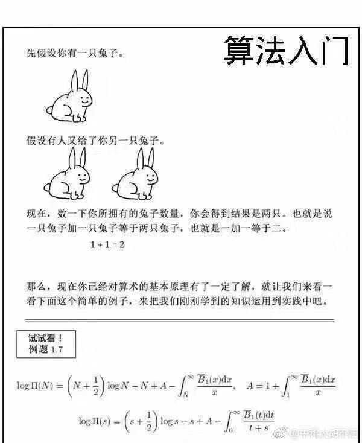

大家好，我是 polarisxu。

前两天，火丁笔记发了一篇文章：[《一个 select 死锁问题》](https://blog.huoding.com/2021/08/29/947)，又是一个小细节。我将其中的问题改一下，更好理解：

```go
package main

import "sync"

func main() {
	var wg sync.WaitGroup
	foo := make(chan int)
	bar := make(chan int)
	wg.Add(1)
	go func() {
		defer wg.Done()
		select {
		case foo <- <-bar:
		default:
			println("default")
		}
	}()
	wg.Wait()
}
```

按常规理解，go func 中的 select 应该执行 default 分支，程序正常运行。但结果却不是，而是死锁。可以通过该链接测试：<https://play.studygolang.com/p/kF4pOjYXbXf>。

原因文章也解释了，Go 语言规范中有这么一句：

> For all the cases in the statement, the channel operands of receive operations and the channel and right-hand-side expressions of send statements are evaluated exactly once, in source order, upon entering the “select” statement. The result is a set of channels to receive from or send to, and the corresponding values to send. Any side effects in that evaluation will occur irrespective of which (if any) communication operation is selected to proceed. Expressions on the left-hand side of a RecvStmt with a short variable declaration or assignment are not yet evaluated.

不知道大家看懂没有？于是，最后来了一个例子验证你是否理解了：为什么每次都是输出一半数据，然后死锁？（同样，这里可以运行查看结果：<https://play.studygolang.com/p/zoJtTzI7K5T>）

```go
package main

import (
	"fmt"
	"time"
)

func talk(msg string, sleep int) <-chan string {
	ch := make(chan string)
	go func() {
		for i := 0; i < 5; i++ {
			ch <- fmt.Sprintf("%s %d", msg, i)
			time.Sleep(time.Duration(sleep) * time.Millisecond)
		}
	}()
	return ch
}

func fanIn(input1, input2 <-chan string) <-chan string {
	ch := make(chan string)
	go func() {
		for {
			select {
			case ch <- <-input1:
			case ch <- <-input2:
			}
		}
	}()
	return ch
}

func main() {
	ch := fanIn(talk("A", 10), talk("B", 1000))
	for i := 0; i < 10; i++ {
		fmt.Printf("%q\n", <-ch)
	}
}
```

有没有这种感觉：



这是 StackOverflow 上的一个问题：<https://stackoverflow.com/questions/51167940/chained-channel-operations-in-a-single-select-case>。

关键点和文章开头例子一样，在于 select case 中两个 channel 串起来，即 fanIn 函数中：

```go
select {
case ch <- <-input1:
case ch <- <-input2:
}
```

如果改为这样就一切正常：

```go
select {
case t := <-input1:
  ch <- t
case t := <-input2:
  ch <- t
}
```

结合这个更复杂的例子分析 Go 语言规范中的那句话。

对于 select 语句，在进入该语句时，会按源码的顺序对每一个 case 子句进行求值：这个求值只针对发送或接收操作的额外表达式。

比如：

```go
// ch 是一个 chan int；
// getVal() 返回 int
// input 是 chan int
// getch() 返回 chan int
select {
  case ch <- getVal():
  case ch <- <-input:
  case getch() <- 1:
  case <- getch():
}
```

在没有选择某个具体 case 执行前，例子中的 `getVal()`、`<-input` 和 `getch()` 会执行。这里有一个验证的例子：<https://play.studygolang.com/p/DkpCq3aQ1TE>。

```go
package main

import (
	"fmt"
)

func main() {
	ch := make(chan int)
	go func() {
		select {
		case ch <- getVal(1):
			fmt.Println("in first case")
		case ch <- getVal(2):
			fmt.Println("in second case")
		default:
			fmt.Println("default")
		}
	}()

	fmt.Println("The val:", <-ch)
}

func getVal(i int) int {
	fmt.Println("getVal, i=", i)
	return i
}
```

无论 select 最终选择了哪个 case，`getVal()` 都会按照源码顺序执行：`getVal(1)` 和 `getVal(2)`，也就是它们必然先输出：

```bash
getVal, i= 1
getVal, i= 2
```

你可以仔细琢磨一下。

现在回到 StackOverflow 上的那个问题。

每次进入以下 select 语句时：

```go
select {
case ch <- <-input1:
case ch <- <-input2:
}
```

`<-input1` 和 `<-input2` 都会执行，相应的值是：A x 和 B x（其中 x 是 0-5）。但每次 select 只会选择其中一个 case 执行，所以 `<-input1` 和 `<-input2` 的结果，必然有一个被丢弃了，也就是不会被写入 ch 中。因此，一共只会输出 5 次，另外 5 次结果丢掉了。（你会发现，输出的 5 次结果中，x 比如是 0 1 2 3 4）

而 main 中循环 10 次，只获得 5 次结果，所以输出 5 次后，报死锁。

---

虽然这是一个小细节，但实际开发中还是有可能出现的。比如文章提到的例子写法：

```go
// ch 是一个 chan int；
// getVal() 返回 int
// input 是 chan int
// getch() 返回 chan int
select {
  case ch <- getVal():
  case ch <- <-input:
  case getch() <- 1:
  case <- getch():
}
```

因此在使用 select 时，一定要注意这种可能的问题。

不要以为这个问题不会遇到，其实很常见。最多的就是 time.After 导致内存泄露问题，网上有很多文章解释原因，如何避免，其实最根本原因就是因为 select 这个机制导致的。

比如如下代码，有内存泄露（传递给 time.After 的时间参数越大，泄露会越厉害），你能解释原因吗？

```go
package main

import (
    "time"
)

func main()  {
    ch := make(chan int, 10)

    go func() {
        var i = 1
        for {
            i++
            ch <- i
        }
    }()

    for {
        select {
        case x := <- ch:
            println(x)
        case <- time.After(30 * time.Second):
            println(time.Now().Unix())
        }
    }
}
```

