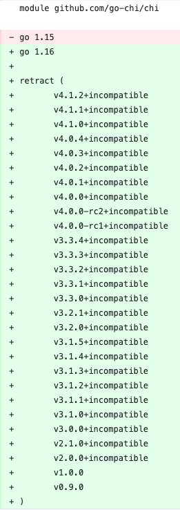

大家好，我是站长 polarisxu。

在 Reddit 上看到一条消息：

> go-chi is retracting all major versions with go1.16 new retract directive.

go.mod 的变更如下：



这利用了 Go 1.16 中 Module 的新特性。在这之前，先一起学习下该特性。

## 01 retract：撤回版本

也许不少人没有开发过自己的 Module（模块），但了解模块版本撤回还是有必要的，说不定哪天就能用到。因此建议你能够跟着本文操作一遍。

一般地，模块作者需要一种方法来指示不应该使用某个已发布的模块版本。可能出于以下几点原因：

- 发现了一个严重的安全漏洞；
- 发现了严重的不兼容性或 bug；
- 这个版本是偶然发布的，或是过早发布了；

作者不能简单地删除版本标签（tag），因为它们很可能在模块代理上仍然可用。如果作者能够从所有代理中删除一个版本，那么依赖该版本的下游用户就会无法使用，出问题。

此外，作者在发布了 `go.sum` 文件之后也不能更改版本，校验和数据库会验证发布的版本从未更改。

那怎么办？作者应该能够撤回模块版本。撤回的模块版本是模块作者明确声明不应该使用的版本。(retract 这个词是从学术文献中借来的：一篇被撤回的研究论文仍然可用，但是它有问题，不应该成为未来工作的基础）。

撤回的版本应该在模块代理和原始代码库中保持可用。依赖已撤回版本的构建应可以继续工作。当用户依赖于一个已撤回的版本（直接或间接）时，应该通知用户。它也应该很难无意中升级到一个已撤回版本。

为了让大家更好的理解模块撤回功能，本文通过具体的例子来演示。我们会创建两个模块：

- foo，这是一个模块，本文将其 push 到 GitHub，完整路径：<https://github.com/polaris1119/foo>，你本地试验记得路径使用你的。本文将发布该模块的许多版本。
- gopher，一个简单的 main 包，使用了上面的模块，该模块不会发布，只是作为本地模块；

> 注意，请确保 Go 版本是 1.16+。
>
> 本文演示用的操作系统是 MacOS。

### 创建 foo 模块

```bash
$ mkdir -p ~/foo
$ cd ~/foo
$ git init -q
$ git remote add origin https://github.com/polaris1119/foo
$ go mod init github.com/polaris1119/foo
go: creating new go.mod: module github.com/polaris1119/foo
```

在模块目录中创建一个文件 foo.go，输入如下内容：

```go
package foo

func Bar() string {
		return "这是初始版本"
}
```

> 注意：在把该模块代码提交之前，先在 GitHub 上创建好项目 foo。

将 foo 模块的改动提交 git 并 push。

```bash
$ git add -A
$ git commit -q -m "Initial commit"
$ git branch -M main
$ git push -u origin main
```

这是该模块的初始版本，我们用 v0 语言版本来标记它，表明它还不稳定。

```bash
$ git tag v0.1.0
$ git push -q origin v0.1.0
```

foo 的第一个版本已经发布，我们看看使用它的 gopher 模块。

### 创建 gopher 模块

该模块就放在本地，因此不用设置 git：

```bash
$ mkdir ~/gopher
$ cd ~/gopher
$ go mod init gopher
```

创建一个 main.go 文件，内容如下：

```go
package main

import (
    "fmt"

    "github.com/polaris1119/foo"
)

func main() {
     fmt.Println(foo.Bar())
}
```

接下来，我们通过 go get 显示指定依赖 foo 的版本：

```bash
$ go get github.com/polaris1119/foo@v0.1.go
go: downloading github.com/polaris1119/foo v0.1.0
go get: added github.com/polaris1119/foo v0.1.0
```

> 注意：我本地配置了 GOPROXY=https://goproxy.cn,direct

然后运行：

```bash
$ go run .
这是初始版本
```

目前一切正常。

### 一个更好的版本

经过一段时间，foo 的功能有一些变化，这里假设 Bar 方法语句变了（一个兼容的变化）。

回到 foo 模块，修改代码如下：

```go
package foo

func Bar() string {
		return "这是一个更好的版本"
}
```

提交并推送到 GitHub。

但现在 foo 模块还不是稳定版，因此不想标记为 v1。安全起见，我们发布 v0.2.0：

```bash
$ git tag v0.2.0
$ git push -q origin v0.2.0
```

现在 foo 发布了 v0.2.0 版本，我们在 gopher 项目尝试下。

```bash
$ cd ~/gopher
$ go get github.com/polaris1119/foo@v0.2.0
go: downloading github.com/polaris1119/foo v0.2.0
go get: upgraded github.com/polaris1119/foo v0.1.0 => v0.2.0
```

然后 go run 运行：

```bash
$ go run .
这是一个更好的版本
```

这时，你发现 “这是一个更好的版本” 不好，怎么办？你可以修改掉，然后再发布一个新版本。然而，gopher 项目已经依赖了 v0.2.0，怎么办？

### 撤回模块版本

我们可以在 go.mod 中增加 retract 指令来撤回某个模块版本。

可以通过命令实现：（也可以直接修改 go.mod 文件）

```bash
$ go mod edit -retract=v0.2.0
```

这时 go.mod 内容如下：

```bash
module github.com/polaris1119/foo

go 1.16

retract v0.2.0
```

一般建议在 retract 上加上撤回的原因。go get、go list 等会显示这个原因。

```bash
module github.com/polaris1119/foo

go 1.16

// Bar 方法返回值不友好
retract v0.2.0
```

修改下 Bar 的返回内容，提交 GitHub 并发布 v0.3.0：

```go
func Bar() string {
		return "这是v0.3.0版本"
}
```

v0.3.0 发布后，回到 gopher 模块，使用这个新版本。

```bash
$ cd ~/gopher
$ go get github.com/polaris1119/foo@v0.3.0
go: downloading github.com/polaris1119/foo v0.3.0
go get: upgraded github.com/polaris1119/foo v0.2.0 => v0.3.0
```

这一步确保 https://goproxy.cn 这个代理知晓了 v0.3.0 版本，这是一种手动让代理拉取你模块的方法。

```bash
$ go run .
这是v0.3.0版本
```

已经正常了。

经过这个步骤到底发生了什么？我们通过以下命令看一下：

```bash
$ go list -m -versions github.com/polaris1119/foo
github.com/polaris1119/foo v0.1.0 v0.3.0
```

v0.2.0 不见了。通过增加 -retracted 选项可以查看撤回的版本：

```bash
$ go list -m -versions -retracted github.com/polaris1119/foo
github.com/polaris1119/foo v0.1.0 v0.2.0 v0.3.0
```

如果我们依赖回收的 v0.2.0 版本会怎么样了？

```bash
$ go get github.com/polaris1119/foo@v0.2.0
go: warning: github.com/polaris1119/foo@v0.2.0: retracted by module author: Bar 方法返回值不友好
go: to switch to the latest unretracted version, run:
	go get github.com/polaris1119/foo@latest go get: downgraded github.com/polaris1119/foo v0.3.0 => v0.2.0
```

提示信息还是挺友好的，告知你 v0.2.0 是一个撤回的版本。

虽然警告，但 v0.2.0 可以正常使用吗？

```bash
$ go run .
这是一个更好的版本
```

发现一切正常。

有了这个功能，有一些模块可能会使用它。那怎么知晓我们的项目有没有依赖撤回的版本呢？使用 go list 命令即可：

```bash
$ go list -m -u all
gopher
github.com/polaris1119/foo v0.2.0 (retracted) [v0.3.0]
```

我们现在回到最新版本：

```bash
$ go get github.com/polaris1119/foo@latest
go get: upgraded github.com/polaris1119/foo v0.2.0 => v0.3.0
```

### 为 foo 模块增加功能

又过了一段时间，我们为 foo 模块增加了新的功能：

```go
func Quz() string {
    return "This is Quz function"
}
```

提交到 GitHub，并发布 v0.4.0，依然是不稳定版本。

```bash
$ git tag v1.0.0
$ git push -q origin v1.0.0

```

但很糟糕的是，我不小心发布了 v1.0.0，这样会让用户以为你的模块已经是稳定版本，但实际上并不是这样。所以，我们想撤回 v1.0.0。

在撤回这个版本之前，我们应该先发布 v0.4.0 版本：

```bash
$ git tag v0.4.0
$ git push -q origin v0.4.0
```

要撤回 v1.0.0，我们需要发布 v1.0.1（为什么？因为我们要写入撤回的信息）。不过这样一来，我们还得撤回 v1.0.1，死循环了。。。go module 允许我们指定一个撤回的版本范围，这次手动编辑 go.mod 文件。

```bash
module github.com/polaris1119/foo

go 1.16

retract (
    // Bar 方法返回值不友好
    v0.2.0

    // v1 提前发布了
    [v1.0.0, v1.0.1]
)
```

提交这次改动到 GitHub，然后再创建 v1.0.1 版本。

```bash
$ git tag v1.0.1
$ git push -q origin v1.0.1
```

接着切到 gopher 模块。

为了让 https://goproxy.cn 知晓 v1.0.0 等版本，我们先获取它。

```bash
$ go get github.com/polaris1119/foo@v1.0.0
$ go get github.com/polaris1119/foo@v1.0.1
$ go get github.com/polaris1119/foo@v0.4.0
```

> 注意，切换到 v1.0.x 版本时，很可能看不到版本撤回的信息，因为 proxy 可能还没自动定期更新。一般需要等待一段时间，比如 1 分钟。如果没有看到警告信息，等待 1 分钟后再试，应该能看到。

现在列出所有的版本：

```bash
$ go list -m -versions -retracted github.com/polaris1119/foo
github.com/polaris1119/foo v0.1.0 v0.2.0 v0.3.0 v0.4.0 v1.0.0 v1.0.1
```

或只列出未撤回版本：

```bash
$ go list -m -versions github.com/polaris1119/foo
github.com/polaris1119/foo v0.1.0 v0.3.0 v0.4.0
```

赞！v0.4.0 是该模块的新版本。

这时可以更新下 gopher，来使用 foo 的新功能：（加上对 foo.Quz 函数的调用）

```bash
$ go run .
这是v0.3.0版本
This is Quz function
```

> 提示：如果你将来要发布 v1 稳定版，应该从 v1.0.2 开始，因为 v1.0.0 和 v1.0.1 被占用了。

## 02 关于 incompatible

讲解完 retract 指令后，先看本文开头截图中的另外一个东西：incompatible。

在 go-chi 框架中，v2.x.x、v3.x.x 和 v4.x.x 都加上了 incompatible，这是什么意思？

Go 模块的版本号需要遵循 `v<major>.<minor>.<patch>` 的格式，当 major 大于 1 时，版本号需要体现在模块名中，比如 Echo 框架：github.com/labstack/echo/v4。

然而，由于 Go 模块功能出现较晚（Go1.11 才出现），在它出现之前，很多项目的版本号已经大于 1 了，比如 Echo 框架，这些版本连 go.mod 文件都没有，更别提模块名加上版本号。于是，这些版本就会有 incompatible 标记。

因为模块名没有版本信息，导致无法判断版本的兼容性问题，比如 v2.x.x 和 v3.x.x 都是 incompatible 的，使用 v2.x.x 的项目，更新依赖时，会直接升级到 v3.x.x，这显然是不行的，因此才标记它们为 incompatible（不兼容）。

你可以在上面做这个试验：新增版本 v2.0.0，但不修改 go.mod 文件中的 module 名，看看最新版本是否会带 incompatible。

一般不建议项目使用 incompatible，毕竟稳定性没法保证，它是不符合 Go Module 规范的。

## 03 go-chi 撤回所有主版本

先介绍下 chi 这个框架：

> lightweight, idiomatic and composable router for building Go HTTP services

它主要强调自己是一个路由，方便构建 HTTP 服务。它兼容 net/http，没有任何第三方依赖。

简单使用示例：

```go
package main

import (
	"net/http"

	"github.com/go-chi/chi"
	"github.com/go-chi/chi/middleware"
)

func main() {
	r := chi.NewRouter()
	r.Use(middleware.Logger)
	r.Get("/", func(w http.ResponseWriter, r *http.Request) {
		w.Write([]byte("welcome"))
	})
	http.ListenAndServe(":3000", r)
}
```

有兴趣的自己去了解。这里主要说下它撤回主版本的事情。

chi 保证自己有很好的兼容性，而作者特别厌烦模块名带版本号，即 `github.com/go-chi/chi/v4` 这样的（有强迫症），但 chi 项目 tag 已经到 4.x.x 了，怎么办？

从上面截图看，它一直使用的 incompatible。没想过到 Go1.16 除了 retract 的功能，于是 chi 作者做了一个决定：在已经发布的版本中，只保留 v1.5.x 系列，其他的全部撤回。

```bash
$ go list -m -versions github.com/go-chi/chi
github.com/go-chi/chi v1.5.0 v1.5.1 v1.5.2 v1.5.3
```

没有了一大堆带 incompatible 的版本，世界瞬间清静了。

不过它的这个决定，有不少人反对，reddit 上也是激烈讨论。

作者表示：<https://github.com/go-chi/chi/issues/561>

> 对于给您带来的不便，我再次表示歉意，但是我为此项目投入了数年甚至数千小时的时间，对此我非常感兴趣，SIV 是我坚决反对的事情，因此我不会采纳它。尽管许多人不同意，但请记住，这是 OSS，不是以任何方式赞助或付费的，您始终可以选择 fork 它并维护自己的版本。

作者很强硬。（谁知道 SIV 是什么意思？）

实际上使用 retract，之前的版本依然可以正常使用。我个人比较支持 chi 作者的做法。你呢？欢迎交流你的看法。