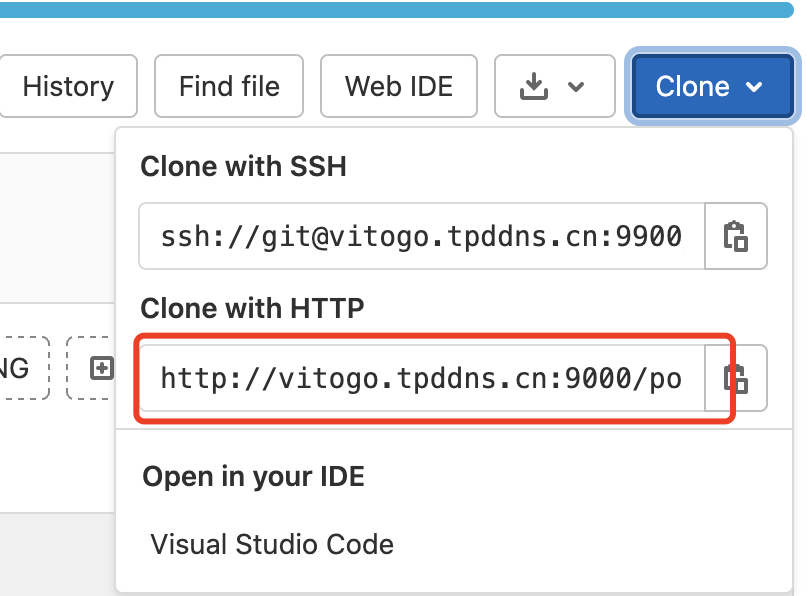

---

title: "Go Module：私有不合规库怎么解决引用问题"
date: 2021-09-12T17:00:00+08:00
toc: true
isCJKLanguage: true
tags: 
  - Go
  - Module
---

大家好，我是 polarisxu。

有一个朋友咨询一个问题：


实际项目中，使用 Go Module 难免会有一些自己的库要引用，这些库使用自建的 Git 服务管理，比如 GitLab 等。针对这样的情况，不少教程都是让设置 GOPRIVATE，即不走 GOPROXY。

然而，有些时候，不仅库是私有的，而且地址很可能不是「合规」的。什么是「不合规」的？

- 不是 HTTPS
- 非 443 或 80 端口
- 直接使用 IP 地址

不是 HTTPS 问题不大，主要是非 443 或 80，以及直接 IP 地址的问题比较大。因为 Go 不支持下面的语法：

```go
import "studygolang.com:8081/polarisxu/util"
import "192.168.1.1:80/polarisxu/util"
```

一般地，我们应该避免出现这样的情况，毕竟太恶心，而且没必要自讨苦吃。

但万一遇到了，怎么办？本文就探讨这个问题。

## 01 模拟环境

因为之前没遇到这样的问题，为了我更好的解决，这位朋友直接提供了他的环境供我试验。我注册了账号，并创建了一个仓库 testgo：<http://vitogo.tpddns.cn:9000/polarisxu/testgo>。（为了方便，这个仓库是 public）

> 提示：你想试验，可以自己注册一个账号试试。当然，也可以通过 gitlab 本地搭建一个。

仓库中创建文件 testgo.go，内容如下：

```go
package testgo

func MyName() string {
	return "polarisxu"
}
```

关键是这个库的 go.mod 如何写？

很显然，我们不能直接用 `vitogo.tpddns.cn:9000/polarisxu/testgo` 这样的 module 名称。

## 02 module 名称

那怎么办？

我们可以借助 git 的功能，将 `vitogo.tpddns.cn:9000` 替换掉：（也可以直接修改 `~/.gitconfig` 文件）

```bash
git config --global url."http://vitogo.tpddns.cn:9000/".insteadof "https://{{gitlab_url}}/"
```

这里有两点需要注意：

1）url 后面的内容，具体什么值，需要根据你的情况定。

可以通过你的自建仓库查看：



这里选择 HTTP 方式（因为我创建了一个 public 仓库）。也可以选择使用 ssh 方式，这样即使私有仓库，你配置上自己的 SSH KEY 也可正常 Pull。（如何配置 SSH KEY，网上很容易查到教程，GitHub 上就有）

我们这里使用了 `http://vitogo.tpddns.cn:9000/`，表示这个域名下所有的内容。

2）insteadOf 后面的内容，表示访问这个链接时，将替换为上面 url 后的链接。

这个值写什么？很显然，必须是合规的域名。我们任意使用一个域名试试，比如使用 `https://studygolang.com/`。

这时，我们尝试执行如下命令：

```bash
$ git config --global url."http://vitogo.tpddns.cn:9000/".insteadof "https://studygolang.com/"
# 让 studygolang.com 不走 GOPROXY
$ go env -w GOPRIVATE=studygolang.com
$ go get -v studygolang.com/polarisxu/testgo
go get: unrecognized import path "studygolang.com/polarisxu/testgo": parsing studygolang.com/polarisxu/testgo: XML syntax error on line 15: unescaped < inside quoted string
```

很好理解，go get 最终需要将代码下载下来，怎么下载？这张图很好的说明了：


那 go get 怎么知道当前仓库使用 VCS 托管的呢？对于 studygolang.com 这种域名，它会尝试请求，判断 CVS 类型。很显然，studygolang.com 没有做任何处理，不是 CVS 类型，所以报错。

> 关于这个过程感兴趣的，可以参考该文：<https://studygolang.com/articles/35235>

网友希望使用 vitogo.tpddns.cn 这个他的域名，但同样有这个问题。如果要让它正常，需要做特殊处理，具体参考上面的文章。

所以，我们使用一个非常用的现成 Git 公开托管服务，比如 gitea.com。（polarisxu/testgo 我打了一个 tag：v0.0.1）

```bash
$ git config --global url."http://vitogo.tpddns.cn:9000/".insteadof "https://gitea.com/"
$ go env -w GOPRIVATE=gitea.com
$ go get -v gitea.com/polarisxu/testgo
get "gitea.com/polarisxu/testgo": found meta tag vcs.metaImport{Prefix:"gitea.com/polarisxu/testgo", VCS:"git", RepoRoot:"https://gitea.com/polarisxu/testgo.git"} at //gitea.com/polarisxu/testgo?go-get=1
go: downloading gitea.com/polarisxu/testgo v0.0.1
gitea.com/polarisxu/testgo
```

成功了！你可以到 `$GOPATH/pkg/mod` 下面看是否有对应的包。

> 注意其中 `?go-get=1` 这个参数，你可以浏览器访问 <https://gitea.com/polarisxu/testgo?go-get=1>，然后查看源码，看看里面是什么内容：
>
> ```html
> <!doctype html>
> <html>
> 	<head>
> 		<meta name="go-import" content="gitea.com/polarisxu/testgo git https://gitea.com/polarisxu/testgo.git">
> 		<meta name="go-source" content="gitea.com/polarisxu/testgo _ https://gitea.com/polarisxu/testgo/src/branch/master{/dir} https://gitea.com/polarisxu/testgo/src/branch/master{/dir}/{file}#L{line}">
> 	</head>
> 	<body>
> 		go get gitea.com/polarisxu/testgo
> 	</body>
> </html>
> ```

因此，我们可以在 polarisxu/testgo 中增加 go.mod 文件：

```bash
go mod init gitea.com/polarisxu/testgo
```

然后打上第二个 tag：v0.0.2，再次获取：

```bash
$ go get -v gitea.com/polarisxu/testgo
get "gitea.com/polarisxu/testgo": found meta tag vcs.metaImport{Prefix:"gitea.com/polarisxu/testgo", VCS:"git", RepoRoot:"https://gitea.com/polarisxu/testgo.git"} at //gitea.com/polarisxu/testgo?go-get=1
go: downloading gitea.com/polarisxu/testgo v0.0.2
gitea.com/polarisxu/testgo
```

## 03 使用该包

本地创建一个项目，引用上面定义的包：

```bash
$ mkdir ~/testprivate
$ cd ~/testprivate
$ go mod init testprivate
$ touch main.go
```

在 main.go 中输入如下内容：

```go
package main

import (
    "fmt"
    "gitea.com/polarisxu/testgo"
)

func main() {
    fmt.Println("Hello", testgo.MyName())
}
```

执行 go mod tidy 后，运行：

```bash
$ go run main.go
Hello polarisxu
```

正常输出我们期望的结果。

## 04 总结

通过了解 go get 的基本原理，知晓 git 的一些处理方式，以及 GOPRIVATE 的作用。我相信遇到类似的问题，你自己也能够解决了。

注意，如果 gitea.com 你有实际使用，可以选择 gitee.com、try.gogs.io 等。

另外，关于本文的问题，Go 有几个相关 issue 讨论：

- https://github.com/golang/go/issues/34436
- https://github.com/golang/go/issues/38213

## 参考文章

- 私有化仓库的 GO 模块使用实践：<https://studygolang.com/articles/35235>
- go modules 使用本地库、合规库、私有库：<https://studygolang.com/articles/35234>

