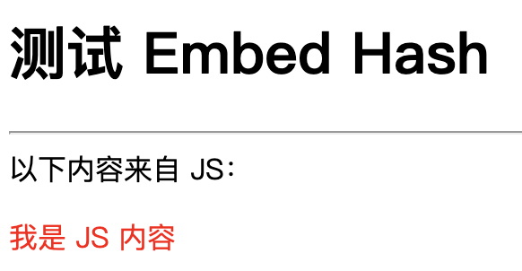
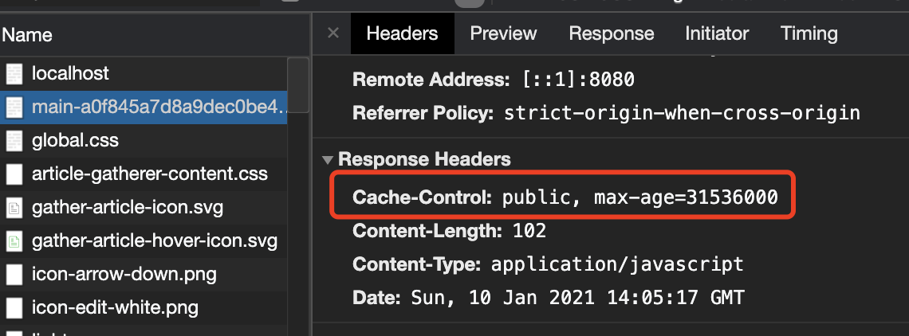

大家好，我是站长 polarisxu。

之前写过一篇文章：[《提前试用将在 Go1.16 中发布的内嵌静态资源功能》](https://mp.weixin.qq.com/s/SiCTV7R2wA_I2nCQkC3GGQ)，如果之前没阅读，建议继续看本文前先阅读下该文。

现在 Go 1.16 Beta 已经发布，离正式版发布不远了，在 GitHub 发现了一个库，它实现了 io/fs.FS 接口，它能够计算文件的 SHA256 哈希值并附加到文件名中以允许进行 HTTP Cache：即控制静态文件的版本。本文对其进行介绍并顺带讲解一些涉及到的其他内容。

> 温馨提示：本文内容基于 Go 1.16 Beta，之前版本不支持！

## 01 hashfs 包

包地址：<https://github.com/benbjohnson/hashfs>，有效代码函数不到 200。

对于给定的一个文件，比如 scripts/main.js，hashfs.FS 文件系统处理后会生成一个带 hash 的文件，类似 scripts/main-b633a..d628.js（中间有省略），客户端请求该文件时，可以选择让客户端缓存。hash 算法使用的是 SHA256。当文件内容发生变化时，hash 值也会变。

该包默认提供对 net/http 的兼容。通过例子看看具体怎么使用。

## 02 基于 net/http 的使用

创建一个目录，使用 module：

```bash
$ mkdir ~/embed
$ cd ~/embed
$ go mod init gtihub.com/polaris1119/embed
```

为了基于同一个项目演示不同使用方式，创建如下目录结构：

```bash
├── cmd
│   ├── std
│   │   └── main.go
├── embed.go
├── go.mod
├── go.sum
├── static
│   └── main.js	// 主要处理该文件的嵌入、hash
├── template
│   └── index.html
```

其中 embed.go 的作用在本文开头文章提到过，内容如下：

```go
package embed

import (
	"embed"

	"github.com/benbjohnson/hashfs"
)

//go:embed static
var embedFS embed.FS

// 带 hash 功能的 fs.FS
var Fsys = hashfs.NewFS(embedFS)
```

> 再说一句，因为 //go:embed 只能相对当前源文件所在目录，所以单独创建这个文件以便和 static 在同一级目录。

index.html 和 main.js 的内容很简单。

index.html：

```html
<html>
  <head>
    <title>测试 Embed Hash</title>
    <script src="/assets/{{.mainjs}}"></script>
  </head>
  <body>
    <h1>测试 Embed Hash</h1>
    <hr>
    <div>
      以下内容来自 JS：
    </div>
    <p id="content" style="color: red;"></p>
  </body>
</html>
```

该模板中有一个变量：mainjs。

main.js：

```js
window.onload = function() {
    document.querySelector('#content').innerHTML = "我是 JS 内容";
}
```

如果一切正常，看到的页面如下：



在 cmd/std/main.go 中写上如下代码：

```go
package main

import (
	"fmt"
	"html/template"
	"log"
	"net/http"

	"github.com/benbjohnson/hashfs"
	"github.com/polaris1119/embed"
)

func main() {
	http.Handle("/assets/", http.StripPrefix("/assets/", hashfs.FileServer(embed.Fsys)))

	http.HandleFunc("/", func(w http.ResponseWriter, r *http.Request) {
		tpl, err := template.New("index.html").ParseFiles("template/index.html")
		if err != nil {
			fmt.Fprint(w, err.Error())
			return
		}

		err = tpl.Execute(w, map[string]interface{}{
			"mainjs": embed.Fsys.HashName("static/main.js"),
		})
		if err != nil {
			fmt.Fprint(w, err.Error())
			return
		}
	})

	log.Fatal(http.ListenAndServe(":8080", nil))
}
```

- 特意为静态资源加上 `/assets/` 前缀，后文解释；
- `hashfs.FileServer(embed.Fsys))` 是 hashfs 包对 net/http 的支持，即 hashfs.FileServer 是一个 http.Handler；
- `embed.Fsys.HashName("static/main.js")` 将文件生成为带 hash 的；

执行 `go run ./cmd/std/main.go`，打开浏览器访问：http://localhost:8080 即可看到上面截图的页面，审查元素可以看到如下信息，缓存一年。（见代码：<https://github.com/benbjohnson/hashfs/blob/main/hashfs.go#L200>）



当你再次刷新浏览器，看到 js 文件直接从缓存获取的。


当 main.js 的内容发生变化，main-xxx.js 中的 hash 部分也会变化，你可以自行试验。（注意，因为资源内嵌了，修改了 js 的内容，需要重新 go run）。

## 03 关于服务静态文件

这块有必要单独拿出来说下，因为比较容易搞错。比如上面的一行代码改为这样：

```go
http.Handle("/assets", http.StripPrefix("/assets", hashfs.FileServer(embed.Fsys)))
```

再次运行结果就不对（没有 “我是 JS 内容”）。（注意禁用浏览器缓存，否则看不到效果）

如果是 Echo 框架，则可以：

```go
e.Static("/assets", ".")
```

Gin 框架，也可以：

```go
router.Static("/assets", ".")
```

关于其中的细节，大家有兴趣可以查阅相关源码。这里只要记住，服务目录，末尾加上 `/`，（目录嘛，应该有 `/`），即：

```go
http.Handle("/assets/", ...)
```

## 04 基于 Echo 的使用

在 cmd 目录下创建 echo/main.go 文件：

```go
package main

import (
	"bytes"
	"fmt"
	"io"
	"mime"
	"net/http"
	"net/url"
	"os"
	"path"
	"strconv"
	"text/template"

	"github.com/benbjohnson/hashfs"
	"github.com/labstack/echo/v4"
	"github.com/polaris1119/embed"
)

func main() {
	e := echo.New()

	e.GET("/assets/*", func(ctx echo.Context) error {
		filename, err := url.PathUnescape(ctx.Param("*"))
		if err != nil {
			return err
		}

		isHashed := false
		if base, hash := hashfs.ParseName(filename); hash != "" {
			if embed.Fsys.HashName(base) == filename {
				filename = base
				isHashed = true
			}
		}

		f, err := embed.Fsys.Open(filename)
		if os.IsNotExist(err) {
			return echo.ErrNotFound
		} else if err != nil {
			return echo.ErrInternalServerError
		}
		defer f.Close()

		// Fetch file info. Disallow directories from being displayed.
		fi, err := f.Stat()
		if err != nil {
			return echo.ErrInternalServerError
		} else if fi.IsDir() {
			return echo.ErrForbidden
		}

		contentType := "text/plain"
		// Determine content type based on file extension.
		if ext := path.Ext(filename); ext != "" {
			contentType = mime.TypeByExtension(ext)
		}

		// Cache the file aggressively if the file contains a hash.
		if isHashed {
			ctx.Response().Header().Set("Cache-Control", `public, max-age=31536000`)
		}

		// Set content length.
		ctx.Response().Header().Set("Content-Length", strconv.FormatInt(fi.Size(), 10))

		// Flush header and write content.
		buf := new(bytes.Buffer)
		if ctx.Request().Method != "HEAD" {
			io.Copy(buf, f)
		}
		return ctx.Blob(http.StatusOK, contentType, buf.Bytes())
	})

	e.GET("/", func(ctx echo.Context) error {
		tpl, err := template.New("index.html").ParseFiles("template/index.html")
		if err != nil {
			return err
		}

		var buf = new(bytes.Buffer)
		err = tpl.Execute(buf, map[string]interface{}{
			"mainjs": embed.Fsys.HashName("static/main.js"),
		})
		if err != nil {
			return err
		}
		return ctx.HTML(http.StatusOK, buf.String())
	})

	e.Logger.Fatal(e.Start(":8080"))
}
```

- 服务静态文件的代码： `e.GET("/assets/*", func(ctx echo.Context) error {`，主要参照了 <https://github.com/benbjohnson/hashfs/blob/main/hashfs.go#L162> 的实现；
- 首页的路由和 net/http 基本一样，关注 mainjs 模板变量；

简单解释下服务静态文件的实现原理：

- 获取请求的路径（`*` 部分）;
- 通过 hashfs.ParseName 解析出文件的 base 和 hash 两部分；
- 使用 fs.FS 打开文件，判断文件类型、大小，并将内容返回给客户端，如果有缓存，设置 HTTP Cache；

运行 go run ./cmd/echo/main.go，不出意外和 net/http 版本一样的效果。

## 05 基于 Gin 的使用

其实知道了如何基于 Echo 框架使用，其他框架参照着实现即可。因为 Gin 框架用户多，因此也实现下。

在 cmd 目录下创建文件：gin/main.go

```go
package main

import (
	"bytes"
	"io"
	"mime"
	"net/http"
	"net/url"
	"os"
	"path"
	"strconv"
	"strings"

	"github.com/benbjohnson/hashfs"
	"github.com/gin-gonic/gin"
	"github.com/polaris1119/embed"
)

func main() {
	r := gin.Default()

	r.GET("/assets/*filepath", func(ctx *gin.Context) {
		filename, err := url.PathUnescape(ctx.Param("filepath"))
		if err != nil {
			ctx.AbortWithError(http.StatusInternalServerError, err)
			return
		}
		filename = strings.TrimPrefix(filename, "/")

		isHashed := false
		if base, hash := hashfs.ParseName(filename); hash != "" {
			if embed.Fsys.HashName(base) == filename {
				filename = base
				isHashed = true
			}
		}

		f, err := embed.Fsys.Open(filename)
		if os.IsNotExist(err) {
			ctx.AbortWithError(http.StatusNotFound, err)
			return
		} else if err != nil {
			ctx.AbortWithError(http.StatusInternalServerError, err)
			return
		}
		defer f.Close()

		// Fetch file info. Disallow directories from being displayed.
		fi, err := f.Stat()
		if err != nil {
			ctx.AbortWithError(http.StatusInternalServerError, err)
			return
		} else if fi.IsDir() {
			ctx.AbortWithError(http.StatusForbidden, err)
			return
		}

		contentType := "text/plain"
		// Determine content type based on file extension.
		if ext := path.Ext(filename); ext != "" {
			contentType = mime.TypeByExtension(ext)
		}

		// Cache the file aggressively if the file contains a hash.
		if isHashed {
			ctx.Writer.Header().Set("Cache-Control", `public, max-age=31536000`)
		}

		// Set content length.
		ctx.Writer.Header().Set("Content-Length", strconv.FormatInt(fi.Size(), 10))

		// Flush header and write content.
		buf := new(bytes.Buffer)
		if ctx.Request.Method != "HEAD" {
			io.Copy(buf, f)
		}
		ctx.Data(http.StatusOK, contentType, buf.Bytes())
	})

	r.LoadHTMLGlob("template/*")
	r.GET("/", func(ctx *gin.Context) {
		ctx.HTML(http.StatusOK, "index.html", gin.H{
			"mainjs": embed.Fsys.HashName("static/main.js"),
		})
	})
	r.Run(":8080")
}
```

服务静态文件的内容和 Echo 框架基本一样，除了各自框架特有的。

> 因为 Gin 框架提供了 LoadHTMLGlob，首页路由的处理函数代码很简单。

运行 go run ./cmd/gin/main.go，不出意外和 net/http 版本一样的效果。

## 06 总结

举一反三，在学习过程中可以让你更好的掌握某个知识点。

之前有读者问到 module 如何使用 vendor（没网情况下使用）。今天试验这个就是用了 vendor。其实它的使用很简单，在项目下执行：go mod vendor 即可。不过需要注意的是，加入了新的依赖，就应该执行一次 go mod vendor。

今天介绍的这个库在这个时代用到的可能性不高，不过也有可能会用得到。更重要的是希望这篇文章可以作为一个小项目实践下。希望你能从头自己编码实现。

另外还留了一个问题给你：index.html 文件没有内嵌，请你自己完成。（提示：html/template 增加了对 io/fs.Fs 的支持）

本项目完整代码：<https://github.com/polaris1119/embed>。

