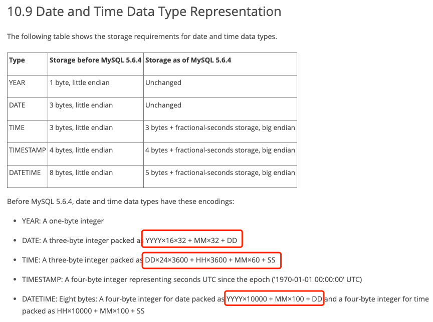
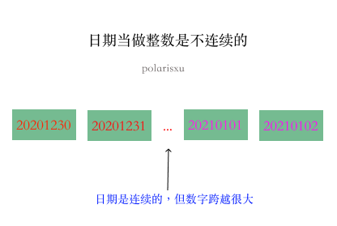
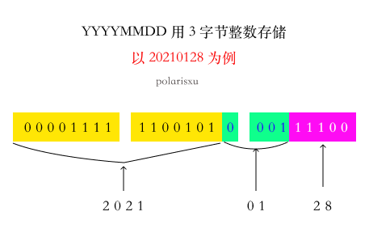

在 Go 语言中文网微信群有人提出了这样的疑问，如下图（文档地址：<https://dev.mysql.com/doc/internals/en/date-and-time-data-type-representation.html>）

不理解为什么 DATE 是通过 YYYY×16×32 + MM×32 + DD 表示，主要不理解为什么 16、32。我做了讲解，但似乎他还是不太理解。干脆我写篇文章详细讲解下，希望对不清楚的人能有所帮助，答案不是重点，关键在于分析的过程。

## 01

讲一个真实的事情。几年前，某大厂的一个 iOS 开发，说之前接触过 PHP，了解一些后端，于是简单聊了聊（半面试形式）。聊到的一些点，让我感觉他的基础很薄弱，于是我试探性的问：int 类型一般占多大空间？（这样的问题我一般不会问，以免让人感觉“鄙视”他）

他回答：32。我就知道他对这块稀里糊涂的。于是追问一句：单位是什么？他不确定的答道：是字节吧？！

回到 MySQL 中的问题，DATE 用 3 字节的整数类型存储，怎么存？如果不考虑空间，DATE 类型最简单的存储方式可能是，直接将 YYYYMMDD 当做整数存储，比如：20210128。这个数是否可以用 3 个字节存储呢？

1 个字节（byte）是 8 位（bit），3 个字节有 24 位，如果表示无符号整数，最大能表示 (1 << 24) - 1（移位操作优先级低于减法），即 16777215。很显然它比 20210128 小，因此我们不能直接使用 YYYYMMDD  当做整数存储。

如果直接把 YYYYMMDD 形式当做整数，中间会有很多“空洞”，也就是很多数字没有用到，是不连续的，空间利用率太低。比如下图，20210101 比它头一天 20201231 大 8870。

因此，我们可以采用“压缩”的方式，让日期集合更“紧凑”。MySQL 这里采用的方法就是。具体为什么是 YYYY×16×32 + MM×32 + DD 呢？

## 02

日期 DD 的范围是：1~31，用 5 个位就可以表示。月份的范围是：1~12，用 4 个位就可以表示，但前面 5 个位被 DD 占用了，因此 MM 得从第 6 位开始，所以需要左移（<<） 5 位，即乘以 32，所以 MM×32 是这么来的。这样一来，MM 和 DD 一共占据了 5 + 4 = 9 位，3 个字节（24 位）还剩 15 位，也就是说有 15 位可以存放年（YYYY），15 位能表示到 32767 年，远超 2021 年。因此，对于 YYYY 来说，需要左移 5 + 4 位，也就是 YYYY×32×16。

至于 TIME，因为用秒表示的值可以存入 3 个字节，因此直接将 TIME 转为秒。即  DD×24×3600 + HH×3600 + MM×60 + SS

而 DATETIME 使用了 8 个字节存储，4 个字节存日期，4 个字节存时间。因为空间比较充足，这里的“压缩”没有采用而二进制位，而是直接用十进制的方式。YYYY×10000 + MM×100 + DD，年月日不会重叠，而且没有超过 4 字节能表示的范围，时间一样的道理。

## 03

如果你问我：为什么 24 位无符号整数最大值是（1<<24) - 1 = 16777215，我建议你可以好好看看《深入理解计算机系统》。

MySQL 这里使用的技巧值得学习。

最后留一个问题：开头文档中第一点，YEAR 这个类型，使用一个字节存储，你觉得该怎么做？！