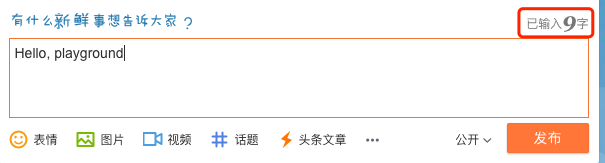

大家好，我是站长 polarisxu。

今天要聊的内容应该可以当做一道面试题，你可以先想想该怎么实现。

统计字数是一个很常见的需求，很多人印象最深的应该是微博早些时候限制 140 字，而且边输入会边统计剩余字数。现在很多社区文章也会有字数统计的功能，而且可以依据字数来预估阅读时间。比如 Go语言中文网就有这样的功能。

## 01 需求分析

下手之前先分析下这个需求。从我个人经验看，在实际面试中，针对一个面试题，你的分析过程，循序渐进的解决方案，可以很好的展示你的思考过程。正所谓分析问题、解决问题。这会给你加分的。

我们采用类似词法分析的思路分析这个需求。

一篇文章通常包含如下元素，我们也称之为 token：

- 普通文字
- 标点符号
- 图片
- 链接（包含各种协议的链接）
- 代码

其中普通文字通常会分为欧美和中日韩（CJK），因为 CJK 属于表意文字，和欧美字母的文字差异很大。同时这里还涉及到编码的问题。本文假设使用 UTF-8 编码。

对于标点符号，中文标点和英文标点也会很不一样。

此外还有全角和半角的问题。

根据以上分析，对于该需求作如下假定：

- 空格（包括换行）不算字数；
- HTML 标签需要剔除；
- 编码方式：假定为 UTF-8 编码；
- 标点符号算不算做字数。如果算，像括号这样的按 2 个字算；
- 链接怎么算？一个链接约定为 1 个字可能更合适，大概阅读时只是把它当链接，而不太会关心链接由什么字母组成；
- 图片不算做字数，但如果计算阅读时间，可能需要适当考虑图片的影响；
- 对于技术文章，代码是最麻烦的。统计代码字数感觉是没多大意义的。统计代码行数可能更有意义；

本文的解决方案针对以上的假定进行。

## 02 Go 语言实现

先看最简单的。

### 纯英文

根据以上分析，如果文章只包含普通文本且是英文，也就是说，每个字（单词）根据空格分隔，统计是最简单的。

```go
func TotalWords(s string) int {
	n := 0
	inWord := false
	for _, r := range s {
		wasInWord := inWord
		inWord = !unicode.IsSpace(r)
		if inWord && !wasInWord {
			n++
		}
	}
	return n
}
```

还有一种更简单的方式：

```go
len(strings.Fields(s))
```

不过看 strings.Fields 的实现，性能会不如第一种方式。

回顾上面的需求分析，会发现这个实现是有 Bug 的。比如下面的例子：

```go
s1 := "Hello,playground"
s2 := "Hello, playground"
```

用上面的实现，s1 的字数是 1，s2 的字数是 2。它们都忽略了标点符号。而且因为写法的多样性（不规范统一），导致计算字数会有误差。所以我们需要对写法进行规范。

### 规范排版

其实和写代码要有规范一样，文章也是有规范的。比如出版社对于一本书的排版会有明确的规定。为了让我们的文章看起来更舒服，也应该遵循一定的规范。

这里推荐一个 GitHub 上的排版指南：[《中文文案排版指北》](https://github.com/studygolang/GCTT/blob/master/chinese-copywriting-guidlines.md)，它的宗旨，统一中文文案、排版的相关用法，降低团队成员之间的沟通成本，增强网站气质。这个规范开头关于空格的一段话很有意思：

> 有研究显示，打字的时候不喜欢在中文和英文之间加空格的人，感情路都走得很辛苦，有七成的比例会在 34 岁的时候跟自己不爱的人结婚，而其余三成的人最后只能把遗产留给自己的猫。毕竟爱情跟书写都需要适时地留白。

建议大家可以看看这个指北，一些知名的网站就是按照这个做的。

因为 GCTT 的排版在这个规范做，但人为约束不是最好的方法，所以我开发了一个 Go 工具：<https://github.com/studygolang/autocorrect>，用于自动给中英文之间加入合理的空格并纠正专用名词大小写。

所以为了让字数统计更准确，我们假定文章是按一定的规范书写的。比如上面的例子，规范的写法是 `s2 := "Hello, playground"`。不过这里标点不算作字数。

刚去微博上试了一下，发现微博的字数计算方式有点诡异，竟然是 9 个字。



测试一下发现，它直接把两个英文字母算作一个字（两个字节算一个字）。而汉字是正常的。大家可以想想微博是怎么实现的。

### 中英文混合

中文不像英文，单词之间没有空格分隔，因此开始的那两种方式不适合。

如果是纯中文，我们怎么计算字数呢？

在 Go 语言中，字符串使用 UTF-8 编码，一个字符用 rune 表示。因此在标准库中查找相关计算方法。

```go
func RuneCountInString(s string) (n int)
```

这个方法能计算字符串包含的 rune（字符）数，对于纯中文，就是汉字数。

```go
str := "你好世界"
fmt.Println(utf8.RuneCountInString(str))
```

以上代码输出 4。

然而，因为很多时候文章会中英文混合，因此我们先采用上面的纯英文的处理方式，即：`strings.Fields()`，将文章用空格分隔，然后处理每一部分。

```go
func TotalWords(s string) int {
	wordCount := 0
  
	plainWords := strings.Fields(s)
	for _, word := range plainWords {
		runeCount := utf8.RuneCountInString(word)
		if len(word) == runeCount {
			wordCount++
		} else {
			wordCount += runeCount
		}
	}

	return wordCount
}
```

增加如下的测试用例：

```go
func TestTotalWords(t *testing.T) {
	tests := []struct {
		name  string
		input string
		want  int
	}{
		{"en1", "hello,playground", 2},
		{"en2", "hello, playground", 2},
		{"cn1", "你好世界", 4},
		{"encn1", "Hello你好世界", 5},
		{"encn2", "Hello 你好世界", 5},
	}
	for _, tt := range tests {
		t.Run(tt.name, func(t *testing.T) {
			if got := wordscount.TotalWords(tt.input); got != tt.want {
				t.Errorf("TotalWords() = %v, want %v", got, tt.want)
			}
		})
	}
}
```

发现 en1 和 encn1 测试不通过，因为没有按照上面说的规范书写。因此我们通过程序增加必要的空格。

```go
// AutoSpace 自动给中英文之间加上空格
func AutoSpace(str string) string {
	out := ""

	for _, r := range str {
		out = addSpaceAtBoundary(out, r)
	}

	return out
}

func addSpaceAtBoundary(prefix string, nextChar rune) string {
	if len(prefix) == 0 {
		return string(nextChar)
	}

	r, size := utf8.DecodeLastRuneInString(prefix)
	if isLatin(size) != isLatin(utf8.RuneLen(nextChar)) &&
		isAllowSpace(nextChar) && isAllowSpace(r) {
		return prefix + " " + string(nextChar)
	}

	return prefix + string(nextChar)
}

func isLatin(size int) bool {
	return size == 1
}

func isAllowSpace(r rune) bool {
	return !unicode.IsSpace(r) && !unicode.IsPunct(r)
}
```

这样可以在 TotalWords 函数开头增加 AutoSpace 进行规范化。这时结果就正常了。

### 处理标点和其他类型

以上例子标点没计算在内，而且如果英文和中文标点混合在一起，情况又复杂了。

为了更好地实现开始的需求分析，重构以上代码，设计如下的结构：

```go
type Counter struct {
	Total     int // 总字数 = Words + Puncts
	Words     int // 只包含字符数
	Puncts    int // 标点数
	Links     int // 链接数
	Pics      int // 图片数
	CodeLines int // 代码行数
}
```

同时将 TotalWords 重构为 Counter 的 Stat 方法，同时记录标点数：

```go
func (wc *Counter) Stat(str string) {
	wc.Links = len(rxStrict.FindAllString(str, -1))
	wc.Pics = len(imgReg.FindAllString(str, -1))

	// 剔除 HTML
	str = StripHTML(str)

	str = AutoSpace(str)

	// 普通的链接去除（非 HTML 标签链接）
	str = rxStrict.ReplaceAllString(str, " ")
	plainWords := strings.Fields(str)

	for _, plainWord := range plainWords {
		words := strings.FieldsFunc(plainWord, func(r rune) bool {
			if unicode.IsPunct(r) {
				wc.Puncts++
				return true
			}
			return false
		})

		for _, word := range words {
			runeCount := utf8.RuneCountInString(word)
			if len(word) == runeCount {
				wc.Words++
			} else {
				wc.Words += runeCount
			}
		}
	}

	wc.Total = wc.Words + wc.Puncts
}

var (
	rxStrict = xurls.Strict()
	imgReg   = regexp.MustCompile(`]*>`)
	stripHTMLReplacer = strings.NewReplacer("\n", " ", "</p>", "\n", "<br>", "\n", "<br />", "\n")
)

// StripHTML accepts a string, strips out all HTML tags and returns it.
func StripHTML(s string) string {
	// Shortcut strings with no tags in them
	if !strings.ContainsAny(s, "<>") {
		return s
	}
	s = stripHTMLReplacer.Replace(s)

	// Walk through the string removing all tags
	b := GetBuffer()
	defer PutBuffer(b)
	var inTag, isSpace, wasSpace bool
	for _, r := range s {
		if !inTag {
			isSpace = false
		}

		switch {
		case r == '<':
			inTag = true
		case r == '>':
			inTag = false
		case unicode.IsSpace(r):
			isSpace = true
			fallthrough
		default:
			if !inTag && (!isSpace || (isSpace && !wasSpace)) {
				b.WriteRune(r)
			}
		}

		wasSpace = isSpace

	}
	return b.String()
}
```

代码过多的细节不讨论。此外，关于文章内的代码行数统计未实现（目前没有想到特别好的方法，如果你有，欢迎交流）。

## 03 总结

通过本文的分析发现，精准统计字数没那么容易，这里涉及到很多的细节。

当然，实际应用中，字数不需要那么特别精准，而且对于非正常文字（比如链接、代码）怎么处理，会有不同的约定。

本文涉及到的完整代码放在 GitHub：<https://github.com/polaris1119/wordscount>。

