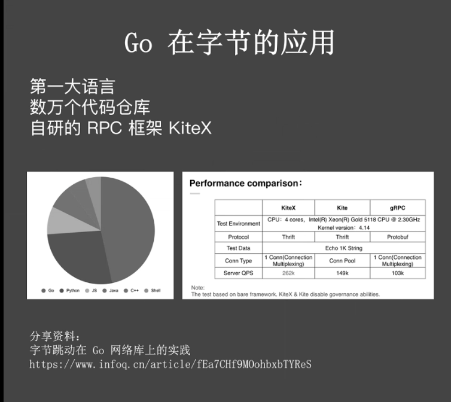
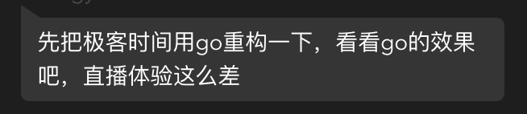

昨天晚上（10 月 25 日）极客时间进行了一场直播，主题是：《未来 5 年将是 Go 语言的天下》。

客观说，这个主题还是挺唬人的，而直播的内容跟这个主题关系不大。有三个嘉宾，只有左耳朵耗子谈了 Go 的未来，他的判断，Go 会成为主流，只会 PHP 肯定行不通。

在提问环节，有人问到耗子哥关于 Python 的看法，他直言：Python 会成为新手语言。不管你认不认同，耗子哥的一些观点还是有一定道理的。

耗子哥的部分，我只听了结尾一点。另外两位的分享，我都听完了。简单聊聊。

## 01 Go 在字节跳动的地位

秦岩老师 PPT 第一页：

> 提到的文章地址：<https://www.infoq.cn/article/fEa7CHf9MOohbxbTYReS>

据我了解，字节当前后端服务超过 80% 的流量是跑在 Go 构建的服务上。高峰 QPS 超过 700 万，日处理请求量超过3000 亿，是业内最大规模的 Go 应用。

对于 Go 爱好者来说，如果能够进入字节跳动，在项目中进行历练，自己上进，相信 Go 水平会有一个质的提升；而应届生，我个人也强烈建议努力朝着进入字节跳动努力。

如上图，Go 在这样量级的公司占据第一使用率，无论从哪方面讲，对 Go 来说都是巨大的成功，也证明了 Go 的可靠性。

## 02 直播的故障

抖音的老师刚开个头，突然直播故障了，持续了几分钟。

大家的吐槽来了：

秦岩老师是负责抖音、直播稳定性的，他一来不稳定了？！

对于这个突发的故障，不用太较真，各种系统应该常遇到。正式因为这样那样的故障，催生出各种应对办法，各种高可用、稳定性架构。

对此，我想说的是，如果你一直在一个小公司，没有大流量，很多问题你是没法遇到的，这些问题只学理论是不够的。你写的代码，你的架构，可能在你的公司运行的很好，但只要流量一大，他们可能就崩溃了。一定阶段，技术的提升，需要环境、需要大项目、大流量的历练。又回到那句话：趁年轻，能进大厂，一定要到大厂去历练，现在能力不够，恶补下，朝着大厂的目标去努力。

## 03 毛剑老师的分享

毛剑老师这次主要站在面试官的角度分享大厂面试 Go 工程师更看重哪些能力。他提到了软实力、硬实力，以及他喜欢问候选人哪些题。

这方面，每个人的喜好不一样，有些面试官喜欢问这个，有些喜欢问那个。就技术能力来说，大厂一般会有规范的流程，有些可能有面试考察能力的要求。所以，除了 Go 语言本身使用掌握外，还需要对核心的一些设计有所了解。比如调度、内存、并发等，此外服务端相关的其他技能，也是必须掌握的。

对此，我个人的看法：

- 根据职位不同，可能侧重点不一样；不同公司、不同部门，面试的喜好也会有所区别，需要有针对性的准备；
- Go 语言本身的基本功，底层的一些实现，作为一个 Gopher，你应该不断探索；
- 操作系统、网络、数据库、缓存等服务端相关的技能得不断加深；
- 适当刷刷题，比如 LeetCode；手写代码也可以练练。比如字节面试都会让手写代码；

## 04 未来 5 年将是 Go 语言的天下？

这个定义有点夸张，但 Go 确实受到越来越多的关注。别的不说，很多 PHPer 都在学习 Go。从我的网站：https://studygolang.com 流量看，这些年上升还是挺厉害的。

一直以来，国内的技术和国外是不太一样的。Go 语言也很明显，在国内的热度明显高于国外。因为有字节跳动、腾讯（据说 Go 在腾讯今年有望成为第二大编程语言，去年是第三大）、滴滴、B 站等大厂的大规模使用（圈内人应该发现，曾经 PHP 一统天下的好未来，这段时间也是各种 Go），Go 必然会受到越来越多的关注。从目前在线教育对 Go 的投入来看，他们也看到了 Go 的潜力。所以，我看好 Go，你呢？！
