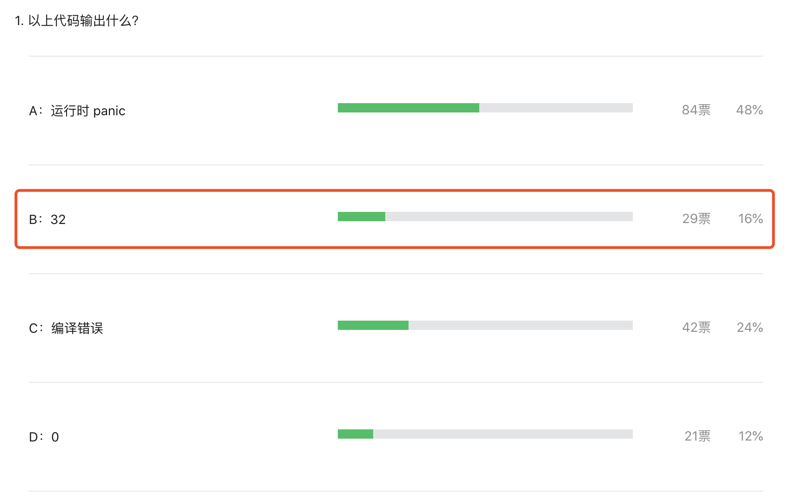

大家好，我是 polarisxu。

在 Go语言爱好者周刊第 104 期有一道题目，以下代码输出什么：

```go
package main

func main() {
  var x *struct {
    s [][32]byte
  }
  
  println(len(x.s[99]))
}
```

答题结果如下：



正确率只有 16%。

本文就讲解下为什么结果是 32。

## 01 解析题目

先剖析下这段代码，x 变量：

```go
var x *struct {
  s [][32]byte
}
```

注意这里不是定义一个结构体类型，而是定义一个结构体类型指针变量，即 x 是一个指针，指针类型是一个匿名结构体。很显然，x 的值是 nil，因为没有初始化，可以打印证实这一点。

```go
package main

import "fmt"

func main() {
	var x *struct {
		s [][32]byte
	}

	fmt.Printf("x.Type = %T; x.Value= %v\n", x, x)
}
```

输出：

```bash
x.Type = *struct { s [][32]uint8 }; x.Value= <nil>
```

这也是为什么 48% 的人选择 A （panic） 的原因，毕竟 x 是 nil，panic 很自然的。比如这样就会 panic：

```go
println(x.s)
// panic: runtime error: invalid memory address or nil pointer dereference
```

相应的，fmt.Println(x.s[99]) 也会 panic。但为什么 `len(x.s[99])` 就不 panic 了呢？所以得从 len 入手一探究竟。

## 02 len 详解

len 函数是一个内置类型，什么意思？就是由编译器实现的。它的参数可以接收多种类型，有泛型的味道。

```go
func len(v Type) int
```

关于它的说明，标准库文档有说明：

> 内建函数 len 返回 v 的长度，这取决于具体类型：
>
> - 数组：v 中元素的数量
> - 数组指针：*v 中元素的数量（v 为 nil 时 panic）
> - 切片、map：v 中元素的数量；若 v 为nil，len(v) 即为零
> - 字符串：v 中字节的数量
> - 通道：通道缓存中队列（未读取）元素的数量；若 v 为 nil，len(v) 即为零

光这个解释，还不够全面，len 函数还有其他一些特殊的点。这要看 Go 语言规范。

在规范中，有一节是[关于 len 和 cap 的](https://hao.studygolang.com/golang_spec.html#id221)。有如下几个要点：

- 返回结果总是 int；
- 返回结果有可能是常量；
- 有时对函数参数不求值，即编译期确定返回值；

2、3 点解释下。（规范中有说明）

如果 len 或 cap 的函数参数 v 是字符串常量，则返回值是一个常量。

**如果 v 的类型是数组或指向数组的指针，且表达式 v 没有包含 channel 接收或（非常量）函数调用，则返回值也是一个常量。这种情况下，不会对 v 进行求值（即编译期就能确定）。否则返回值不是常量，且会对 v 进行求值（即得运行时确定）。**

**这一点是这道题的关键。**

首先，x.s[99] 的类型是 `[32]byte`，它是一个数组，且表达式 `x.s[99]` 没有包含 channel 接收也不是函数调用，因此不会对  x.s[99] 进行求值，不求值自然不会 panic（想不明白？可以想成没有解引用操作）。也就是说，编译器能够在编译阶段分析出 x.s[99] 的类型是 [32]byte，且不需要对 x.s[99] 求值，因此直接返回数组的长度，即 32。

## 03 其他类似情况

类似这样不求值的情况还有没有？还真有。比如下面的代码：

```go
var testdata *struct {
  a *[7]int
}
for i, _ := range testdata.a {
  fmt.Println(i)
}
```

同样不会 panic，原理和上面的类似，[在 Go 语言规范有说明](https://hao.studygolang.com/golang_spec.html#id355)。

"range" 子句中右侧的表达式被称为 range 表达式 ，它可以是数组、数组的指针、切片、字符串、map或是允许接收操作 的 channel。range 表达式会在开始此循环前被求值一次，但有一个例外：当存在最多一个迭代变量且 `len(x)` 是常量时，range 表达式是不被求值的。

所以上面代码中 testdata.a 不会被求值，因为 len(testdata.a) 是常量。

但如果改为这样：

```go
var testdata *struct {
  a *[7]int
}
for i, j := range testdata.a {
  fmt.Println(i, j)
}
```

就会 panic。

## 04 总结

通过这么一道「诡异」的面试题，希望你能够对 len 有更深的理解，也希望你能够重视 Go 语言规范，多留意一些细节，同时学会如何寻找问题的答案。
