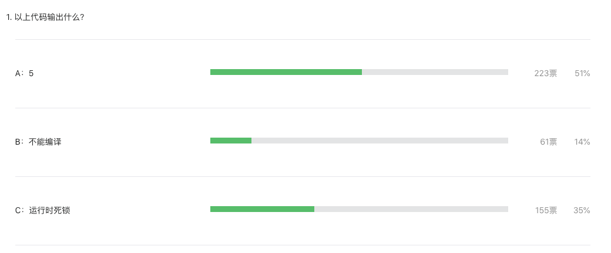

大家好，我是站长 polarisxu。

昨天在 [Go语言爱好者周刊第 78 期](https://mp.weixin.qq.com/s/kma8hvdLVPIkZnKw_MaSKg)出了一道题，以下代码输出什么？

```go
package main

import (
	"fmt"
	"time"
)

func main() {
	ch1 := make(chan int)
	go fmt.Println(<-ch1)
	ch1 <- 5
	time.Sleep(1 * time.Second)
}
```

A：5；B：编译不通过；C：运行时死锁

如果你没有做这道题，往下看之前，先思考下。

今天看了下答题结果，正确率有点低，才 35%：



可见不少人的基础还是不扎实。

此题如果改为这样：

```go
package main

import (
	"fmt"
	"time"
)

func main() {
	ch1 := make(chan int)
  go func(){
    fmt.Println(<-ch1)
  }()
	ch1 <- 5
	time.Sleep(1 * time.Second)
}
```

结果就是 A 了。对比下你能知道原因了吧！

在 Go 语言规范中，关于 [go 语句](https://docs.studygolang.com/ref/spec#Go_statements)有这么一句描述：

> ```
> GoStmt = "go" Expression .
> ```
>
> The expression must be a function or method call; it cannot be parenthesized. Calls of built-in functions are restricted as for [expression statements](https://docs.studygolang.com/ref/spec#Expression_statements).
>
> The function value and parameters are [evaluated as usual](https://docs.studygolang.com/ref/spec#Calls) in the calling goroutine, but unlike with a regular call, program execution does not wait for the invoked function to complete. 

这里说明，go 语句后面的函数调用，其参数会先求值，这和普通的函数调用求值一样。在规范中[调用部分](https://docs.studygolang.com/ref/spec#Calls)是这样描述的：

> Given an expression `f` of function type `F`,
>
> ```
> f(a1, a2, … an)
> ```
>
> calls `f` with arguments `a1, a2, … an`. Except for one special case, arguments must be single-valued expressions [assignable](https://docs.studygolang.com/ref/spec#Assignability) to the parameter types of `F` and are evaluated before the function is called. 

大意思是说，函数调用之前，实参就被求值好了。

因此这道题目 `go fmt.Println(<-ch1)` 语句中的 `<-ch1` 是在 main goroutine 中求值的。这相当于一个无缓冲的 chan，发送和接收操作都在一个 goroutine 中（main goroutine）进行，因此造成死锁。

更进一步，大家可以通过汇编看看上面两种方式的不同。

此外，defer 语句也要注意。比如下面的做法是不对的：

```go
defer recover()
```

而应该使用这样的方式：

```go
defer func() {
  recover()
}()
```

