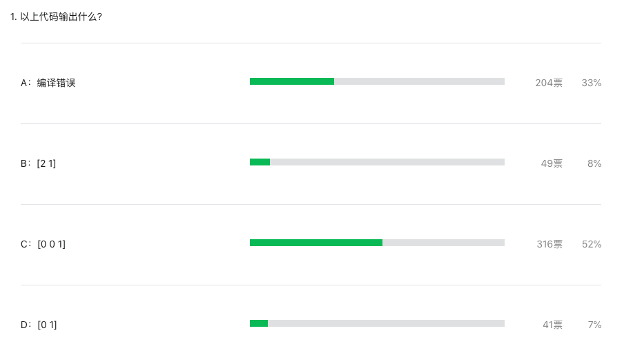
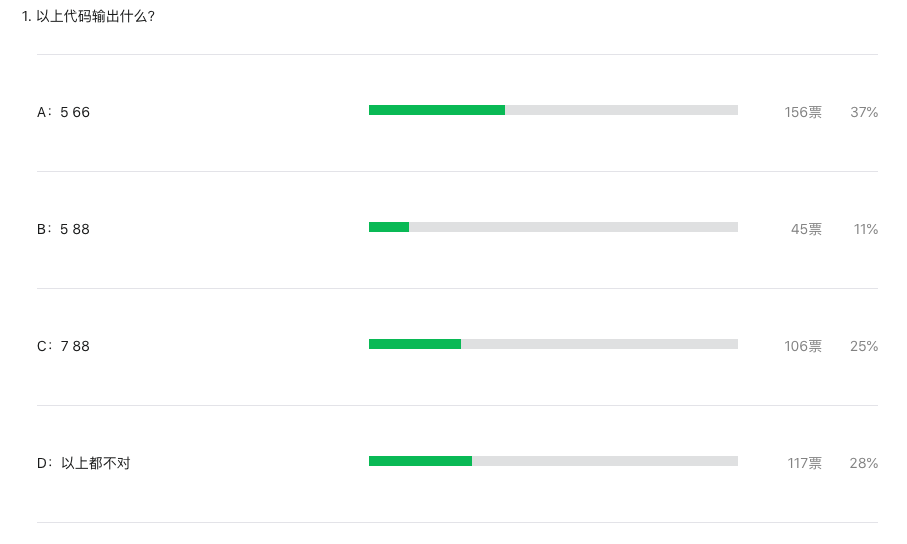

大家好，我是站长 polarisxu。

我在 Go 语言爱好者周刊[第 87](https://mp.weixin.qq.com/s/4HI78Yd1ENVFCWHCESlPBg) 和 [88 期](https://mp.weixin.qq.com/s/pgIoGnOd0CMPHFc4HD0xFA)刊首出了两道题，这两道题有点类似，都是和切片初始化有关。但这两道的题正确率比较低，特别是 88 期的题。

第 87 期题目如下：

```go
package main

import (
	"fmt"
)

func main() {
	a := []int{2: 1}
	fmt.Println(a)
}
```

正确答案是：C，正确率 52%。这道题相对简单，但依然有近一半的人答错了。



第 88 期题目和 87 期类似，但难度高一些，题目如下：

```go
package main

func main() {
	var x = []int{4: 44, 55, 66, 1: 77, 88}
	println(len(x), x[2])
}
```

正确答案是：C，正确率很低，只有 25%。



为了更全面，我们讲解下 array/slice 的一些相关知识。

## 01 数组和切片

关于两者，Go 语言规范中都有明确定义。

[数组](https://hao.studygolang.com/golang_spec.html#ruby-rb-rb-rp-rp-rt-array-types-rt-rp-rp-ruby)是这么说明的：

> 数组是单一类型元素的有序序列，该单一类型称为元素类型。元素的个数被称为数组长度，并且不能为负值。长度是数组类型的一部分；它必须为一个可以被 int 类型的值所代表的非负常量。

这里一个关键点就是，长度是数组的一部分，因此 [3]int 和 [4]int 是不同类型。

再看看[切片](https://hao.studygolang.com/golang_spec.html#ruby-rb-rb-rp-rp-rt-slice-types-rt-rp-rp-ruby)：

> 切片是针对一个底层数组的连续段的描述符，它提供了对该数组内有序序列元素的访问。切片类型表示其元素类型的数组的所有切片的集合。元素的数量被称为切片长度，且不能为负。未初始化的切片的值为 `nil` 。

从 EBNF 的表示可以看出区别：

```
ArrayType   = "[", ArrayLength, "]", ElementType .
SliceType = "[", "]", ElementType .
```

也就是说，长度不是切片类型的一部分，切片长度可变。

## 02 常见字面量初始化

我不打算讲解数组/切片初始化的各种情况，主要介绍常见的字面量初始化，以及和上面题目相关的部分。

通常我们会这么初始化一个数组：

```go
var intSet = [6]int{2, 4, 6}
```

注意 `[]` 中的 6，它表示数组的长度。因为初始化时，我们只给定了 3 个数，因此后 3 个元素是 0：

```bash
[2 4 6 0 0 0]
```

注意和这种写法的区别：

```go
var intSet = [...]int{2, 4, 6}
```

对于切片来说，一般这样初始化：

```go
var intSlice = []int{2, 4, 6}

// 或基于 intSet 进行初始化
var intSlice = intSet[:]
```

当然，针对 Slice，更多时候是通过 make 创建，然后其他方式初始化，这里不展开了。

## 03 特殊的初始化

在 Go语言规范「[Composite literals](https://hao.studygolang.com/golang_spec.html#ruby-rb-rb-rp-rp-rt-composite-literals-rt-rp-rp-ruby)」部分对数组和切片的字面值初始化进行了规定，因为数组和切片类似，我们这里只说切片的情况。

先看组合字面值的 EBNF 表示：

```bash
CompositeLit  = LiteralType, LiteralValue .
LiteralType   = StructType | ArrayType | "[", "...", "]", ElementType |
                SliceType | MapType | TypeName .
LiteralValue  = "{", [ ElementList, [ "," ] ], "}" .
ElementList   = KeyedElement, { ",", KeyedElement } .
KeyedElement  = [ Key, ":" ], Element .
Key           = FieldName | Expression | LiteralValue .
FieldName     = identifier .
Element       = Expression | LiteralValue .
```

从上到下看，简单解释一下：

- 第 1 行，表示组合字面值由 LiteralType 和 LiteralValue 构成，其中 LiteralType 表示组合字面值的类型，LiteralValue 表示值；
- 第 2 行，解释 LiteralType，它可以是 `=` 后面的类型。允许的类型有：结构体、数组、切片、map 等，其中还可以是类似 `[…]int` 的形式；
- 第 4 行，解释 LiteralValue，它由一对 `{}` 包裹，其中包含可选的 ElementList；
- 第 5 行，解释 ElementList，它由若干 KeyedElement 组成；
- 第 6 行，解释 KeyedElement，这是**该篇题目的重点之处**。在 EBNF 中，`[]` 表示这部分是可选的，因此表示具体元素时，一般 Key 可以省略（map 不能省略），这就是通常数组和切片的初始化语法；

在这个之后，规范上给出了针对数组和切片字面值的应用规则：

1. 数组中的每个元素有一个关联的标记其位置的整数索引。
2. **带键的元素使用该键作为其索引**。这个键必须是可被类型 int 所表示的一个非负常量；而且如果其被赋予了类型的话则必须是整数类型。
3. **不带键的元素使用之前元素的索引加一**。如果第一个元素没有键，则其索引为零。

根据以上 3 点，我们很容易知道，在 `a := []int{2: 1}` 中，我们指定了第 3 个元素（注意索引是从 0 开始的）的值为 1，根据数组/切片的特性，自然存在第 1、2 个元素，没有指定值时，Go 会为其设置默认值。因此这个写法和下面的写法等价：

```go
a := []int{0, 0, 1}
```

对于第 88 期的题目：

```go
var x = []int{4: 44, 55, 66, 1: 77, 88}
```

指定了第 5 个元素（对应索引是 4），值是 44。根据上面规则的第三点，55、66 都没有指定索引，因此它们的索引是前一个元素的索引加一，即：

```go
5: 55, 6: 66
```

下一个元素是 `1: 77`，为其指定了索引 1，因此它的下一元素 88 的索引就是 2 了，因此这个定义相当于如下的定义：

```go
var x = []int{4: 44, 5: 55, 6: 66, 1: 77, 2: 88}
```

同样，因为数组/切片的特性，缺少的元素（索引 0 和 3）值是 0，而整个切片的长度是最大索引加一，即 7。

## 04 总结

别觉得这道题目恶心，实际中这么写代码可能也确实会被打（当然，第 87 题的写法还是很有可能的）。这里主要是希望大家多掌握一些规范、细节，我想不少人不清楚，原来数组（切片）也可以指定索引进行初始化。语言语法毕竟必须严谨，而这些都在 Go 语言规范里。

延伸思考：第 88 期的题目，如果改为这样结果又如何？

```go
var x = []int{4: 44, 55, 66, 3: 77, 88}
```

欢迎大胆的留言说出你的答案！