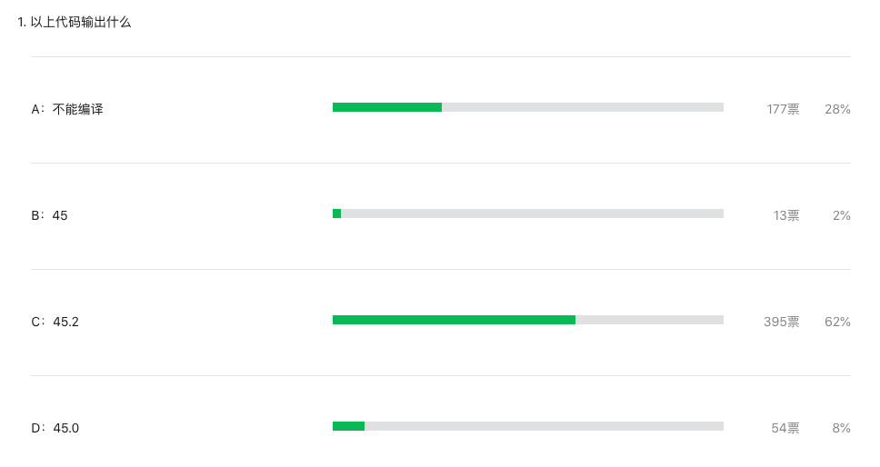

大家好，我是 polarisxu。

之前周刊题目正确率一直挺低的，于是我在「94期」出了一道简单的题目，如下：

```go
package main

import (
	"fmt"
)

func main() {
  var ans float64 = 15 + 25 + 5.2
  fmt.Println(ans)
}
```

没想到，这道题的正确率也才 62%：



这篇文章就给大家讲解下这道题涉及到的常量表达式的一个知识点。

## 概念

常量表达式是指仅包含常量操作数，且是在编译的时候进行计算的。

而常量，在 Go 语言中又可以分为无类型常量和有类型常量，也可以分为字面值常量和具名常量。说人话？！

通过代码看看：

```go
const a = 1 + 2 			// a == 3，是无类型常量
const b int8 = 1 + 2 	// b == 3，是有类型常量，类型是 int8

// 而 1、2 这样的就是字面值常量
// a、b 这样的就是具名常量
```

> 无类型常量英文是 untyped constants；具名常量英文是 named constants。

无类型常量也叫类型不确定常量，有类型常量也叫类型确定常量。虽然无类型常量类型不确定，但对于大多数类型不确定值来说，它们各自都有一个默认类型， 除了预声明的`nil`。`nil`是没有默认类型的。（参考 Go101）

- 一个字符串字面量的默认类型是 string 类型。
- 一个布尔字面量的默认类型是 bool 类型。
- 一个整数型字面量的默认类型是 int 类型。
- 一个 rune 字面量的默认类型是 rune（也就是 int32）类型。
- 一个浮点数字面量的默认类型是 float64 类型。
- 如果一个字面量含有虚部字面量，则此字面量的默认类型是 complex128 类型。

## 02 类型推断

大家都知道，Go 能自动进行类型推导。因此，在一些场景下，我们可以使用类型不确定值，而 Go 编译器会自动推断出这些值在特定场景下的类型。

如果根据上下文，没有确定的类型，则编译器会将这些不确定类型值视为它们的默认类型。

以上是 Go 中的隐式类型转换。除了这些情况，Go 是不支持隐式类型转换的，必须进行显示类型转换。

## 03 常量表达式

现在回到题目，说说常量表达式。

在 Go 语言规范中提到，任何在无类型常量上的操作结果是同一个类别的无类型常量，也就是：布尔、整数、浮点数、复数或者字符串常量。如果一个二元运算（非位移）的无类型操作数是不同类的，那么其结果是在如下列表中靠后显示的操作数的类：整数、 rune、浮点数、复数。又该说人话了？！

通过解析题目就明白这段话的意思了。

```go
var ans float64 = 15 + 25 + 5.2
```

根据这段话，15 + 25 + 5.2 是常量表达式，因为这个表达式的操作数都是无类型的常量，因为其中有 5.2，它的默认类型是浮点型，所以这个常量表达式的结果虽然是无类型的，但默认类型是浮点型。

其实这道题抛开编程语言来说，就是一个常规的数学算式：15 + 25 + 5.2，这么简单的算式相信大家都会。所以，这道题做错了的，大概率是想多了，想复杂了！

当然，也有人说，看到这道题，怕有陷阱，所以想多了。。。

