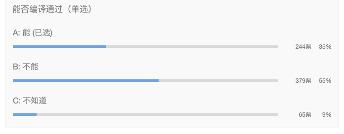

大家好，我是站长 polarisxu。

时不时有人催问周刊题目的解析，那就先先解析下[第 71 期](https://mp.weixin.qq.com/s/QpG5oBlz9mcmBUV8gl7P7w)的题目。

## 01

题目是，以下代码能否通过编译：

```go
package main

import (
	"fmt"
)

type worker interface {
	work()
}

type person struct {
	name string
	worker
}

func main() {
	var w worker = person{}
	fmt.Println(w)
}
```

这是大家的投票结果：



只有 35% 的人答对了。

这里答错的原因在于 worker 是一个接口，如果是一个普通的类型，相信大家会答对。一个结构体竟然可以嵌入一个接口？！

## 02

我们都知晓 Go 没有继承，但可以通过内嵌类型模拟部分继承的功能。大家要记住，接口也是类型，自然也将它作为嵌入类型。如果题目的 person 接口体改为：

```go
type person struct {
	name string
	worker worker
}
```

相信会有更多人答对，这和嵌入类型唯一的区别在于是否显示指定了字段名，其他并无区别。

将接口作为嵌入类型可能让人感觉有些奇怪：那这个类型不是默认就实现了这个接口？！确实是这样的，所以才有了题目中这一句能编译通过：

```go
var w worker = person{}
```

只不过，因为实例化 person 时，没有给 worker 指定值，因此 person 中的 worker 是 nil，调用它的话会报错，但编译是没问题的。

## 03

有人可能要问，嵌入接口有实际用途吗？我找一个标准库中的例子。

在 sort 包中，有一个接口：Interface

```go
type Interface interface {
	// Len is the number of elements in the collection.
	Len() int
	// Less reports whether the element with
	// index i should sort before the element with index j.
	Less(i, j int) bool
	// Swap swaps the elements with indexes i and j.
	Swap(i, j int)
}
```

这是用于排序的。还有另外一个结构体：[reverse](https://docs.studygolang.com/src/sort/sort.go?s=7078:7105#L239)

```go
type reverse struct {
	// This embedded Interface permits Reverse to use the methods of
	// another Interface implementation.
	Interface
}
```

它就内嵌了一个 Interface，用于排序的反转。

而内嵌接口的关键在于如何给这个内嵌的接口赋值。sort 包有一个函数：Reverse

```go
func Reverse(data Interface) Interface {
	return &reverse{data}
}
```

其中实例化 reverse 时，直接通过传递的 Interface 实例赋值给 reverse 的内嵌接口，然后 reverse 类型可以有选择的重新实现内嵌的 Interface 的方法。比如 Less 方法：

```go
func (r reverse) Less(i, j int) bool {
	return r.Interface.Less(j, i)
}
```

## 04

回到上面的题目，如果我们通过实例化的 w 调用 work 方法会报错：

```go
var w worker = person{}
w.work()	// panic
```

和上面 reverse 类似，你需要给 person 中的 worker 实例化，也就是需要一个实现了 worker 接口的类型实例。比如：

```go
type student struct{
    name string
}

func (s student) work() {
    fmt.Println("I am ", s.name, ", I am learning")
}
```

然后这样实例化 person：

```go
var w worker = person{worker: student{"polarisxu"}}
```

你掌握了吗？

