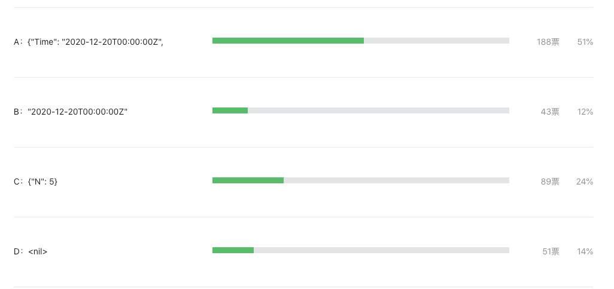

这题是有点坑，但很多人对结果还是不知所以

大家好，我是站长 polarisxu。

在 [《Go 语言爱好者周刊第 74 期》](https://mp.weixin.qq.com/s/oDMSFjjzGbu7kkERM8ilGw)有一道题，以下代码输出什么？

```go
package main

import (
	"encoding/json"
	"fmt"
	"time"
)

func main() {
	t := struct {
		time.Time
		N int
	}{
		time.Date(2020, 12, 20, 0, 0, 0, 0, time.UTC),
		5,
	}

	m, _ := json.Marshal(t)
	fmt.Printf("%s", m)
}
```

A：`{"Time": "2020-12-20T00:00:00Z", "N": 5}`；B：`"2020-12-20T00:00:00Z"`；C：`{"N": 5}`；D：`<nil>`

答题结果如下：



虽然参与投票的人不是很多，但从结果还是能反馈出来一些问题的，不少人知晓了答案是 B，但还是想不明白为什么。所以写篇文章对该题进行解析。大家不用在乎是不是刁钻的题目，通过题目能学到知识才是最重要的。

## 01

对一个结构体实例进行 json 系列化，直觉很容易选 A。但很显然，不可能这么简单，因此需要仔细看代码。至于选 C 和 D 的人，多半是瞎猜的吧，当然选 B 也不排除有瞎猜的。

为什么选 B 呢？我想借助一个例子讲解。

```go
package main

import (
	"encoding/json"
  "fmt"
)

type Person struct {
  name  string
  hobby string
}	

func main() {
  person := Person{name: "polarisxu", hobby: "Golang"}
  m, _ := json.Marshal(person)
  fmt.Printf("%s", m)
}
```

如果你认为输出 `{"name":"polarisxu","hobby":"Golang"}`，那你得去补补 encoding/json 包的知识了。要想输出  `{"name":"polarisxu","hobby":"Golang”}`，一般我们会这么做：将 Person 的字段导出，同时设置上 tag。

```go
type Person struct {
  Name  string `json:"name"`
  Hobby string `json:"hobby"`
}
```

但如果我们不想导出 Person 的字段呢？可以通过实现 Marshaler 来做到。

```go
func (p Person) MarshalJSON() ([]byte, error) {
	return []byte(`{"name":"`+p.name+`","hobby":"`+p.hobby+`"}`), nil
}
```

## 02

回到题目上，[time.Time](https://docs.studygolang.com/pkg/time/#Time) 是什么类型？

```go
type Time struct {
    // contains filtered or unexported fields
}
```

这是一个没有导出任何字段的结构体类型，因此它肯定[实现了 Marshaler 接口](https://docs.studygolang.com/src/time/time.go?s=38148:38191#L1230)。

```go
// MarshalJSON implements the json.Marshaler interface.
// The time is a quoted string in RFC 3339 format, with sub-second precision added if present.
func (t Time) MarshalJSON() ([]byte, error) {
	if y := t.Year(); y < 0 || y >= 10000 {
		// RFC 3339 is clear that years are 4 digits exactly.
		// See golang.org/issue/4556#c15 for more discussion.
		return nil, errors.New("Time.MarshalJSON: year outside of range [0,9999]")
	}

	b := make([]byte, 0, len(RFC3339Nano)+2)
	b = append(b, '"')
	b = t.AppendFormat(b, RFC3339Nano)
	b = append(b, '"')
	return b, nil
}
```

这么说，答案不应该就是 A 吗？别急。

## 03

如果 t 是这么定义的：

```go
t := struct {
  Time time.Time
  N int
}{
  time.Date(2020, 12, 20, 0, 0, 0, 0, time.UTC),
  5,
}
```

那结果就是 A。而题目中，time.Time 是内嵌的。你学习 Go 时，应该看过通过内嵌来模拟继承的功能吧！

正是因为内嵌，t 的方法集包括了 time.Time 的方法集，所以，t 自动实现了 Marshaler 接口。因此答案是 B。

其实这道题的情况，在日常工作中还真有可能遇到。所以，当你内嵌某个类型时，特别这个类型不是你自己定义的，需要留意这种情况。

一般解决这个问题的方法有两种：1）不内嵌；2）重新实现 MarshalJSON 方法。

然而这道题无法重新实现 MarshalJSON 方法，因为结构体类型是匿名的。只能通过不内嵌来得到正确的结果。

## 04

最后一起看下 json.Marshal 函数的文档，主要看下面这段：

> Marshal traverses the value v recursively. If an encountered value implements the Marshaler interface and is not a nil pointer, Marshal calls its MarshalJSON method to produce JSON. If no MarshalJSON method is present but the value implements encoding.TextMarshaler instead, Marshal calls its MarshalText method and encodes the result as a JSON string. The nil pointer exception is not strictly necessary but mimics a similar, necessary exception in the behavior of UnmarshalJSON.

大意是说，如果值实现了 json.Marshaler 接口并且不是 nil 指针，则 Marshal 函数会调用其 MarshalJSON 方法以生成 JSON。如果不存在 MarshalJSON 方法，但该值实现 encoding.TextMarshaler 接口，则 Marshal 函数调用其 MarshalText 方法并将结果编码为 JSON 字符串。

可见，json.Marshal 函数优先调用 MarshalJSON，然后是 MarshalText，如果都没有，才会走正常的类型编码逻辑。