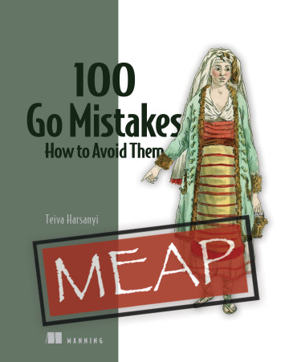

大家好，我是 polarisxu。

Go 虽然简单，但一样会有很多容易犯的错误。网上也有不少总结的 Go 常见错误。

Teiva Harsanyi 在 2019 年发表过一篇文章：[《The Top 10 Most Common Mistakes I’ve Seen in Go Projects》](https://itnext.io/the-top-10-most-common-mistakes-ive-seen-in-go-projects-4b79d4f6cd65)（这里有中文版：<https://tomotoes.com/blog/the-top-10-most-common-mistakes-ive-seen-in-go-projects/>），总结了 Go 项目中常见的 10 个错误。这篇文章不仅分析每个错误的场景，还给出了最佳实践，值得一读。

看其中一个例子：

```go
type Status uint32

const (
  StatusOpen Status = iota
  StatusClosed
  StatusUnknown
)
```

这样的代码，你认为有什么问题？

最近这篇文章的作者发文说，因为那篇文章挺受欢迎，他就想着能不能写一本这方面的图书。于是，他不断收集各种常见问题，研究博文、图书等。

去年年底，这样的错误达到了 100 个之多，于是他联系出版社准备出版该书。

和作者那篇文章类似，每一个错误都将尽可能用现实生活中的例子来说明。目标是希望能够帮助 Go 开发者更高效地工作，减少不必要的错误，真正做到 Go 提倡的 Happy Working！

目前这本书已经基本完成，在 manning 官方可以找到：<https://www.manning.com/books/100-go-mistakes-how-to-avoid-them>，封面如下：



该书目前出于预售阶段，打 5 折。不过，其中前三章已经可以免费阅读。作者给出了本书的目录，希望大家提建议。（可以访问这里看详细目录：<https://medium.com/solvingalgo/100-go-mistakes-2022-4debd9449a72>）

从目录看，这本书挺适合作为手册翻阅的。作者预计，这本书得 2022 年春出版。期待一下！