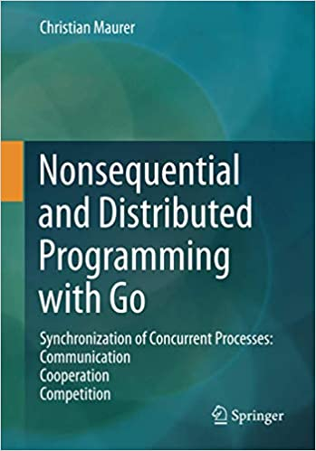
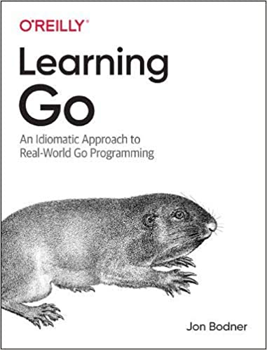

大家好，我是站长 polarisxu。

大家觉得 Go 的图书多吗？其实是很少的。今天聊下近期将要出版的基本 Go 图书。

## 01 《Go语言设计与实现》

这是一本 Go 语言进阶图书。作者历时两年，在他的网站可以免费阅读：<https://draveness.me/golang/>。他朋友圈透露，该书已经交稿，应该很快会出版。这本书绝对是 2021 年度最值得期待的 Go 图书。

作为支持，书出版时，我会送出几本，敬请期待！

从网站上看该书，主要包含如下内容（直接引用书中的思维导图）：

该书作者功底很深，如果你的计算机基础不扎实，不少内容会看的一头雾水，这表示你需要夯实你的基础了。我相信，如果你能把它吃透，一定会很有收获。

**五星推荐**

## 02 《ultimate go notebook》

作者 William Kennedy，他是 《Go In Action》作者之一，是 <https://www.ardanlabs.com/> 的创始人。目前在做咨询和培训。

前段时间，他在 Twitter 说，几个月没露脸了，因为在潜心写一本书：

关于该书的内容，作者没有透露更多，但期待一下。预计 2021 年 3 月份出版。不过是英文版，中文是否会引进，我觉得看质量吧。

## 03 《Nonsequential and Distributed Programming with Go》

这本书是已经出版了的。本书介绍了 Go 的非顺序和分布式编程。它系统地介绍了并发进程的同步和通信的基本概念。其中包括锁，信号量，公平性和死锁，监视器，本地和整个网络的消息传递，图形网络，网络探索，分布式深度和广度优先搜索以及网络领导者的选择。为了使读者熟悉这些概念，作者始终采用相同的经典示例。这使学习变得更容易，因为所介绍的概念可以更轻松地与语言资源比较。

该书是有电子版的。但价格真的。。。相比来说，国内的图书真的好便宜。

## 04 《Learning Go》

从书名看，感觉是一本比较普通的入门书籍。但它有一个副标题：An Idiomatic Approach to Real-World Go Programming。

Go 语言爱好者，很多是其他语言转过来的，在写 Go 代码时，总是能看到其他语言的影子。该书的目标是教大家 Go 的习惯用法，它提供了编写清晰且惯用的 Go 所需的基本背景。

无论你的经验水平如何，通过该书都将学习如何像 Go 开发人员那样思考。作者 Jon Bodner 介绍了 Go 开发人员所采用的设计模式，并探讨了使用它们的原理。你还将预览 Go 即将推出的泛型支持以及它如何适应该语言。

目前该书还未出版，预计 2021 年 3 月底与大家见面。

这本书还是挺期待的，O’Reilly 出品应该不错~

以上 4 本书，你期待哪本？