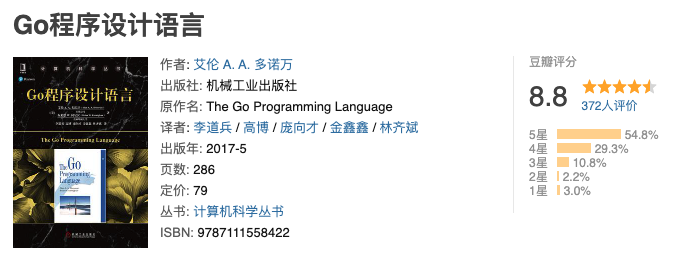
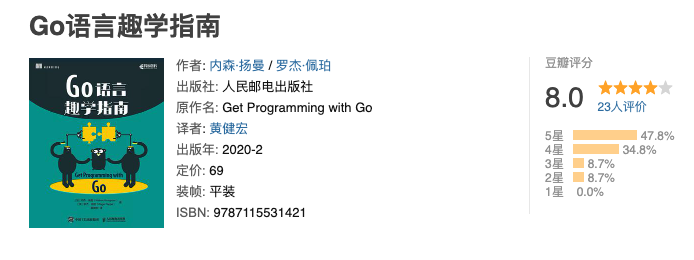
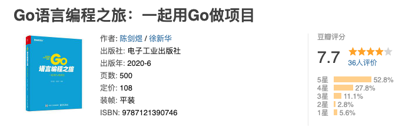
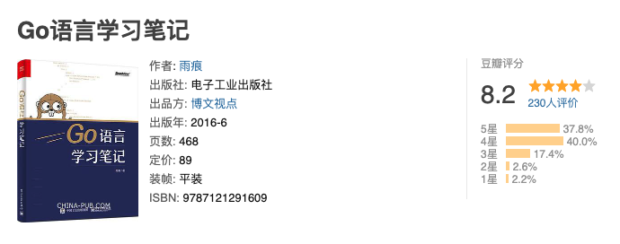
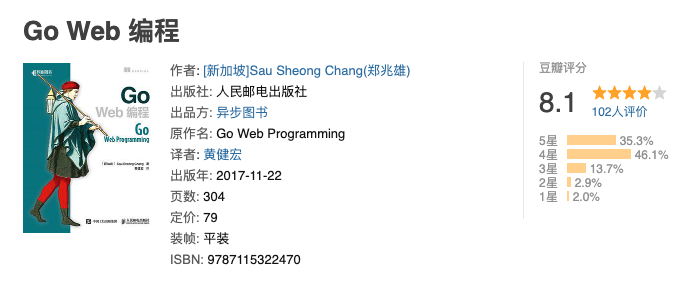
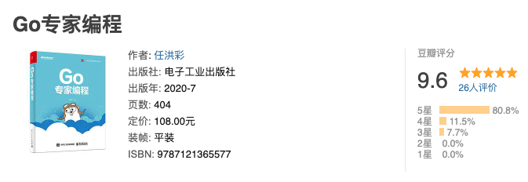
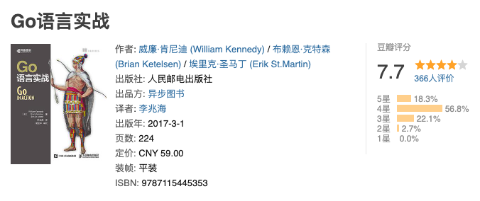
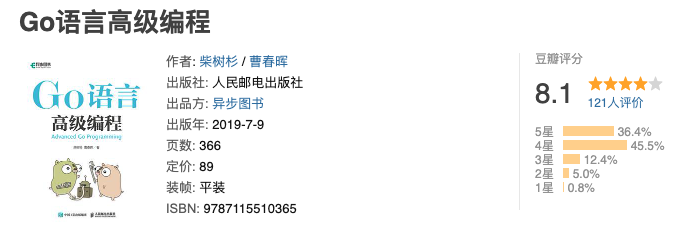

大家好，我是站长 polarisxu。

今天是 4 月 23 日，是世界读书日。当当有很大的优惠，而且我还要到了额外的优惠码，花 140 可以买到 400 块钱的书。借这个机会，我分享一份 Go 语言书单（实际上还有很多免费电子书单，但这里只说纸质版），需要的可以今天购买，超便宜！

> 我认为不错的书，不代表你也认为好。所以，买不买自行判断哈。

## 01 入门级

以下排名不分先后。

### Go 程序设计语言（俗称 Go 圣经）

本书由《C程序设计语言》的作者Kernighan和谷歌公司Go团队主管Alan Donovan联袂撰写，是学习Go语言程序设计的指南。本书共13章，主要内容包括：Go的基础知识、基本结构、基本数据类型、复合数据类型、函数、方法、接口、goroutine、通道、共享变量的并发性、包、go工具、测试、反射等。本书适合作为计算机相关专业的教材，也可供Go语言爱好者阅读。

这本书是翻译版，翻译水平自己鉴别。国内有大佬另外翻译了一版，并免费开源了，如果你喜欢电子书，可以[在线阅读](https://books.studygolang.com/gopl-zh/)。

豆瓣评分：8.8

### Go 语言趣学指南

这是一本面向 Go 语言初学者的书，书中循序渐进地介绍了使用Go语言必需知道的知识，展示了非常多生动有趣的例子，并通过提供大量练习来加深读者对书中所述内容的理解。本书共分7个单元，分别介绍了变量、常量、分支和循环等基础语句，整数、浮点数和字符串等常用类型， 类型、函数和方法，数组、切片和映射，结构和接口，指针、nil 和错误处理方法，并发和状态保护，并且每个单元都包含相应的大章和单元测试。

这本书是国外的，这是中译本，译者有些人可能很熟悉，他出版过、翻译过挺多图书。

豆瓣评分：8.0

## 02 Go实战或进阶

以下排名不分先后。

### Go语言编程之旅：一起用Go做项目

本书分为6章，分别是命令行应用、HTTP应用、RPC应用、WebSocket 应用、进程内缓存和 Go语言中的大杀器，其中前5章是Go语言开发中最常见的项目类型，适合有一定Go语言基础的读者以及相关开发人员阅读。

作者是煎鱼和 polarisxu。

豆瓣评分：7.7，分数不高，应该是第一次印刷挺多编辑错误导致的，目前发现的错误都已改正，已完成第三次印刷。

### Go 语言学习笔记

本书经四年多逐步完善，内容覆盖了语言、运行时、性能优化、工具链等各层面知识。且内容经大量读者反馈和校对，没有明显的缺陷和错误。上卷细致解析了语言规范相关细节，便于读者深入理解语言相关功能的使用方法和注意事项。下卷则对运行时源码做出深度剖析，引导读者透彻了解语言功能背后的支持环境和运行体系，诸如内存分配、垃圾回收和并发调度等。本书不适合编程初学入门，可供有实际编程经验或正在使用Go 工作的人群参考。

作者雨痕，Go 圈大神！

豆瓣评分：8.2

### Go Web 编程

该书围绕一个网络论坛 作为例子，教授读者如何使用请求处理器、多路复用器、模板引擎、存储系统等核心组件去构建一个 Go Web 应用，然后在该应用的基础上，构建出相应的 Web 服务。本书只会用到 Go 语言自带的标准库，而不会用到任何特定的 Web 框架：这使得读者学习到的知识不会受到特定的框架所限制，即使将来有需要用到现成的框架又或者自行构建框架，读者仍然会从本书介绍的知识中获益。

该书作者是新加坡人，由黄健宏翻译（上面 《Go语言趣学指南》也是他翻译的）。

豆瓣评分：8.1

### Go专家编程

本书首先介绍Go语言常见的数据结构及控制结构的实现原理，包括管道、切片、Hash表、select和for-range等，这部分内容大都以几个精心准备的测验题目开头，每个测验题目均对应一个知识点，读者可以借此测验自身对该知识点的掌握程度。接着介绍了Go语言最基础的概念，包括协程的概念、协程调度模型、协程调度策略，以及内存分配和垃圾回收相关的内容。本书还介绍了一些标准库、异常处理和依赖管理等非语法相关但非常重要的内容。最后结合作者的见闻，整理了一些发生在真实项目中的编程陷阱。

本书作者是华为云原生团队核心成员，开源爱好者，深度参与CNCF（云原生计算基金会）旗下Kubernetes、Prometheus等项目。

豆瓣评分：9.6

### Go语言实战（Go In Action）

本书向读者提供一个专注、全面且符合语言习惯的视角。Go语言实战同时关注语言的规范和实现，涉及的内容包括语法、类型系统、并发、管道、测试，以及其他一些主题。

这是国外 In Action 系列（本书是中译本），很经典。相对来说，这个系列都不是入门系列。

豆瓣评分：7.7，分数不高。

### Go语言高级编程

本书从实践出发讲解Go语言编程的进阶知识。本书共6章，第1章简单回顾Go语言的发展历史；第2章和第3章系统介绍CGO编程和Go汇编语言的用法；第4章对RPC和Protobuf技术进行深入介绍，并讲述如何打造一个自己的RPC系统；第5章介绍工业级环境的Web系统的设计和相关技术；第6章介绍Go语言在分布式领域的一些编程技术。

作者是柴大和曹大。

豆瓣评分：8.1

## 03 小结

Go 的书越来越多，我这里做了一些精选。有一些书没有入选，有几方面原因：

- 太老旧，比如 12、13 年出的
- 豆瓣评分很低。比如翻译太烂
- 有些豆瓣没有评分，而我又不了解

