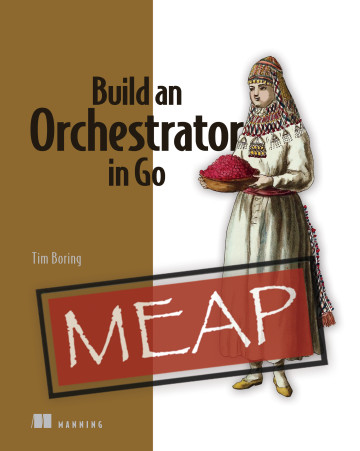
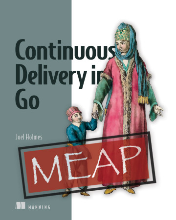

大家好，我是 polarisxu。

国庆假期结束了，大家玩的开心吗？！

该收收心，认真学习工作了~

manning 最近有 2 本 Go 相关图书，推荐给大家。

## 01 Build an Orchestrator in Go

本书希望带领大家通过使用 Go 和 Docker API 构建自己的编排系统，深入了解 Kubernetes 和其他编排系统。具体来说包括：

- 了解构成任何编排系统的组件
- 将容器安排到工作节点
- 使用 Docker API 启动和停止容器
- 使用简单的 API 管理工作节点集群
- 使用从 cutting-edge Google Borg 研究论文中获取的算法
- 揭开像 Kubernetes 和 Nomad 这样的编排系统的神秘面纱

像 Kubernetes 这样的编排系统协调其他软件子系统和服务，以创建一个完整的组织系统。虽然编排工具以复杂性著称，但它们的设计有些适用于软件开发的许多方面的重要模式。本书通过指导你使用 Go SDK 设计和实现自己的编排框架，揭示编排框架的内部运作原理。在创建自己的编排框架时，将提高你对 Kubernetes 及其在分布式系统设计中的作用的理解。

该书前三章可以免费阅读：<https://livebook.manning.com/book/build-an-orchestration-system-from-scratch/chapter-1/v-1/>。当然也可以购买电子版：<https://www.manning.com/books/build-an-orchestrator-in-go>。

## 02 Continuous Delivery in Go

如何有效地将 Go 程序交付给客户？本书这个持续交付的实用指南向你展示了如何快速建立一个自动化管道，以提高你的测试、代码质量和最终产品。具体包括的内容有：

- 根据客户的反馈开发更好的软件
- 创建将反馈转化为功能的开发管道
- 通过管道自动化减少在部署代码之前验证代码的错误
- 建立卓越代码质量的连续测试
- 无服务器、基于容器和基于服务器的部署
- 以具有成本效益的方式扩展部署
- 提供持续改进的文化

本书是一本基于 Go 的软件交互的实践指南。以强大的 Go 编程语言为例，你将学习如何建立管道，通过生产和部署无缝地运送（ferry）你的项目。将连续交付和持续集成的理论付诸实践，并发现关于团队构建自动化和灵活响应客户需求的即时实用指导。

该书前四章可以免费阅读：<https://livebook.manning.com/book/continuous-delivery-in-go/chapter-1>。当然也可以购买电子版：<https://www.manning.com/books/continuous-delivery-in-go>。

## 03 总结

这两本书可能不适合所有人，更偏向运维方向，或者是 Devops。当然，如果你对这方面感兴趣，可以关注下。这两本书目前都只是 MEAP 版本，正式版本需要等到 2022 年。