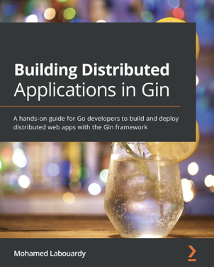

大家好，我是 polarisxu。

有段时间没推荐新书了。最近看到一本书《Building Distributed Applications in Gin》，本书是学习如何使用 Gin 中的各种功能构建大规模分布式应用程序的有效指南。出版日期：2021 年 7 月 23 日，英文版（目前肯定没有中文版）。购买地址：<https://www.packtpub.com/web-development/building-distributed-applications-in-gin>。

介绍下本书的作者：**Mohamed Labouardy**

他是 Crew 的 CTO 和联合创始人，同时也是 DevSecOps 的布道师。他是 Komiser 的创始人，经常在会议上演讲，并且写了几本关于无服务器和分布式应用的书。他也是诸如 Jenkins、 Docker 和 Telegraf 等许多开源项目的贡献者。

从这本书，你可以学习到如下知识点：

- 使用 Gin 框架构建一个生产环境可用的 REST API
- 基于事件驱动架构构建可扩展 Web 应用程序
- 使用 NoSQL 数据库进行数据持久化
- 使用 JWT 和 Auth0 建立身份验证中间件
- 使用 Docker 和 Kubernetes 在 AWS 上部署基于 gin 的 RESTful API
- 为 Gin Web 应用实现 CI/CD 工作流

全书一共分成三部分：

1）第一部分，介绍 Gin 框架。包括简单介绍 Go、安装 Go 环境，以及安装 Gin。

2）第二部分，分布式微服务。分 5 章介绍，包括确认 Endpoint、存储、API 认证、HTML 渲染和扩展 Gin 应用。

3）第三部分，非基础功能。分 4 章介绍，包括 Gin HTTP 路由测试、在 AWS 上部署应用（这个咱们可能用的较少，一般会使用国内的云服务）、实现 CI/CD 和获取 Gin 的度量指标用于监控等。

---

对于没有 Go 项目经验的朋友，这本书也许能够让你更好开始自己的项目，包括练手项目，为找工作、实际工作做准备！
