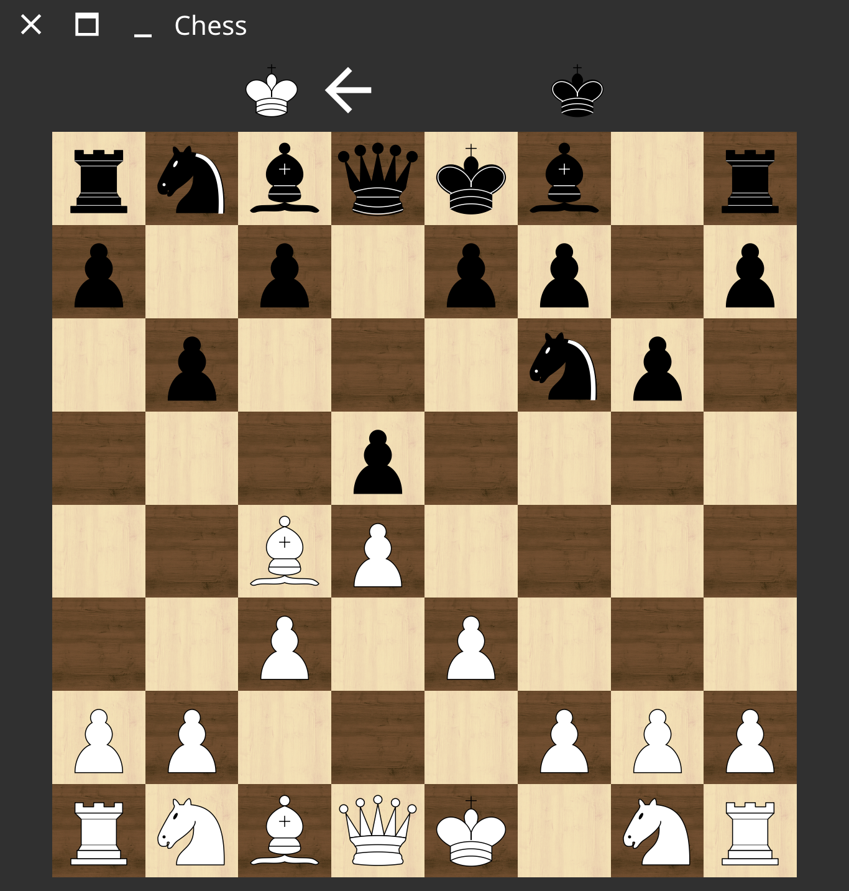
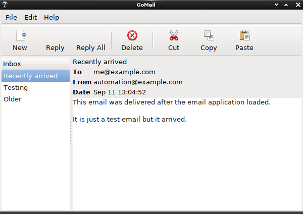
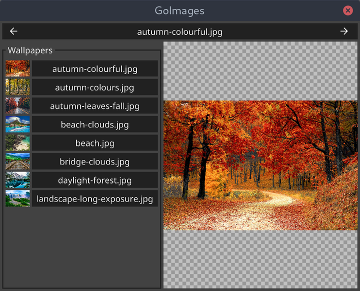
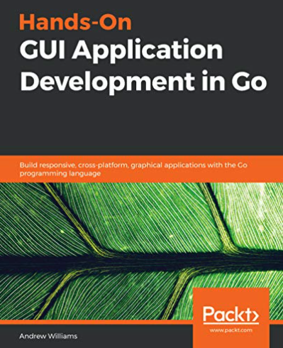

大家好，我是站长 polarisxu。

最近看到一个视频：[Building a Chess GUI with Fyne](https://www.youtube.com/watch?v=zlPDWBLhn6c)，讲解如何使用 Go 构建一个完整的国际象棋应用程序。这个视频演示了如何构建 UI，添加动画，交互和拖放。所有这些都基于 [Fyne](https://fyne.io/) 这个库构建，可以安装到桌面和移动设备！这个国际象棋的项目地址：<https://github.com/andydotxyz/chess>。

出于好奇，我深挖了一下，访问了视频作者的个人网站：<https://andy.xyz/>，发现它就是 Fyne 的作者：Andrew Williams。他还创建了 [FyneLabs](https://fynelabs.com/)，专门支持 Fyne 的发展。

## 01 一本 Go GUI 图书

同时，通过作者的网站，我发现他写了一本书：[《GUI Application Development in Go》](https://andy.xyz/2019/03/07/meet-the-first-book-about-golang-gui-programming/)，作者在这本书里对比了 Go 中可用的 GUI 工具包，包括一些传统的工具包（[Walk](https://github.com/lxn/walk)、 [andlabs UI](https://github.com/andlabs/ui)、 [Go-GTK](https://github.com/mattn/go-gtk)、 [qt](https://github.com/therecipe/qt)）和一些更前沿的项目（[Shiny](https://github.com/golang/exp/tree/master/shiny)、 [nk](https://github.com/golang-ui/nuklear)、 [Fyne](https://github.com/fyne-io/fyne)）。通过这些项目，作者探讨什么样的结构和代码更适合开发 Go GUI 程序。

通过 GTK+ 的 Go 绑定构建了一个电子邮件应用程序，界面如下图，看起来还可以？

另外有一个图片查看器，使用 Fyne 构建的，界面如下图：

在这本书中，作者还讨论了如何规划和构建一个 GUI 应用程序以及它所依赖的代码。此外还了如何使用单元测试、持续集成，以及在集成网络和云服务时如何保持可维护的代码。最后介绍了如何打包和分发跨平台应用程序，以便交付给最终用户。

该书在 [Amazon](https://www.amazon.com/Hands-GUI-Application-Development-cross-platform-ebook/dp/B07GYLYSCT/ref=sr_1_1) 上可以买到，还有 Kindle 版，出版时间是 2019 年 2 月。

## 02 一个 Fyne 图书

通过上面那本书，我又发现了另外一本书：[《Building Cross-Platform GUI Applications with Fyne》](https://www.amazon.com/Building-Cross-Platform-Applications-Fyne-platform-agnostic-ebook/dp/B08PKTNVBQ/ref=pd_rhf_dp_s_ci_mcx_mr_hp_d_2)，副标题是：Create beautiful, platform-agnostic graphical applications using Fyne and the Go programming language。

这也是 Andrew Williams 写的，出版时间是 2021 年 1 月底。

上一本书主要对比现存的 Go GUI 库，以及探索一个更合适的 Go GUI 开发方案，而这本书，主要讲述如何使用 Fyne 这个 Go GUI 工具包开发出漂亮的、跨平台的 GUI 应用程序。

该书主要让你：

- 了解如何使用标准 widgets，dialogs 和 layouts 以及如何构建自己的以上组件
- 了解如何开发应用程序和包并将其分发到不同的操作系统和应用商店
- 探索 Fyne 工具包的设计原则和愿景以及你在项目中可以如何使用

本书主要通过示例项目来讲解，一共有五个示例项目，你将学习如何有效构建应用程序，专注于每个主要区域，包括画布，布局，文件处理，小部件，数据绑定和主题。本书还将向你展示已完成的应用程序如何在桌面计算机，笔记本电脑和智能手机上运行。完成这些项目后，你还可以将它们分发各种应用商店中供别人下载使用。

如果你坚持学完该书，应该能够创建出漂亮的跨平台图形应用程序。

以下是该书目录：

1. A Brief History of GUI Toolkits and Cross-Platform Development
2. The Future According to Fyne
3. Window, Canvas, and Drawing
4. Layout and File handling
5. Widget Library and Themes
6. Data Binding and Storage
7. Building Custom Widgets and Themes
8. Project Structure and Best Practices
9. Bundling Resources and Preparing for Release
10. Distribution - App Stores and Beyond
11. Appendix A: Developer Tool Installation
12. Appendix B: Installation of Mobile Build Tools
13. Appendix C: Cross-Compiling

## 03 总结

虽然 GUI 不是 Go 的主战场，但作为一门通用编程语言，一些第三方库证明，Go 也是可以进行 GUI 开发的。如果你对 Go 语言开发 GUI 感兴趣，可以看看本文介绍的这两本书，特别是 Fyne 这本。从 Fyne 的发展看，前途还是值得期待的。

当然，你也可以直接研究文章开头提到的国际象棋项目。

以后请别说 Go 不能开发 GUI 程序了~当然，我们可以将 Go GUI 开发作为自己的爱好，业余研究，不能指望通过它找工作啥的。

你会学习下 Go 的 GUI 开发吗？欢迎留言交流。