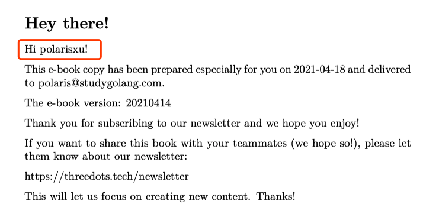

大家好，我是站长 polarisxu。

我又来给大家推荐 Go 新书了，免费的哦。说明一点，这本书我只是浏览了下目录，看了下介绍，感觉应该还可以，值得读一读。书名是：《Go With The Domain》。

先介绍下该书的作者。Miłosz 和 Robert，他们是 Three Dots Labs 的创始人，这是一个什么组织呢？官网上是这么介绍的：

> Golang, Domain-Driven Design and Continuous Delivery.

关注 Go 领域驱动设计和持续交付，所以，这本书也是和这方面有关的，书的子标题是：Building Modern Business Software in Go。

注意，这里的 Business Software，我翻译成商务软件，不一定准确。该书开篇也解释了该词，认为企业任何应用开发或 Saas 产品，都算是 Business Software。

开篇还介绍了为什么使用 Go 语言来讲解。

此外，这本书最开始是他们发布在网站上的系列文章，写的多了，觉得应该整理下，更系统地进行讲解，于是有了该书。

阅读该书，要求你熟悉 Go 语言，并对某些项目的基本知识有所了解。最适合这样的你：正在寻找某种模式，希望这些模式帮助你在几个月内设计好的应用程序。

本书中的大多数想法在复杂的业务场景中可能出现。不过，如果在小项目中使用，看起来就会有点奇怪（简单问题复杂化的感觉）。所以，我们应该尽量务实，并选择最佳工具。

这是该书的目录：

1、Welcome on board!

2、Building a serverless application with Google Cloud Run and Firebase

3、gRPC communication on Google Cloud Run

4、Authentication using Firebase

5、When to stay away from DRY

6、Domain-Driven Design Lite

7、The Repository Pattern

8、High-Quality Database Integration Tests

9、Clean Architecture

10、Basic CQRS

11、Combining DDD, CQRS, and Clean Architecture

12、Tests Architecture

13、Repository Secure by Design

14、Setting up infrastructure with Terraform

15、Running integration tests in the CI/CD pipeline

16、Intermission

17、Event Storming (Coming soon)

18、Bounded Context (Coming soon)

19、Ubiquitous Language (Coming soon)

20、Aggregate (Coming soon)

21、Value Object (Coming soon) 

22、Dependency Injection (Coming soon)

后面六章还没完成。

说了这么多，该书怎么获取？访问 <https://threedots.tech/newsletter/>，填写你的邮箱订阅，会收到该书的电子版，包括 PDF、EPUB 和 MOBI 三种格式。虽然我获取到了，但需要的还是从这里获取吧，上面会有你的名字，类似定制的感觉，比如我的：

