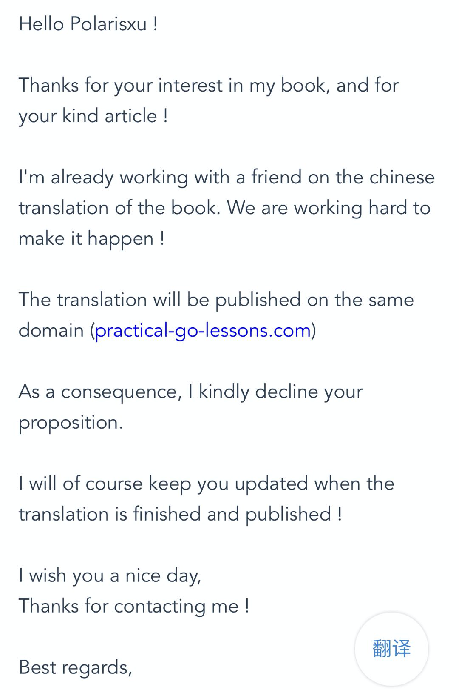

大家好，我是 polarisxu。

看到广大 gopher 们的需求，昨天我发文宣布[组织翻译《Practical Go Lessons》](https://mp.weixin.qq.com/s/ry-qn0-7GuS0qb6ylU_4qA)这本书。发文后，有将近一百人要参与。感受到了大家的热情~

昨天下午，我给作者发信息，请求授权我们翻译。昨天一天没有回应（虽然看到信息已读，但没有给我答复）。但我们觉得，大概率会取得授权，所以，昨天做好了准备工作：流程、规范等，并且大家觉得端午节假期可以搞定，因为参与人数多，一个人翻译一章，假期抽空完全可以搞定。同时也敲定了十来个校对者。又一次体会到了人多力量大！昨晚，就有几个人陆陆续续提交了 PR，翻译完成了几章。

然而，今天下午 3 点 24，我收到了作者的回信：

被“无情”的拒绝了~所以，我立马通知了大家，没有获得授权。大家还是挺失望的，不过已经翻译了的，也算是一种学习，也是收获！而且，我们会考虑翻译其他 Go 图书。

但也有一个好消息，作者和他的朋友正在出中文版，虽然进度肯定没那么快，但毕竟官方出品。不得不佩服作者，一个法国人，用英文写该书，然后还自己搞定中文版。值得敬佩！

我昨天给他发消息，说明了国内 Gopher 的热情。也许他看到了中国 Gopher 的市场，所以决定自己出中文版。这，是好事！

虽然组织了半天，最后没取得授权，但得知了官方会出中文版，挺好！中文版出来，我会第一时间分享给大家！

再次感谢大家的热情和支持！祝大家端午节快乐！

