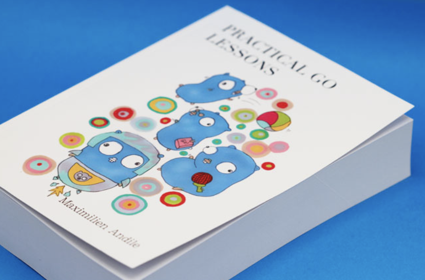
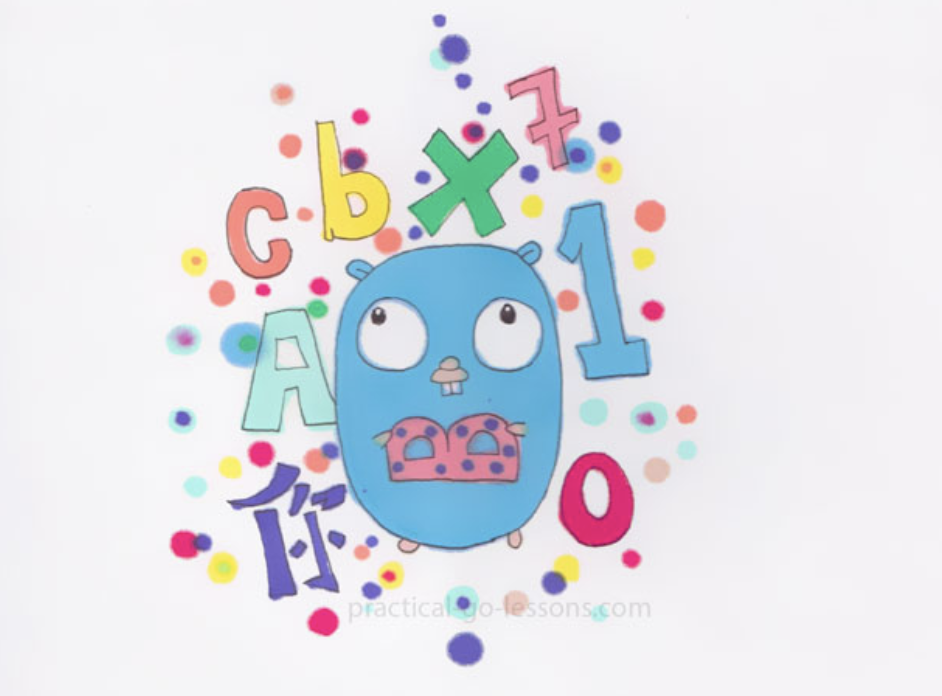
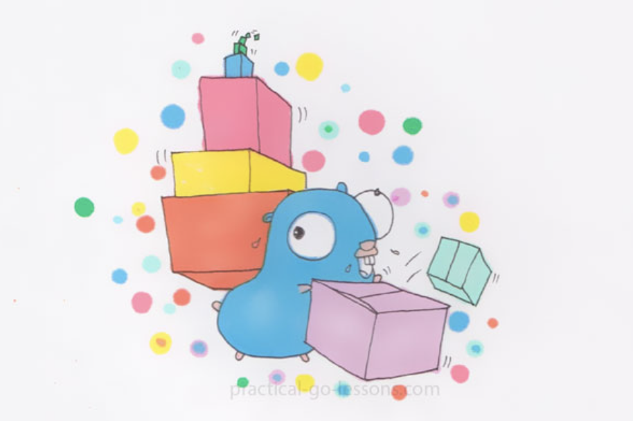

大家好，我是 polarisxu。

又一次为大家推荐 Go 图书，这是一本免费的 Go 语言在线图书：<https://www.practical-go-lessons.com/>。以下是该书的一个封面：

这本书采用渐进的方式讲解 Go 语言。作者还试图解释一些难以掌握的计算机科学概念，对于新人来说很有用。因此这本书对于那些没有计算机基础的人也有帮助。

我也写过书，也一直在坚持写文章，知道写作的不容易。但我看到这本书作者的写作经历，实在是佩服！！！

这本书是从 2018 年开始写的，作者都是利用晚上和周末。在 2020 年底，作者决定辞掉工作全职写该书，一本花了 2.5 年的书。可见作者多用心。而且，作者在书中每一章节开头都配置了一幅 Gopher 图，超级可爱，猜测是作者自己画的！上面的图就是其中一张。

花了这么多心血，还全职写该书，但万万没想到，作者竟然决定在网上免费分享该书。是不是很不理解？作者却认为，多年来他从互联网上获取到了很多知识。现在，他想通过这本书回馈社区！真的是良心作者。

当然，大家也可以购买支持。在这里可以购买：<https://www.practical-go-lessons.com/buy-digital-or-hard-copy>。老师和学生 10% 折扣。

这本书一共 41 章，758 页。可惜是英文的。大家有兴趣可以组织翻译一波？！

最后，附上该书的一些插图。

