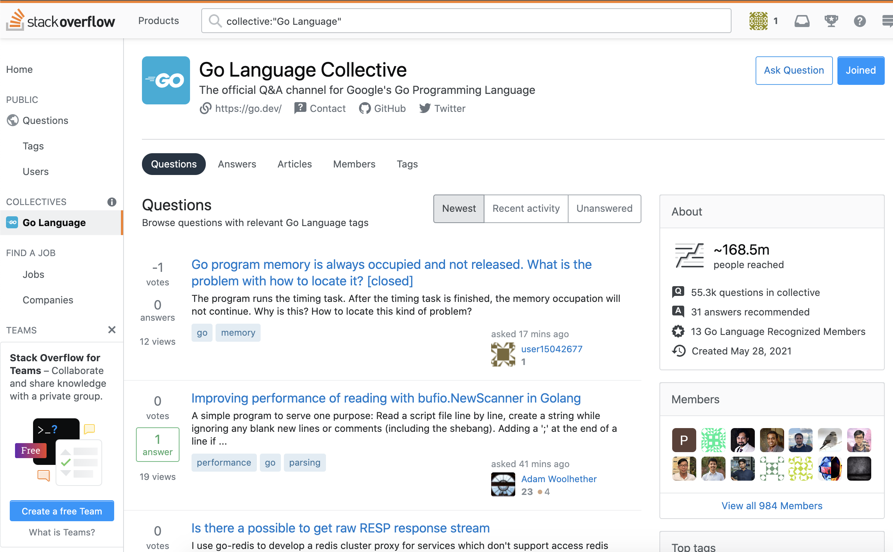

大家好，我是 polarisxu。

Go 官方宣布，在 StackOverflow 上启用新的问答社区，而这之前，官方的主要在 Google Groups。先简单介绍下 StackOverflow 的 [Collective](https://stackoverflow.com/collectives)。

## 01 Collective 是什么？

我们知道 StackOverflow 是一个问答社区，针对某一个类问题，一般通过 Tag 的形式汇集，比如 Go 语言的：<https://stackoverflow.com/questions/tagged/go>。而 Collective 是 StackOverflow 推出的，专门用于为你喜欢的技术构建一个社区。

该社区最大的特点：帮助你更快地找到可信赖的答案，汇集了该领域专家，并围绕你最常使用的技术分享知识。

关于 Collective 更多介绍，可以查看官方博文：<https://stackoverflow.blog/2021/06/23/collectives-stack-overflow/>，这也是最近新推出的功能。

截止目前，只有两个 Collective 可用，分别是 Go 语言和 Google Cloud，相信马上会越来越多。

## 02 Go Collective

根据 [Go 官方介绍](https://blog.golang.org/stackoverflow)，Go Collective 是 StackOverflow Collective 上的第一个开源项目，是 Go & StackOverflow 合作的结果。（<https://stackoverflow.com/collectives/go>）

官方访问时间的截图，15 个成员，目前已经近 1000 成员。

相比 StackOverflow 上普通的 Go 问答，Go Collective 是一个改进版的 StackOverflow。它将保留从 StackOverflow 得到的问答经验。但它也将为 Gopher 提供一个家园，为 Go 社区领袖提供一个发表意见和帮助建立最佳实践的机会。

具体来说，根据 Go 官方介绍，Go Collective 有如下好处：

- 更快地找到可信的答案。一般，我们通过网上找答案之前，需要甄别以下方案的优劣，做一些对比。通过 Go Collective，你现在可以看到由 Go 团队推荐的答案，或者由认可的成员提供的答案，即 Go 团队成员、 Go Google 开发专家和 StackOverflow 用户，这些用户已经被 Stack Overflow 认可为 Go 生态系统技术的主题专家。当这些用户发布或编辑问题、提供答案或撰写文章时，他们将有一个徽章，标识他们为已认可成员。
- 希望在一个统一的地方获得需要的信息（这挺难的，需要时间，但真做到了，对社区来说是一件大好事）。StackOverflow 上的 Go Collectives 页面集中了所有与 Go 和相关标签相关的问题和答案以及其他内容。将包括从 Collective 到关键的 Go 网站的链接，同时 Go 网站也会引导 Gopher 到来到 Go Collective。
- 探索新的内容格式。Go 官方会随时更新技术，在 Go Collective 页面上可以找到更深入的产品信息，包括文章、长形式的内容，如 how-to 指南和公告。
- 赢得认可。StackOverflow 上的 Collective 也为 Go 官方提供了一种方式来认可你对社区的贡献。会有一个排行榜，你可以通过 Go Collective ([见“成员”标签](https://stackoverflow.com/collectives/go?tab=members))访问，这将有助于识别被指定为认可成员的可信任的贡献者。如果你有兴趣成为认可会员，请发邮件至 stackoverflow@golang. org。

如果你是 Go 领域专家，同时英语还可以，建议试试成为 Go Collective 认可会员。

## 03 总结

Go 官方和 Google Cloud 入驻 StackOverflow Collective，因为 Go 是构建云基础设施和应用程序的最佳语言，而 Google Cloud 是运行 Go 应用程序的最佳场所，所以现在 StackOverflow 是找到 Go 和云计算问题答案的最佳地点。

有官方的加持，相信 Go 社区会更好，遇到问题，大家可以多尝试上 Go Collective 查找。一些好问题、常见问题，我会考虑引入 Go 语言中文网，方便大家访问。

对 Go Collective，你有什么想说的吗？欢迎留言交流。
