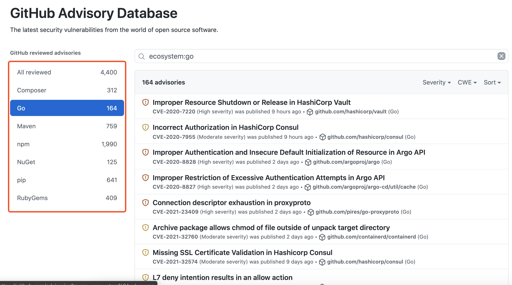
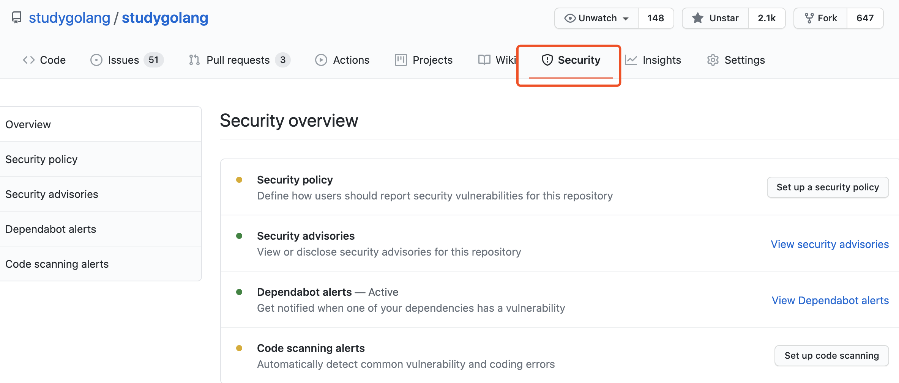
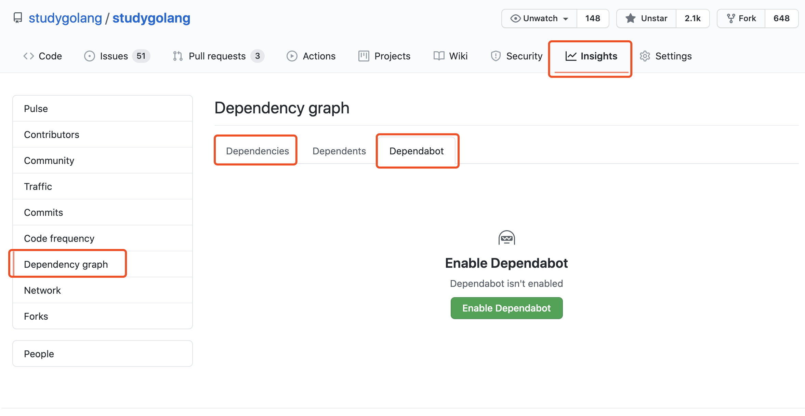

大家好，我是 polarisxu。

关于 Go 安全相关的内容，我写过几篇文章：[《Go 团队开始重视安全问题了》](https://mp.weixin.qq.com/s/-Zv1QwM1lYNWEvIoUNjmXQ)、[《Go Module 有漏洞？免费的 Go 漏洞扫描 VSCode 插件》](https://mp.weixin.qq.com/s/NkxIEoOHXbjgqLPhWsKYRA)和[《这个工具真好：看看你的Go项目依赖有无漏洞》](https://mp.weixin.qq.com/s/pzCefw0g82f6fNqiW3wqEg)，有兴趣的可以看看。

今天介绍另外一个关于安全的内容，是 GitHub 的。

大家都知晓，目前 Go 是严重依赖 GitHub 的，很多第三方库基本都托管在 GitHub 上。因为 Go 把 GitHub 既当作代码协作的平台，也当作发布包的平台，从而使 Go 成为如今 GitHub 上排名前 5 的编程语言之一，见[《GitHub 显示，Go 排名第 4 了，有视频为证！》](https://mp.weixin.qq.com/s/Y_9TN9XxlQjfa9oXenjpxg)。所以，GitHub 官方也更重视 Go 社区，最近宣布他们的安全特性可以用于 Go 模块，这将有助于 Go 社区发现、报告和防止安全漏洞。

## 01 GitHub 安全数据库

GitHub 有一个开放的安全建议数据库，叫 [Advisory Database](https://github.com/advisories)，专注于为开发人员提供高质量、可操作的漏洞信息。它使用的是知识共享署名 4.0，所以数据可以在任何地方使用。

从上图可以看到，目前这个数据库支持 PHP、Go、Java、JS、.NET、Python、Ruby 等语言，GitHub 发文宣布支持 Go 时，该数据库有 155 条 Go 相关记录，现在已经 164，你看到这篇文章时，应该会更多。正如 GitHub 宣称的，随着他们对现有漏洞和新发现的漏洞进行筛选，这个数字每天都在增长。

## 02 如何帮助发现漏洞

有这个数据库，那 GitHub 是如何帮助发现漏洞的呢？

GitHub 很早就有一套安全策略，只是现在这套策略可以支持 Go 仓库。关于这套策略的详细信息，可以查看 GitHub 官方文档：<https://docs.github.com/cn/code-security/getting-started/securing-your-repository>，这里给的是中文版。

这里简单介绍几个点。

- 公开的仓库，默认启动了相关的安全策略；如果是私有仓库，需要你手动处理，文档中有说明；
- 可以自定义用户如何报告安全漏洞。这点建议大的开源项目可以好好研究、利用下。官方建议是，再漏洞进入 GitHub   建议漏洞库之前，你和报告者私下沟通交流解决。

具体来说，在仓库的 Security 选项卡，可以配置安全策略。

在 Insights 选项卡可以查看依赖相关信息，包括配置是否触发依赖漏洞报警等。

## 03 哪个更好用

了解了几个安全相关的工具后，到底该用哪个？VSCode 插件是适合大部分人的选择，不过 jfrog 的 gocenter 不维护了，所以没法用了。

所以，我推荐谷歌的 deps.dev。不过如果你是开源项目作者，你应该好好研究、利用下 GitHub 提供的安全策略，让你的开源项目更健壮。

