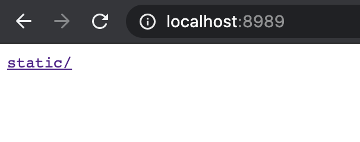

大家好，我是站长 polarisxu。

喜欢 Go 语言有很多理由，其中有一点“因为编译为一个二进制文件，直接运行，没有其他依赖，使得部署特别容易。”我想是很多人喜欢的。

然而一个项目，很可能会包含一些静态资源文件，这样一来，一个 Go 二进制文件就不能解决了，需要将静态资源文件一起带上。于是有了很多第三方解决方案，将静态资源文件“嵌入”最终的 Go 二进制文件中。最知名的应该是 [go-bindata](https://pkg.go.dev/github.com/jteeuwen/go-bindata)，此外还有很多其他的：

- [github.com/alecthomas/gobundle](https://pkg.go.dev/github.com/alecthomas/gobundle)
- [github.com/GeertJohan/go.rice](https://pkg.go.dev/github.com/GeertJohan/go.rice)
- [github.com/go-playground/statics](https://pkg.go.dev/github.com/go-playground/statics)
- [github.com/gobuffalo/packr](https://pkg.go.dev/github.com/gobuffalo/packr)
- [github.com/knadh/stuffbin](https://pkg.go.dev/github.com/knadh/stuffbin)
- [github.com/mjibson/esc](https://pkg.go.dev/github.com/mjibson/esc)
- [github.com/omeid/go-resources](https://pkg.go.dev/github.com/omeid/go-resources)
- [github.com/phogolabs/parcello](https://pkg.go.dev/github.com/phogolabs/parcello)
- [github.com/pyros2097/go-embed](https://pkg.go.dev/github.com/pyros2097/go-embed)
- [github.com/rakyll/statik](https://pkg.go.dev/github.com/rakyll/statik)
- [github.com/shurcooL/vfsgen](https://pkg.go.dev/github.com/shurcooL/vfsgen)
- [github.com/UnnoTed/fileb0x](https://pkg.go.dev/github.com/UnnoTed/fileb0x)
- [github.com/wlbr/templify](https://pkg.go.dev/github.com/wlbr/templify)
- [perkeep.org/pkg/fileembed](https://pkg.go.dev/perkeep.org/pkg/fileembed)

从这个列表足以看出需求的广泛性。于是官方决定提供实现，在 go 命令中实现该功能。因为在 Go 命令中添加对嵌入基本功能的直接支持将消除对某些工具的需求，至少可以简化其他工具的实现。

2020 年 10 月 30 日，Russ Cox 提交了最终的实现：[cmd/go: add //go:embed support](cmd/go: add //go:embed support)，意味着你在 tip 版本可以试用该功能了。Go1.16 版本会包含该功能。欢迎大家试用，反馈建议。

## 01 试用 go embed

通过几个示例快速了解 go embed 的用法。

### 例 1：内嵌文件 — Web 应用

基于 Echo 框架：

```go
package main

import (
	_ "embed"
	"net/http"

	"github.com/labstack/echo"
)

//go:embed static/logo.png
var content []byte

func main() {
	e := echo.New()
	e.GET("/", func(c echo.Context) error {
		return c.Blob(http.StatusOK, "image/png", content)
	})
	e.Logger.Fatal(e.Start(":8989"))
}
```

目录结构如下：

```bash
.
├── main.go
└── static
    └── logo.png
```

编译运行后，可以将二进制文件移到任何地方运行，浏览器访问 http://localhhost:8989，能够正确显示 logo 图片表示成功了。

基于 Gin 框架，代码类似：

```go
package main

import (
    _ "embed"
    "net/http"

    "github.com/gin-gonic/gin"
)

//go:embed static/logo.png
var content []byte

func main() {
    router := gin.Default()
    router.GET("/", func(ctx *gin.Context) {
        ctx.Data(http.StatusOK, "image/png", content)
    })

    router.Run(":8989")
}
```

直接使用 net/http 库，代码如下：

```go
package main

import (
    _ "embed"
    "log"
    "net/http"
    "fmt"
)

//go:embed static/logo.png
var content []byte

func main() {
    http.HandleFunc("/", func(w http.ResponseWriter, r *http.Request) {
        w.Header().Add("Content-Type", "image/png")
        w.WriteHeader(http.StatusOK)
        fmt.Fprintf(w, "%s", content)
    })

    log.Fatal(http.ListenAndServe(":8989", nil))
}
```

### 例 2：内嵌文件 — 命令行应用

简单的 Hello World：

```go
package main

import (
    _ "embed"
    "fmt"
)

//go:embed message.txt
var message string

func main() {
    fmt.Println(message)
}
```

其中 messaeg.txt 中的内容是 Hello World。目录结构如下：

```bash
.
├── main.go
└── message.txt
```

编译后，可以将二进制移到任何地方，运行输出 Hello World（即 messaeg.txt 中的内容）。

### 例 3：内嵌目录 - 命令行应用

以下程序将 static 目录内嵌到二进制程序中，然后在当前目录创建 static 目录中的所有文件。

```go
package main

import (
	"embed"
	"io"
	"log"
	"os"
	"path"
)

//go:embed static
var local embed.FS

func main() {
	fis, err := local.ReadDir("static")
	if err != nil {
		log.Fatal(err)
	}
	for _, fi := range fis {
		in, err := local.Open(path.Join("static", fi.Name()))
		if err != nil {
			log.Fatal(err)
		}
		out, err := os.Create("embed-" + path.Base(fi.Name()))
		if err != nil {
			log.Fatal(err)
		}
		io.Copy(out, in)
		out.Close()
		in.Close()
		log.Println("exported", "embed-"+path.Base(fi.Name()))
	}
}
```

该示例的目录结构和例 1 一样。编译后，可以将二进制文件移到任何地方，运行后，会在当前目录输出以 embed- 开头的文件。

### 例 4：内嵌目录 — Web 应用

基于 Echo 框架：

```go
package main

import (
    "embed"
    "net/http"

    "github.com/labstack/echo/v4"
)

//go:embed static
var local embed.FS

func main() {
    e := echo.New()
    e.GET("/*", echo.WrapHandler(http.FileServer(http.FS(local))))
    e.Logger.Fatal(e.Start(":8989"))
}
```

同样，目录结构和 example1 一致。编译后运行，访问 http://localhost:8989，看到如下界面：



注意上面使用的是 `/*`，如果直接使用 `/`，点击链接会是 404。

换成 Gin，代码如下：

```go
package main

import (
    "embed"
    "net/http"

    "github.com/gin-gonic/gin"
)

//go:embed static/*
var local embed.FS

func main() {
    router := gin.Default()
    router.GET("/*filepath", gin.WrapH(http.FileServer(http.FS(local))))

    router.Run(":8989")
}
```

结果和 Echo 框架一样。同样要注意是 `/*filepath`，不能是 `/`。

换成标准库 net/http 试试？

```go
package main

import (
    "embed"
    "log"
    "net/http"
)

//go:embed static
var local embed.FS

func main() {
    http.Handle("/", http.FileServer(http.FS(local)))
    log.Fatal(http.ListenAndServe(":8989", nil))
}
```

标准库中 `/` 会自动处理所有的请求。

## 02 //go:embed 指令

之前第三方的现实，基本是基于 go generate，将静态资源文件生成 go 源文件，最后编译进二进制文件中。官方的实现，通过 `//go:embed` 指令，在编译时将静态资源嵌入二进制文件中。然后，Go 通过标准库，让用户能够访问这些内嵌的资源。因此，先介绍下 `//go:embed` 指令的用法。

### 相关规则

在变量声明上方，通过 `//go:embed` 指令指定一个或多个符合 path.Match 模式的要嵌入的文件或目录。相关规则或使用注意如下：

1）跟其他指令一样，// 和 go:embed 之间不能有空格。（不会报错，但该指令会被编译器忽略）

2）指令和变量声明之间可以有空行或普通注释，不能有其他语句；

```go
//go:embed message.txt

var message string
```

以上代码是允许的，不过建议紧挨着，而且建议变量声明和指令之间也别加注释，注释应该放在指令上方。

3）变量的类型只能是 string、[]byte 或 embed.FS，即使是这三个类型的别名也不行；

```go
type mystring = string

//go:embed hello.txt
var message mystring	// 编译不通过：go:embed cannot apply to var of type mystring
```

4）允许有多个 `//go:embed` 指令。多个文件或目录可以通过空格分隔，也可以写多个指令。比如：

```go
//go:embed image template
//go:embed html/index.html
var content embed.FS
```

5）文件或目录使用的是相对路径，相对于指令所在 Go 源文件所在的目录，路径分隔符永远使用 `/`；当文件或目录名包含空格时，可以使用双引号或反引号括起来。

6）对于目录，会以该目录为根，递归的方式嵌入所有文件和子目录；

7）变量的声明可以是导出或非导出的；可以是全局也可以在函数内部；但只能是声明，不能给初始化值；

```go
//go:embed message.txt
var message string = ""	// 编译不通过：go:embed cannot apply to var with initializer
```

8）只能内嵌模块内的文件，比如 `.git/*` 或软链接文件无法匹配；空目录会被忽略；

9）模式不能包含 `.` 或 `..`，也不能以 `/` 开始，如果要匹配当前目录所有文件，应该使用 `*` 而不是 `.`；

## 03 标准库

和 embed 相关的标准库有 5 个，其中 2 个是新增的：embed 和 io/fs；net/http，text/template 和 html/template 包依赖 io/fs 包，而 embed.FS 类型实现了 io/fs 包的 FS 接口，因此这 3 个包可以使用 embed.FS。（Go1.16 发布时可能还会增加其他包或修改一些包的内容）

### io/fs 包

该包定义了文件系统的基本接口。文件系统既可以由主机操作系统提供，也可以由其他包提供。本文我们主要介绍和 embed 密切相关的内容。

先看 **FS 接口**：

```go
type FS interface {
    // Open opens the named file.
    //
    // When Open returns an error, it should be of type *PathError
    // with the Op field set to "open", the Path field set to name,
    // and the Err field describing the problem.
    //
    // Open should reject attempts to open names that do not satisfy
    // ValidPath(name), returning a *PathError with Err set to
    // ErrInvalid or ErrNotExist.
    Open(name string) (File, error)
}
```

FS 提供对分层文件系统的访问。像操作系统使用的文件系统就是一种分层文件系统。

FS 接口是文件系统所需的最小实现。文件系统可以实现其他接口，比如 fs.ReadFileFS，以提供其他或优化的功能。

**File 接口**：

```go
type File interface {
    Stat() (FileInfo, error)
    Read([]byte) (int, error)
    Close() error
}
```

该接口定义对单个文件的访问。这是文件的最小实现要求。文件可以实现其他接口，例如 fs.ReadDirFile，io.ReaderAt 或 io.Seeker，以提供其他或优化的功能。

因为有了 FS、File 等的接口抽象，之前在 os 包中的一些内容移到了 io/fs 包中，比如 fs.FileInfo 接口、fs.FileMode 类型，os 中原有的定义改成了它们的别名。

**DirEntry 接口**：

```go
type DirEntry interface {
    // Name returns the name of the file (or subdirectory) described by the entry.
    // This name is only the final element of the path (the base name), not the entire path.
    // For example, Name would return "hello.go" not "/home/gopher/hello.go".
    Name() string

    // IsDir reports whether the entry describes a directory.
    IsDir() bool

    // Type returns the type bits for the entry.
    // The type bits are a subset of the usual FileMode bits, those returned by the FileMode.Type method.
    Type() FileMode

    // Info returns the FileInfo for the file or subdirectory described by the entry.
    // The returned FileInfo may be from the time of the original directory read
    // or from the time of the call to Info. If the file has been removed or renamed
    // since the directory read, Info may return an error satisfying errors.Is(err, ErrNotExist).
    // If the entry denotes a symbolic link, Info reports the information about the link itself,
    // not the link's target.
    Info() (FileInfo, error)
}
```

DirEntry 是从目录读取的条目（使用 ReadDir 函数或 ReadDirFile 的 ReadDir方法）。比如下面 embed 包中的 embed.FS 有一个方法 ReadDir 就返回了 DirEntry 类型的切片。这样可以遍历 embed.FS 这个文件系统。

### embed 包

资源文件嵌入 Go 二进制程序后，我们通过 embed 包可以访问它们。

#### string 和 []byte

当指令用于 string 或 []byte 时，只能有一个模式，匹配一个文件，字符串或 []byte 的内容是该文件的内容。这时虽然不需要使用 embed 包，但必须导入，因此采用空导入：

```go
import _ "embed" 
```

#### FS（File System）

一般内嵌单个文件，采用 string 或 []byte 是最好的选择；但内嵌很多文件或目录树，应该使用 embed.FS 类型，这也是该包目前唯一的类型。

```go
type FS struct {
	// The compiler knows the layout of this struct.
	// See cmd/compile/internal/gc's initEmbed.
	//
	// The files list is sorted by name but not by simple string comparison.
	// Instead, each file's name takes the form "dir/elem" or "dir/elem/".
	// The optional trailing slash indicates that the file is itself a directory.
	// The files list is sorted first by dir (if dir is missing, it is taken to be ".")
	// and then by base, so this list of files:
	//
	//	p
	//	q/
	//	q/r
	//	q/s/
	//	q/s/t
	//	q/s/u
	//	q/v
	//	w
	//
	// is actually sorted as:
	//
	//	p       # dir=.    elem=p
	//	q/      # dir=.    elem=q
	//	w/      # dir=.    elem=w
	//	q/r     # dir=q    elem=r
	//	q/s/    # dir=q    elem=s
	//	q/v     # dir=q    elem=v
	//	q/s/t   # dir=q/s  elem=t
	//	q/s/u   # dir=q/s  elem=u
	//
	// This order brings directory contents together in contiguous sections
	// of the list, allowing a directory read to use binary search to find
	// the relevant sequence of entries.
	files *[]file
}
```

FS 是文件的只读集合，通常使用 `//go:embed` 指令进行初始化。如果不使用 `//go:embed` 指令声明 FS，则它是一个空文件系统。

FS 是只读值，因此可以安全地同时使用多个 goroutine，也可以将 FS 类型的值相互赋值。

FS 实现了 fs.FS，因此它可以与任何使用文件系统接口（fs.FS）的包一起使用，包括 net/http，text/template 和 html/template。

此外，FS 还是实现了 fs.ReadDirFS 和 fs.ReadFileFS 这两个接口。

所以，FS 实现了 3 个接口，一共 3 个方法：

```go
func (f FS) Open(name string) (fs.File, error)
func (f FS) ReadDir(name string) ([]fs.DirEntry, error)
func (f FS) ReadFile(name string) ([]byte, error)
```

关于它们的用法，在上文例子中有所涉及。

## 04 实际项目使用

本节模拟一个实际项目，看怎么使用 embed，主要两个方面：嵌入静态资源；嵌入模板文件。本节示例代码地址：<https://github.com/polaris1119/embed-example>，采用 Echo 框架。

因为是演示 embed 的实际用法，因此项目做了尽可能简化，目录结构如下：

```bash
.
├── LICENSE
├── README.md
├── cmd
│   └── blog
│       └── main.go
├── embed.go
├── go.mod
├── go.sum
├── static
│   └── css
│       └── style.min.css
└── template
    └── index.html
```

做个说明：

- 因为 `go:embed` 指令只能从相对源码所在目录的位置引用资源，这里特意采用了 main.go 放在 cmd/blog 中这种方式，看这样如何处理资源嵌入；
- static 和 template 目录是需要嵌入的目录；

因为 main.go 和 static/template 不在同一个目录，因此 main.go 中没法直接使用 `go:embed` 指令。我们在 static 的同级目录下创建一个文件：embed.go，专门用来写该指令。代码如下：

```go
package embedexample

import (
	"embed"
)

//go:embed static
var StaticAsset embed.FS

//go:embed template
var TemplateFS embed.FS
```

这样，项目中所有其他的地方都可以通过引用该包来使用内嵌的资源。

接着看 main.go 的代码如何使用它的。

```go
package main

import (
	"html/template"
	"io"
	"net/http"

	"github.com/labstack/echo/v4"
	"github.com/labstack/echo/v4/middleware"
	"github.com/polaris1119/embedexample"
)

func main() {
	e := echo.New()
	e.Use(middleware.Recover())
	e.Use(middleware.Logger())

	tpl := &Template{
		templates: template.Must(template.New("index").ParseFS(embedexample.TemplateFS, "template/*.html")),
	}
	e.Renderer = tpl

	e.GET("/static/*", echo.WrapHandler(http.FileServer(http.FS(embedexample.StaticAsset))))

	e.GET("/", func(ctx echo.Context) error {
		return ctx.Render(http.StatusOK, "index.html", nil)
	})

	e.Logger.Fatal(e.Start(":2020"))
}

type Template struct {
	templates *template.Template
}

func (t *Template) Render(w io.Writer, name string, data interface{}, c echo.Context) error {
	return t.templates.ExecuteTemplate(w, name, data)
}
```

模板的引用：

```go
tpl := &Template{
  templates: template.Must(template.New("index").ParseFS(embedexample.TemplateFS, "template/*.html")),
}
```

通过 ParseFS 方法来实现，支持 path.Match 格式。

而静态资源这样引用：

```go
e.GET("/static/*", echo.WrapHandler(http.FileServer(http.FS(embedexample.StaticAsset))))
```

这样，在模板文件 index.html 中就可以访问到样式文件了：

```html
<link rel="stylesheet" href="/static/css/style.min.css">
```

可以将编译后的二进制文件移到任何地方，然后运行，访问 http://localhost:2020 看到如下界面表示成功了。


## 05 总结

本文通过几个例子快速了解官方内嵌静态资源的用法，然后讲解一些关键的标准库，最后是一个实际项目中使用的例子。

纵观官方的实现，使用起来很方便，通过一个 `go:embed` 指令，让很多细节都不需要关注。当然，如果你对它的实现感兴趣，可以阅读设计提案和源码。

## 06 参考资料

1. Embed 设计提案：<https://github.com/golang/proposal/blob/master/design/draft-embed.md>
2. 示例参考：<https://github.com/mattn/go-embed-example>
3. tip 相关文档：<https://tip.golang.org>

