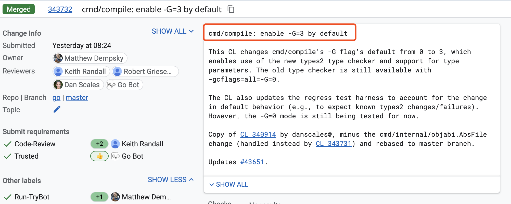

大家好，我是 polarisxu。

上周 Go 1.17 发布，在发布文档中，没有提到泛型的事情。但在发布之前，大家就发现，泛型的相关代码在 1.17 中埋下了，只是默认不启用。

就在最近，gotip 已经默认启用泛型。Go 泛型官方叫做：type parameters。



`-G` 的默认值由 0 改为了 3，那 Go 1.17 有没有这个 flag？

## 01 Go1.17 启用泛型支持

安装 Go1.17，推荐使用类似 [goup](https://mp.weixin.qq.com/s/yTblk9Js1Zcq5aWVcYGjOA) 这样的工具，方便切换版本，确保已经是 1.17：

```bash
$ go version
go version go1.17 darwin/amd64
```

然后执行如下命令，查看编译器 flag：

```bash
$ go tool compile -h
usage: compile [options] file.go...
  -% int
    	debug non-static initializers
  -+	compiling runtime
  -B	disable bounds checking
  -C	disable printing of columns in error messages
  -D path
    	set relative path for local imports
  -E	debug symbol export
  -G	accept generic code
  -I directory
    	add directory to import search path
  ....
```

注意到：`-G	accept generic code` 了吧，通过它来控制是否接受泛型代码，这个 flag 可能是临时性的。从这个帮助文档上没有看到 `-G` 能够接受那些值，通过查代码可以知晓（包括上面提到默认值由 0 改为 3），0 表示不启用泛型，3 表示启用泛型。

看一个具体泛型的例子：

```go
package main

import (
    "fmt"
)

type Addable interface {
	type int, int8, int16, int32, int64,
		uint, uint8, uint16, uint32, uint64, uintptr,
		float32, float64, complex64, complex128,
		string
}

func add[T Addable](a, b T) T {
    return a + b
}

func main() {
    fmt.Println(add(1,2))

    fmt.Println(add("foo","bar"))
}
```

> 例子来自：<https://github.com/mattn/go-generics-example>。

使用 Go1.17 编译：

```bash
$ go build test.go
# command-line-arguments
./test.go:8:2: syntax error: unexpected type, expecting method or interface name
./test.go:14:6: missing function body
./test.go:14:9: syntax error: unexpected [, expecting (
```

发现报语法错误。

改成这样编译：

```bash
$ go build -gcflags=-G=3 test.go
```

一切正常，运行也得到了正确的结果。表明 Go1.17 支持泛型了。

## 02 gotip 默认支持泛型

上面提到，目前 gotip 已经将 `-G` 默认值改为了 3，也就是默认就支持泛型了。（gotip 即是 go 仓库的 master 分支代码）

基于上面的代码用 gotip 试验下，确保版本：

```bash
$ go version
go version devel go1.18-6416bde023 Sun Aug 22 13:54:24 2021 +0000 darwin/amd64
```

直接运行上面的代码：

```bash
$ go run add.go
3
foobar
```

关于默认启用泛型 HN 上有很多讨论：<https://news.ycombinator.com/item?id=28253692>，有认为泛型来的太晚的，有说 Go 根本不需要泛型的。

我觉得，如果你不喜欢泛型，完全可以不用嘛。很多时候，泛型还是很有好处的。相关泛型的教程，后续可以慢慢出了。

## 03 总结

Go 1.17 虽然支持了泛型，但不建议线上使用，毕竟官方承诺的是 Go1.18 正式启用泛型。而且，有了泛型，需要更多相关工具、标准库的支持，才能够用起来更顺手。Go1.18，2022 年 2 月见！
