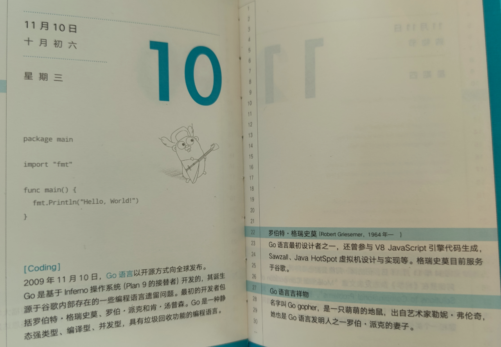
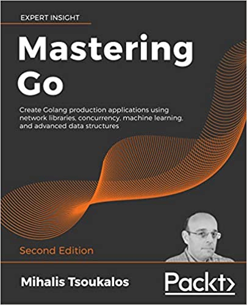
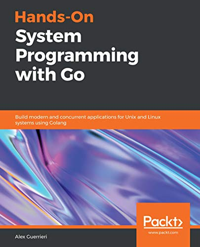

题图来自《了不起的程序员》

今天是 Go 语言开源 11 周年。有些人可能不太知道，简单回顾下 Go 的历史。

2007 年 Rob Pike, Robert Griesemer 和 Ken Thompson 一起创建了 Go 语言。从代码提交记录看，2008 年 3 月 3 日有了 [Go 最初的规范](https://github.com/golang/go/blob/18c5b488a3b2e218c0e0cf2a7d4820d9da93a554/doc/go_spec)。

- 2009 年 11 月 10 日，Go 语言以开放源代码的方式向全球发布，当年获得了 TIOBE 年度编程语言称号；
- 2011 年 3 月 16 日，Go 语言的第一个稳定版本 r56 发布；
- 2012 年 3 月  28 日，Go 语言的第一个正式版本 Go1 发布，并承诺 1.x 的 兼容性；
- 直到 2013 年  5 月 13 日，Go1.1 正式版才发布，距离 1.0 过去了一年多。正式因为经历了这么久，Go 官方团队正式考虑发布周期的问题，并整理成文档：<https://github.com/golang/go/wiki/Go-Release-Cycle>；总的目标是 6 个月发布一个版本，细分为 3 个月的常规开发，然后是 3 个月的测试和优化，即所谓的版本冻结。通过发行小版本来纠正诸如崩溃或安全性等关键问题。同时明确发布周期定于每年的 2 月 1 日和 8 月 1 日；
- 2013 年 12 月 1 日，Go1.2 正式发布；
- 2014 年 6 月 18 日，Go1.3 正式发布；
- 2014 年 12 月 10 日，Go1.4 正式发布；
- 2015 年 8 月 19 日，Go1.5 正式发布。该版本实现了自举，即移除了 C 代码，使用 Go 开发 Go 语言；开始按发布节奏走了（该版本故意推迟 2 个月发布）；
- 2016 年 2 月 17 日，Go1.6 正式发布；
- 2016 年 8 月 15 日，Go1.7 正式发布；引入 context 包；
- 2017 年 2 月 17 日，Go1.8 正式发布；
- 2017 年 8 月 24 日，Go1.9 正式发布；引入别名；
- 2018 年 2 月 16 日，Go1.10 正式发布；
- 2018 年 8 月 25 日，Go1.11 正式发布。开始支持 Module；
- 2019 年 3 月 1 日，Go1.12 正式发布；
- 2019 年 9 月 3 日，Go1.13 正式发布；
- 2020 年 2 月 25 日，Go1.14 正式发布；goroutine 支持异步抢占调度；
- 2020 年 8 月 11 日，Go1.15 正式发布；

关于以上版本的一些关键改动，可以查看 [《你必须了解的 Go 历史：帮助理解 Go 的设计思想和每个版本的优势或弱点》](https://mp.weixin.qq.com/s/Tzqn5kzdfzcQPUD5NtN2mg)。

今天是 11 月 10 日，11 年前的今天，Go 语言开源了。在此祝愿 Go 语言越来越好！

Go 语言这两年出版了不少图书，这里分享几本 Go 语言英文图书。

### 01《Mastering Go 2nd Edition》

使用网络库，并发，机器学习和高级数据结构创建 Golang 生产级应用程序。这本书试用于已经了解语言基础知识并希望成为专家级 Go 实践者的 Go 程序员。

该书目录：

1. Go 和操作系统
2. 了解 Go 内部
3. 使用基本 Go 数据类型
4. 复合类型的用途
5. 如何使用数据结构增强 Go 代码
6. 你可能不了解的 Go 包和功能
7. 反射和接口
8. 告诉 Unix 系统该怎么做
9. Go 中的并发性：Goroutines，通道和管道
10. Go 中的并发：高级主题
11. 代码测试，优化和分析
12. Go中网络编程的基础
13. 网络编程：构建自己的服务器和客户端
14. Go 中的机器学习

### 02《Hands-On System Programming with Go》

使用 Golang 为 Unix 和 Linux 系统构建现代和并发应用程序。探索系统编程的基础知识，从内核 API 和文件系统开始，再到网络编程和过程通信。

该书目录：

1. 系统编程简介
2. Unix OS 组件
3. Go 概述
4. 使用文件系统
5. 处理流
6. 构建伪终端
7. 处理进程和守护程序
8. 退出代码，信号和管道
9. 网络编程
10. 使用 Go 进行数据编码
11. 处理 Channel 和 Goroutines
12. 使用 sync 和 atomic 进行同步
13. 使用 Context 进行协调
14. 实现并发模式
15. 使用反射
16. 使用 CGO

### 03《Hands-On High Performance with Go》

通过弹性大规模扩展和优化 Golang 应用程序的性能。成熟的方法和并发技术将帮助您使用 Go 编程编写更快更好的代码。

该书目录：

1. Go 性能介绍
2. 数据结构与算法
3. 了解并发
4. Go 中的 STL 算法等效项
5. Go 中的矩阵和向量计算
6. 编写可读的 Go 代码
7. Go 中的模板编程
8. Go 中的内存管理
9. Go 中的 GPU 并行化
10. Go 中的编译时间评估
11. 构建和部署 Go 代码
12. Profiling Go 代码
13. Tracing Go 代码
14. 集群和作业队列
15. 跨版本比较代码质量

