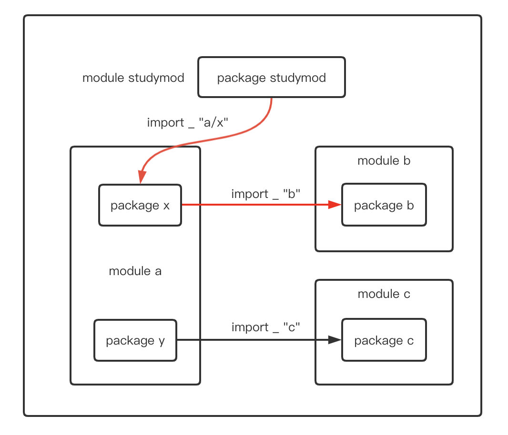
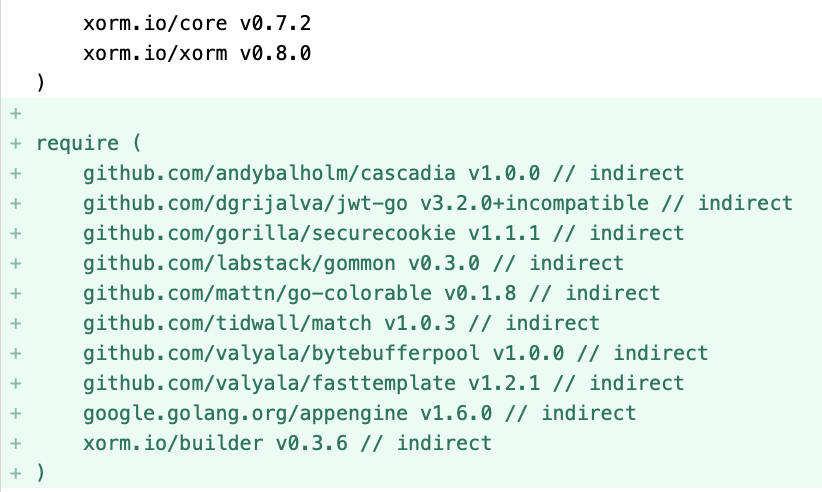

大家好，我是 polarisxu。

自从 Go1.11 增加 Go Module 以来，每个版本都在不断改进 Module。Go1.17 也不例外。这次最主要的变化有两点：

- Module graph pruning：Module 依赖图修剪
- Lazy Loading：Module 延迟加载

此外还有 Deprecated 注释等。本文就一起探究下这些新变化，因为有人没看懂，不知道这些变化是什么意思。

## 01 Module 依赖图修剪

要搞懂这个知识点，需要对比 1.17 之前的情况。

> 注意，这个变化并不会影响 go mod 的任何使用

为了方便演示，我们构建一个这样的例子。

有四个模块：主模块（studymod）和 a、b、c 三个模块，如下图：



module studymod 是我们的项目，它依赖模块 a 中的 x 包，而 x 包依赖模块 b，同时 a 包中的 y 包依赖模块 c。

很显然，对我们的项目 studymod 来说，模块 c 的代码根本没用上。Go 1.17 对 module 的改进主要就是在这种没用上的模块上。

### 基于 Go1.16

假定在 `$HOME` 下创建一个新目录 gomod116，构建如下目录结构：

```bash
[xuxinhua@/Users/xuxinhua/gomod116]
$ tree -L 3
.
├── a
│   ├── x
│   │   └── x.go	// 包含正确的包定义和 import
│   └── y
│       └── y.go
├── b
│   └── b.go
├── c
│   └── c.go
└── studymod.go
```

在 Go 文件中只是简单的定义包和 import。几个 go 文件的内容分别如下：

```go
// x.go
package x

import _ "b"

// y.go
package y

import _ "c"

// b.go
package b

// c.go
package c

// studymod.go
package studymod

import _ "a/x"
```

进入 gomod116 目录，将 Go 版本切换到 Go1.16.x（多版本发挥作用了，多版本问题，可以看看这篇文章：[终于找到了一款我喜欢的安装和管理 Go 版本的工具](https://mp.weixin.qq.com/s/yTblk9Js1Zcq5aWVcYGjOA)），然后执行下列命令：

```bash
$ go mod init studymod
$ cd a
$ go mod init a
$ cd ../b
$ go mod init b
$ cd ../c
$ go mod init c
```

因为模块 a 依赖模块 b 和 c，往 a/go.mod 增加如下代码：

```bash
module a

go 1.16

require (
    b v0.1.0
    c v0.1.0
)
```

在 gomod116 根目录的 go.mod 增加如下代码：

```bash
module studymod

go 1.16

require a v0.1.0

replace (
        a v0.1.0 => ./a
        b v0.1.0 => ./b
        c v0.1.0 => ./c
)
```

因为 studymod 只直接依赖模块 a。replace 部分可以忽略，只是为了本地能够正常引入模块。

此时，在 gomod116 目录下执行 go build，如果不报错，表示一切正常，我们可以执行如下命令看到依赖关系：

```bash
$ go mod graph
studymod a@v0.1.0
a@v0.1.0 b@v0.1.0
a@v0.1.0 c@v0.1.0
```

studymod 依赖 a，a 依赖 b 和 c。

但我们知道，studymod 模块实际根本不需要模块 c，因此，我们尝试在 studymod 模块中删除模块 c 的引用，即删除 go.mod 中 replace 部分的 ` c v0.1.0 => ./c`，再次执行 go build：

```bash
$ go build
go: a@v0.1.0 requires
	c@v0.1.0: missing go.sum entry; to add it:
	go mod download c
```

可见模块 c 不能少。（验证后，记得将 go.mod 恢复原样）

### 基于 Go1.17

现在我们基于 Go1.17 做类似的验证，将 Go 切到 1.17，执行如下命令，将 gomod116 拷贝一份：

```bash
$ cp -rf gomod116 gomod117
```

然后进入 gomod117 目录，将 go.mod 的 版本由 1.16 改为 1.17：

```bash
module studymod

go 1.17

require a v0.1.0

replace (
    a v0.1.0 => ./a
    b v0.1.0 => ./b
    c v0.1.0 => ./c
)
```

接着执行 go mod tidy，发现 go.mod 变成这样：

```bash
module studymod

go 1.17

require a v0.1.0

require b v0.1.0 // indirect

replace (
        a v0.1.0 => ./a
        b v0.1.0 => ./b
        c v0.1.0 => ./c
)
```

多了一行 require，记录了 module studymod 的间接依赖：module b@v0.1.0。执行 go build 一切正常。

跟 Go1.16 一样，删除掉 `c v0.1.0 => ./c` 这行，再次执行 go build，依然正常。这就是依赖图裁剪，再看依赖关系，跟 Go1.16 是不一样的。

```bash
$ go mod graph
studymod a@v0.1.0
studymod b@v0.1.0
a@v0.1.0 b@v0.1.0
a@v0.1.0 c@v0.1.0
```

### 这么做的优劣

这么做是基于社区的反馈，有兴趣的可以看看这个提案：[Proposal: Lazy Module Loading](https://go.googlesource.com/proposal/+/master/design/36460-lazy-module-loading.md)，这也是合理的，毕竟没有用到的代码为什么一定需要呢？

此外，裁剪后，go.mod 中会包含入更多的依赖项（完整的依赖列表），新包含的依赖项单独放在一个 require 下。可以通过 <https://github.com/studygolang/studygolang> 试验下。下载该代码后，执行如下命令：

```bash
$ go mod tidy -go=1.17
```

diff 后，在原来的基础上多出了如下的 require：



有点类似其他语言中 xxx.lock 文件的感觉了。

当然，这种方式后，go.mod 的文件会更大，这也是该方式的一个相对劣势。

## 02 延迟加载（lazy Loading）

理解了上面依赖图的裁剪，延迟加载就一句话：那些根本没有用上的模块（比如上面例子中的模块 c），Go 1.17 后，Go 命令不会去读取其 go.mod 文件。如果之后需要了，再去加载。

## 03 Deprecated 注释

Go1.17 go.mod 中支持 Deprecated 注释，用来标明该模块废弃了。

```bash
// Deprecated: use example.com/mod/v2 instead.
module example.com/mod
```

对于那些使用了被废弃的 module 的 go 项目，go list、go get 命令都会给出 warning。

看过我这篇文章：[《从 go-chi 框架撤回所有主版本聊 Go1.16 的新特性》](https://mp.weixin.qq.com/s/mBJ3hQ6oR1V9YtdXpkTnow) 的朋友，可能会有疑问，撤回和废弃有何不同，如何分别使用？这里稍微总结下：

**撤回的使用场景**：

- 发现了一个严重的安全漏洞；
- 发现了严重的不兼容性或 bug；
- 这个版本是偶然发布的，或是过早发布了；

而 Deprecated 是用来作废整个 module 的，也就是说，不能废弃某个 minor 或 patch 版本。Deprecated 更多用来提示使用者升级到更新的 major 版本，比如要废弃 v1，希望大家升级到 v2，就应该使用 Deprecated。

## 04 总结

还有其他一些小的变动，这里不一一列举。提醒下大家，从 Go1.16 版本开始，下载安装 Go 二进制程序，不再使用 go get，而是 go install，go get 只用来下载普通包。

因为 module 越来越完善，官方针对 module 也有更完整的文档：<https://docs.studygolang.com/ref/mod>。
