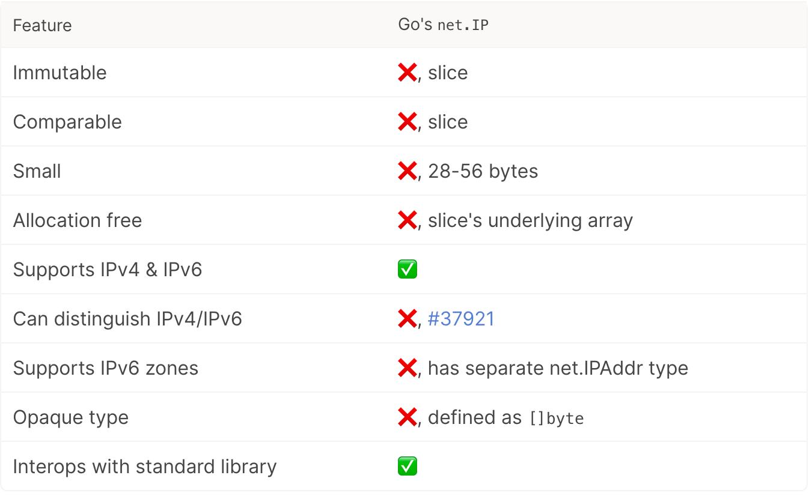
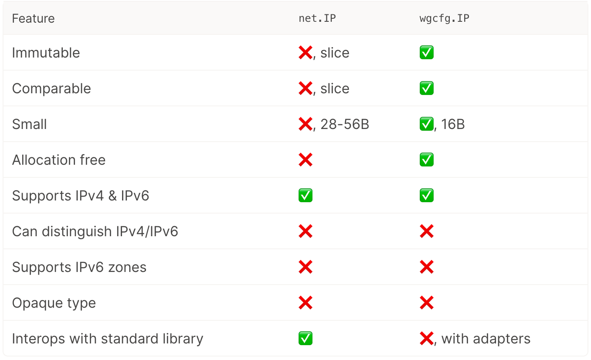
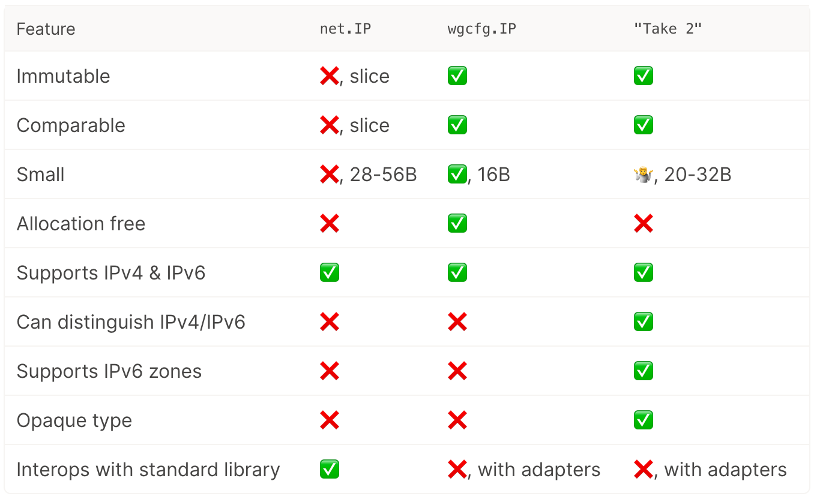
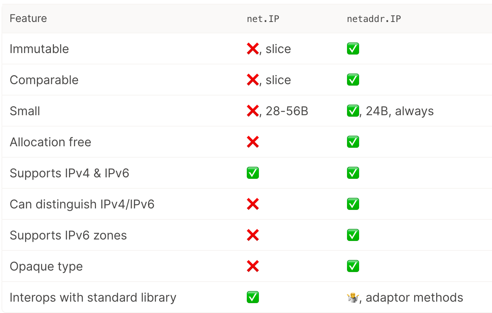

大家好，我是 polarisxu。

Go 1.18 标准库新增了一个包：net/netip，大部分人可能用不上这个包，但这个包的设计思路以及和现有标准库 IP 的比较值得学习。

## 01 标准库 net.IP 的问题

前 Go Team 成员之一 Brad Fitzpatrick 加入 [Tailscale](https://tailscale.com/) 后，经常需要操作 IP 地址。因为使用 Go 语言实现的，自然会使用过标准库的 net.IP 和 net.IPNet 等类型。但他们认为标准库的相关类型有很多问题，所以他们自己写了一个包：<https://github.com/inetaf/netaddr>。

早在 2017 年 1 月，Brad Fitzpatrick 就提了 issue，认为 net.IP 的设计存在问题：<https://github.com/golang/go/issues/18804>，那时他还在 Go Team。

具体来说，net.IP 存在如下几个问题：

- 可变的。net.IP 的底层类型是 []byte，它的定义是：`type IP []byte`，这意味着你可以随意修改它。不可变数据结构更安全、更简单。
- 不可比较的。因为 Go 中 slice 类型是不可比较的，也就是说 net.IP 不支持 `==`，也不能作为 map 的 key。
- 有两个 IP 地址类型，net.IP 表示基本的 IPv4 或 IPv6 地址，而 net.IPAddr 表示支持 zone scopes 的 IPv6。因为有两个类型，使用时就存在选择问题，到底使用哪个。标准库存在两个这样的方法：`Resolver.LookupIP` vs `Resolver.LookupIPAddr`。（关于什么是 [IPv6 zone scopes 见维基百科](https://en.wikipedia.org/wiki/IPv6_address#Scoped_literal_IPv6_addresses_(with_zone_index))。）
- 太大。在 Go 中，64 位机器上，slice 类型占 24 个字节，这只是 slice header。因此，net.IP 的大小实际包含两部分：24 字节的 slice header 和 4 或 6 字节的 IP 地址。而 net.IPAddr 更有额外的字符串类型 Zone 字段，占用空间更多。
- 不是 allocates free 的，会增加 GC 的工作。当你调用 net.ParseIP 或接收一个 UDP 包时，它为了记录 IP 地址会分配底层数组的内存，然后指针放入 net.IP 的 slice header 中。
- 当解析一个字符串形式的 IP 地址时，net.IP 无法区分 [IPv4 映射的 IPv6 地址](https://en.wikipedia.org/wiki/IPv6#IPv4-mapped_IPv6_addresses)和 IPv4 地址。因为 net.IP 不会记录原始的地址族（address family）。见 [issue 37921](https://github.com/golang/go/issues/37921)
- 它是一种透明类型（transparent type）。因为它的定义是：`type IP []byte`，底层类型是一个字节切片。这有什么问题呢？我们没法改变 IP 的底层类型了，因为它已经是导出 API 的一部分。标准库中一个很好的例子是 time.Time 类型，它是一个不透明类型：`type Time struct { /* unexported */ }`，也就是里面有什么没公开，这样库作者可以随便修改里面的内容，只需要保证导出 API 不变即可。实际上 Go1.9 就改过一次 time.Time 的内部结构，完全不会破坏兼容性。

但为了兼容性，以上这些问题没法通过改进 net.IP 类型解决。于是才有了 Brad Fitzpatrick 上面开发的包。该包已经正式合入 Go1.18 标准库中，这就是 net/netip 包，这里可以查看包文档：<https://pkg.go.dev/net/netip@master>。

## 02 net/netip 包设计思路

新的 netip 包定义了一个 IP 地址（Addr）类型，它是一个小值类型。基于该 Addr 类型，该包还定义了 AddrPort（一个 IP 地址和一个端口）和 Prefix（一个 IP 地址和一个位长前缀）。

与 net.IP 类型相比，netip 包的 Addr 类型占用更少的内存（24 byte），不可变（immutable），并且具有可比性（支持 == 并作为 map 键）。（本文基于 64 位机器讲解）

该包的具体 API 等信息可以查看文档，这里着重讲解 netip 的设计思路。（来自 Brad Fitzpatrick 的文章）

net.IP 类型的特性：



基于此，netip 包的演进过程中，有几种设计。

**1）wgcfg.IP**，查看[具体代码](https://github.com/tailscale/wireguard-go/commit/89476f8cb53b7b6e3e67041d204a972b69902565#diff-d6e6f254849cb9119d9aaa21a41ee7f26f499251ce073522bdd89361a316814bR13)。

```go
// Internally the address is always represented in its IPv6 form.
// IPv4 addresses use the IPv4-in-IPv6 syntax.
type IP struct {
       Addr [16]byte
}
```

这种结构相比 net.IP 结果：



可见还存在几个问题：1）无法区分 IPv4 和 IPv6；2）不支持 IPv6 zone。而不透明可以通过将字段 Addr 改为 addr 解决。

**2）netaddr.IP**，查看[具体代码](https://github.com/inetaf/netaddr/commit/7f2e8c8409b7c27c5b44192839c8a94fca95aa21#diff-5aea5a23fd374194efa71dd12c8ddf8ede924f1043045520a8283d2490f40f12R27)。

不知道大家是否知道，Go 中的 interface 是可比较的（即可通过 `==` 比较和用作 map 的键，不过如果接口的底层值是不可比的，则运行时会 panic）。利用这一点，设计了 netaddr.IP 类型：

```go
type IP struct {
     ipImpl
}

type ipImpl interface {
     is4() bool
     is6() bool
     String() string
}

type v4Addr [4]byte
type v6Addr [16]byte
type v6AddrZone struct {
      v6Addr
      zone string
}
```

该结构的对比：



这种结构存在的问题：不够小（20-23 byte），不是 Allocation free。

因此继续优化。

**3）allocation-free 24 字节表示**

为什么定为 24 字节？Go 标准库中 net.IP 的 Slice Header 大小是 24 字节，而 Go 中 Slice 很常见。time.Time 类型的大小目前也是 24 字节。所以，Go 编译器肯定能够很好的处理 24 字节值类型。所以，tailscale 团队定了目标，要求表示 IP 的类型不超过 24 字节。

由于 IPv6 地址已经占去 16 个字节，因此剩下 8 字节用于编码以下内容：

- 地址族（v4、v6 或两者都不是，例如 IP 零值），至少需要 2 位
- IPv6 zone

此外，还需要能比较。

剩下的内容只能占 8 字节，因此没法使用 interface{}（它占用 16 字节），字符串也不行（16 字节）。

可以尝试采用了 bit-packing 的方式：

```go
type IP struct {
   addr          [16]byte
   zoneAndFamily uint64
}
```

将地址族和 IPv6 zone 打包（packing）进 zoneAndFamily 字段中（8 字节）。不过这种方式编码不是太方便，可能还会有一些问题。

最后采用了指针的方式：

```go
type IP struct {
    addr [16]byte
    z    *intern.Value // zone and family
}
```

具体的过程分析可以参考 <https://tailscale.com/blog/netaddr-new-ip-type-for-go/>。

这样可以定义三个哨兵：

```go
var (
     z0    *intern.Value        // nil for the zero value
     z4    = new(intern.Value)  // sentinel value to mean IPv4
     z6noz = new(intern.Value)  // sentinel value to mean IPv6 with no zone
)
```

这接近最终实现。不过，基于此有进一步的优化，感兴趣的可以阅读上面参考文章以及 Go1.18 的 net/netip 实现。



## 03 总结

这个包你可能用不到，不过标准库中之前的 IP 实现的问题，以及新 IP 类型的设计思路还是值得认真看一下的。对其中更多细节感兴趣的，可以认真研读这篇文章：<https://tailscale.com/blog/netaddr-new-ip-type-for-go/>。
