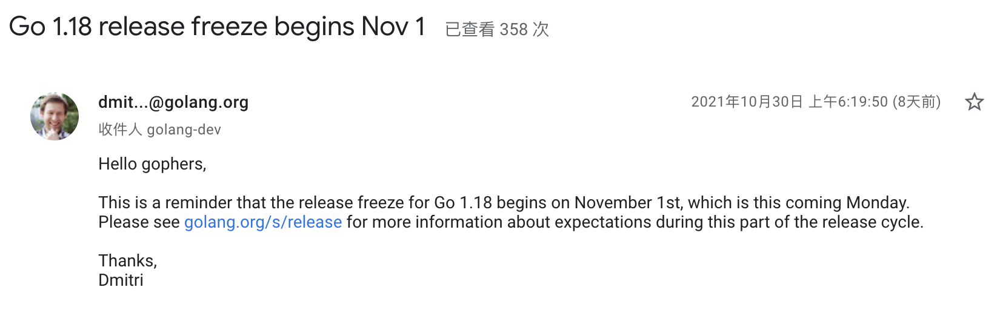
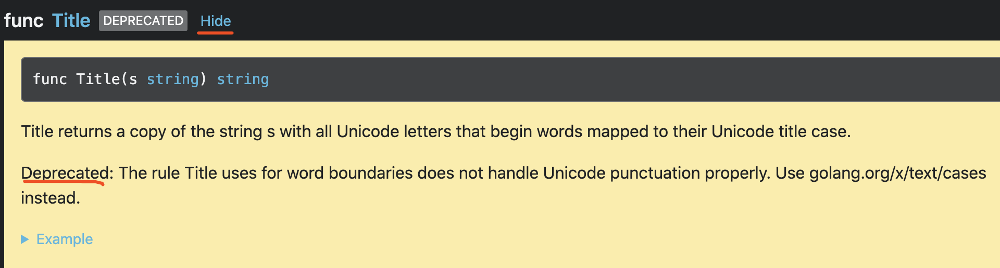

大家好，我是 polarisxu。

从 11 月 01 日起，Go1.18 就冻结了，也就是 1.18 的功能已经确定。



今天介绍一个 Go1.18 废弃的 API，同时介绍响应的替代 API。

## 01 strings.Title 被废弃

查看 go tip 标准库文档，发现 strings.Title 被标识为 deprecated：<https://pkg.go.dev/strings@master>，而且该 API 的文档默认被折叠了。



pkg.go.dev 针对废弃的 API 使用了不一样的样式。

该 API 是干什么的？为什么会被标识为废弃？

看一个例子就知道 strings.Title 的作用了：

```go
package main

import (
	"fmt"
	"strings"
)

func main() {
	fmt.Println(strings.Title("her royal highness"))
	fmt.Println(strings.Title("loud noises"))
	fmt.Println(strings.Title("хлеб"))
}
```

输出：

```bash
Her Royal Highness
Loud Noises
Хлеб
```

可见，strings.Title 会将每个单词的首字母变成大写字母。

strings 中还有一个函数：ToTitle，它的作用和 ToUpper 类似，所有字符全部变成大写，而不只是首字母。不过 ToTitle 和 ToUpper 的区别特别微小，[Stackoverflow 上有相关讨论](https://stackoverflow.com/questions/18559587/confusing-toupper-and-totitle)，它们的区别是 Unicode 规定的区别。

那 strings.Title 为什么废弃呢？strings.Title 的规则是使用单词边界，不能正确处理 Unicode 标点。

比如下面的代码：

```go
fmt.Println(strings.Title("here comes o'brian"))
```

期望输出：`Here Comes O'brian`，但 strings.Title 的结果是：`Here Comes O'Brian`。

## 02 golang.org/x/text/cases 包

在 strings.Title 中提到，可以使用 `golang.org/x/text/cases` 代替 strings.Title，具体来说就是 cases.Title。

该包提供了通用和特定于语言的 case map，其中有一个 Title 函数，签名如下：

```go
func Title(t language.Tag, opts ...Option) Caser
```

第一个参数是 language.Tag 类型，表示 BCP 47 种语言标记。它用于指定特定语言或区域设置的实例。所有语言标记值都保证格式良好。

第二个参数是不定参数，类型是 Option，这是一个函数类型：

```go
type Option func(o options) options
```

它被用来修改 Caser 的行为，cases 包可以找到相关 Option 的实例。

cases.Title 的返回类型是 Caser，这是一个结构体，这里我们只关心它的 String 方法，它接收一个字符串，并返回一个经过 Caser 处理过后的字符串。

所以，针对上文 strings.Title 的场景，可以改为 cases.Title 实现。

```go
caser := cases.Title(language.English)
caser.String("here comes o'brian")
```

得到的结果是：`Here Comes O'brian`。

## 03 总结

Go 语言很强的地方之一就是它的标准库。其实除了标准库，golang.org/x 相关库也是一个大宝藏，需要什么功能，如果标准库没有，可以优先看看 golang.org/x 有没有提供相关库。后续我也会不断介绍 golang.org/x 一些库的用法。
