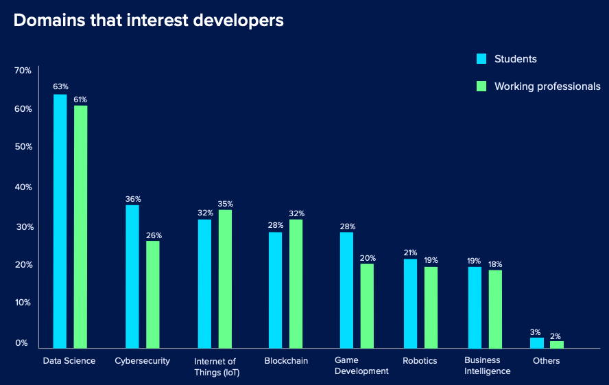
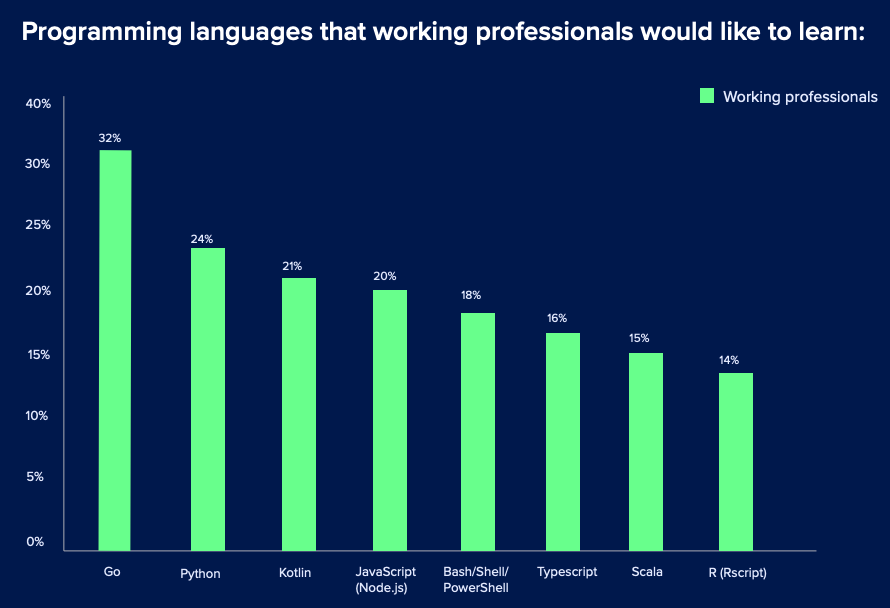
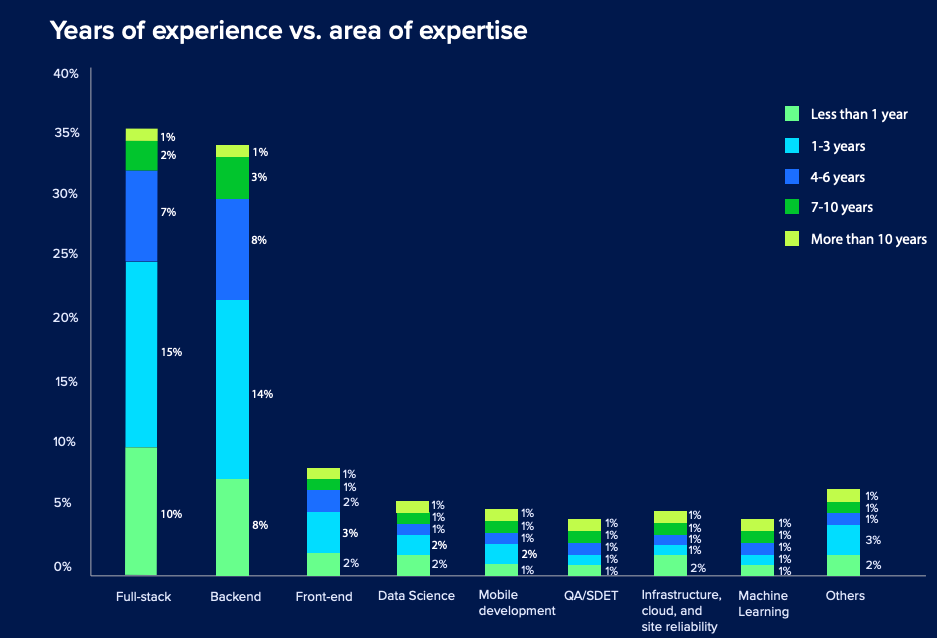
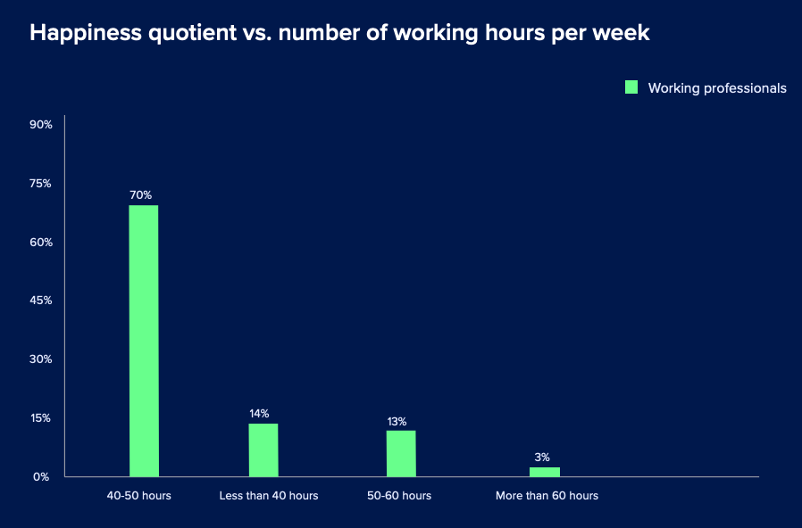

大家好，我是站长 polarisxu。

今天看到一个 2020 年开发者调查报告，看到了 Go 的前景，忍不住想跟大家分享一下。

## 01

这份调查报告来自 [HackerEarth](https://www.hackerearth.com/)。简单介绍下它。

HackerEarth 的口号是：远程雇用最优秀的技术人才。拥有 400 万+ 开发人员（注册用户），上千家企业信赖，他们帮助公司准确评估，面试和雇用顶尖技术人才。

他们提供编程练习、黑客挑战，号称能够进行准确的编码评估并远程聘用最好的技术人才。根据官网介绍，创始人是大学时候的两个朋友。

## 02

为什么要做开发者调查？HackerEarth 是这么认为的：

过去十年来技术的飞速发展改变了一切。它改变了我们的生活方式，工作方式以及彼此之间的互动方式—实际上，很难找到没有被技术改变的事物。

然而，全球的组织都感觉到技术人才短缺。但是这种短缺可能比您预期的还要严重。根据最近的一项调查，今天的技术人才短缺是自 2008 年以来的最高水平。因此，招聘人员和招聘经理必须了解开发人员的状况并了解当今技术人员的心态，这样才能更好地满足开发人员的要求、需求。

组织要想更好地招聘，需要做的关键改变之一就是将重点从传统的招聘方法转移到基于技能的招聘过程。如果我们超越目前对简历或学位的关注，将所有中学后课程都包括在内，那么将会出现更多的选择。基于技能的招聘实践可以帮助您降低招聘成本和雇用时间，提高多样性，更快地填补空缺职位，并在紧张的劳动力市场中找到组织所需的合适技术人才。

在 HackerEarth，我们拥有 400 万强大的开发者社区，我们的使命是为他们提供合适的机会。为继续支持我们的使命，我们很高兴为您带来 2020 HackerEarth 开发人员调查。 HackerEarth 有史以来第一次分享了对来自 76 个国家/地区的 16,000 多名开发人员（其中女性占受访者的 20％ 以上）的调查所收集的反馈。

我们认为，调查中提供的数据和见解将帮助招聘者更好地了解开发人员生态系统，采用基于技能的招聘方法。此外，这项调查将为开发人员提供一个机会，使他们能够了解当今市场的情况，了解趋势以及如何提高自己的技能。

希望这份调查能够对你的技术招聘有帮助，对你的职业发展能有一点帮助。

## 03

调查结果的一些关键结论。

### 到了 2020 年，数据科学仍然占据统治地位

数据科学无止境！从学生开发人员（63％）到在职专业人员（61％），每个人都想占有一席之地。学生开发人员感兴趣的其他领域包括网络安全和物联网，而在职专业人员对物联网和区块链感兴趣。

### Go 是今年最受欢迎的编程语言

在学生（29％）和经验丰富的开发人员（32％）中，Go 已成为最受欢迎的编程语言的明显赢家。

### 开发人员在全栈开发方面经验最丰富，而在机器学习方面经验最少

大多数开发人员（无论是初学者还是经验丰富的人员）都具有全栈开发以及前端和后端开发的专业知识。

尽管大多数开发人员都表示希望从事数据科学项目，但在机器学习方面经验不足。

可见机器学习方面还有很大的潜力。

### 您要让开发人员挂了吗？

技术面试可能会让人感到压力，招聘人员有责任使求职者的面试过程变得更加轻松。可悲的是，大多数开发人员在面试后都没有收到建设性的反馈。

使他们对技术招聘过程感到不满意的其他原因包括：面试次数过多（14％），误导性的职位描述（14％），面试之间的等待时间（12％）和缺乏相关的技术问题（10％）。（不能同意更多，很多企业面试完全不考虑候选人的面试体验）

### 你对开会怎么看？

当问及要实现 100％ 的工作效率需要什么时，70％的开发人员选择了更少的会议。

此外，大多数开发人员还选择了多显示器（61％），无杂物的工作空间（59％）以及戴耳机时不打扰的方式（59％）。

### 开发人员的幸福感与工作时间不成比例

所有的工作，没有乐趣，会削弱开发人员的幸福感吗？我们认为不是！在接受调查的所有开发人员中，有 70％ 对当前工作不满意的开发人员每周工作 40 至 50 个小时。大家还是希望能够按时上下班~

考虑到大多数员工每周工作 40 小时是标准的工作，因此可以肯定地说，开发人员正在寻找有意义的工作，而坐在办公桌前并不能增加他们的幸福感。

这一点国内似乎谈不上？

其他更多内容，包括程序员业余都喜欢做什么？喜欢从哪获取知识等，可以访问这里查看：<https://www.hackerearth.com/recruit/developer-survey/>。

## 04

虽然这份报告不能完全反馈出国内的情况，但有一点，那就是 Go 在国外也收到越来越多的关注，很多人都希望学习 Go 语言。是的，你别犹豫了~
