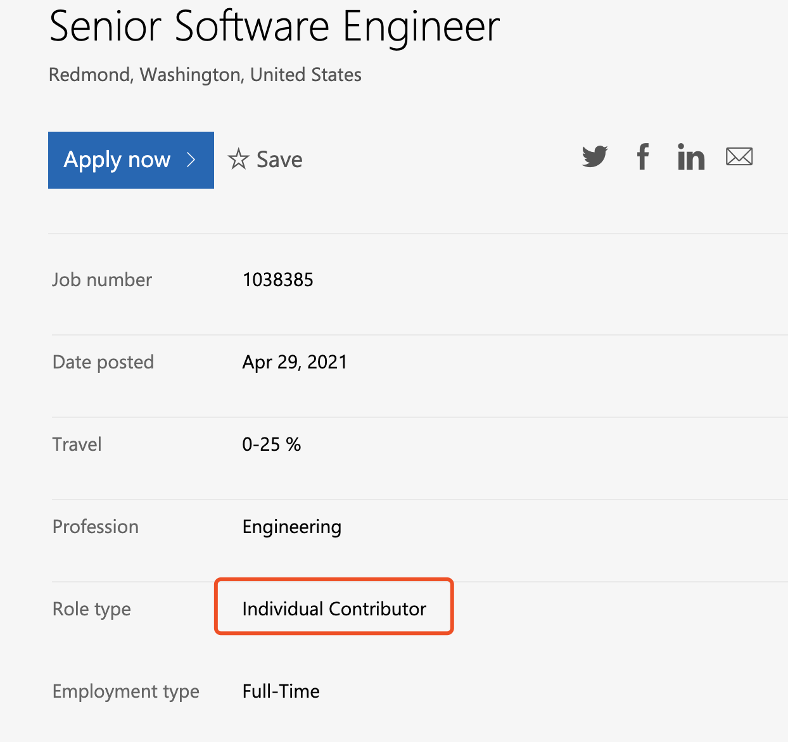

大家好，我是 polarisxu。

微软在其招聘主页上挂了一个招聘信息，招聘高级软件工程师（职位链接：<https://careers.microsoft.com/us/en/job/1038385/Senior-Software-Engineer>）。这个职位有点特别：

个人贡献者。具体来说，找为 Go 语言编译器和工具开发的全职员工。

我们都知道，一直以来，微软搞了不少开发语言，最有名的是 VB、C#（.NET 框架）等。现在他们计划招全职人员，专门为 Go 编译器和工具贡献代码，这个真的很赞。

招聘需求中还提到，这个角色，将与 Microsoft 其他产品组密切合作，以收集需求并为 Go 开发工具改进。微软的愿景是希望这个角色支持 Go 在微软的应用，同时与更广泛的 Go 社区合作并分享这些改进。

从这点可以看出，Go 在微软内部肯定有不少产品在使用，这对 Go 来说是大好事。同时也反映了微软这些年在纳德拉的带领下发生了很大的变化，拥抱开源就是其中之一。

具体职责方面，该职位信息提到，为 Go 编译器和工具生态系统的设计和实现做出贡献，结合开源和封闭源代码开发工具技术，专注于提供 Go 工具集改进以支持内部产品组。

具体要求截图给大家看看：

对于那些从事 Go 编译器和工具相关的社区爱好者来说，这也许是一个很好的机会。

反观国内，有这样的大厂招类似的职位吗？

