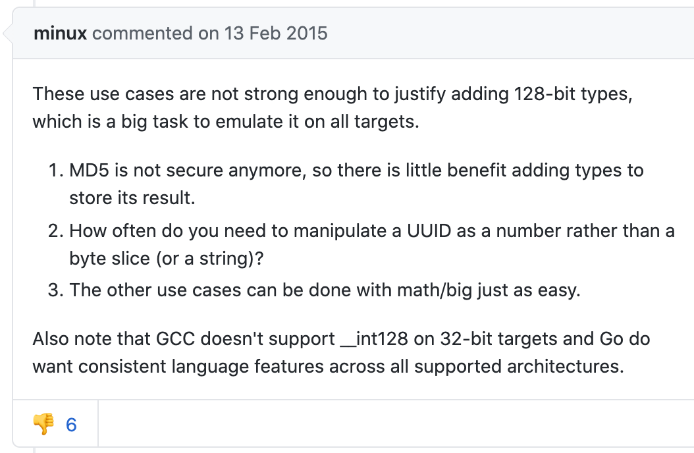
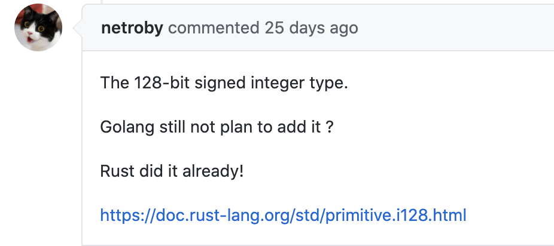

大家好，我是站长 polarisxu。

如果有看我写的 Rust 系列教程，会注意到，Rust 有一个整数类型：i128/u128，即 16 字节长的整数。而 Go 是不支持 int128/unit128 的。

当时，我也没有多想，感觉 128 长度应该用的也少。今天，我发现早在 2014 年就有人提议在 Go 中增加 int128/uint128 的支持：<https://github.com/golang/go/issues/9455>。

为什么想要这个类型呢？

有人提出了相关的使用场景，总结下大概有如下几个：

-  UUID
- IPv6
- hashing (MD5)
- timestamps
- cryptographic nonces
- database keys
- 。。。

针对有人提出的一些需求点，minux（很早期就参与 Go 开发的，华人，go mobile 项目是他主导的）给了如下答复：

大家注意到没，被人 👎。

ianlancetaylor（泛型是他在主导设计）给出了这样的答复：

> UUID 和 IP6 的例子不够有说服力，它们很容易用其他方式实现。要不要支持 int128/uint128，关键在于有没有该类型相关的算术运算需求。在具体实现时，硬件是否很好的支持也需要考虑。
>
> 如果增加了该类型，strconv、math/big 等包为了兼容，需要增加额外的一些列函数。

他还回复了很多人的其他疑问，他一直强调几点：

- 你为什么需要 int128/uint128？
- 是否有做运算的需要？
- 对语言可能有破坏，因此这个提案标记为 「Go2」

其中他的一句话不少人可能要吐槽：

> Go is not a language that decides what features to add based solely on demand. Of course demand plays a role, but it is not the determining factor.

Go 是否增加某个特性，需求不是决定因素！

这就是 Go 一直坚持的理念：大道至简！节制！！！有人不喜欢，有人骂，但同样也会有人喜欢，有人爱。对我来说，挺喜欢 Go 的简单，Go 的节制！

最近有人在这个提案接着问：

Rust 支持了，包括 PostgreSQL 数据库也支持，Go 还不支持吗？该提案的作者给出了回复：

闲扯一句：不知道大家看出什么异样了吗？欢迎留言。

最后，int128/uint128 目测迟早应该会支持，因为 ianlancetaylor 在设计泛型时，考虑了对该类型的兼容问题。这个问题我们以后再聊。